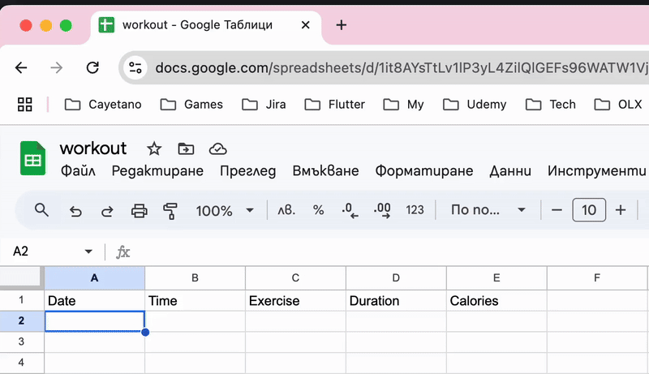
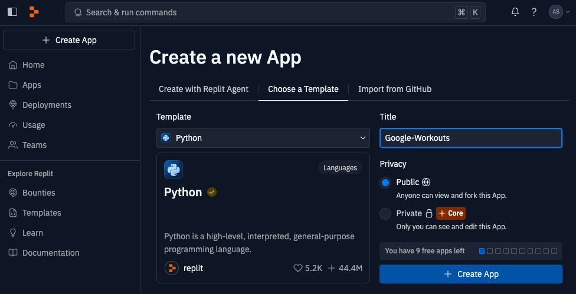
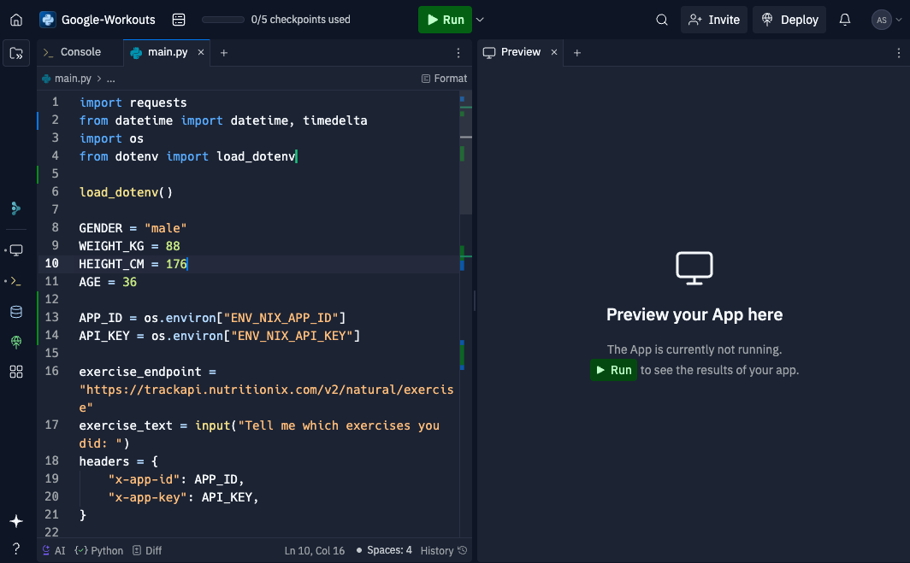
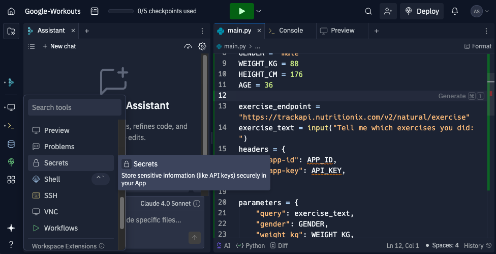
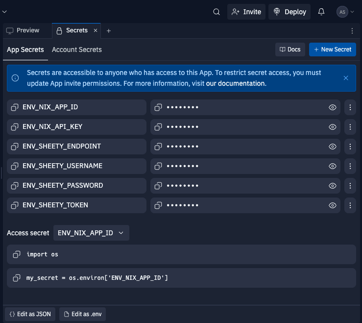
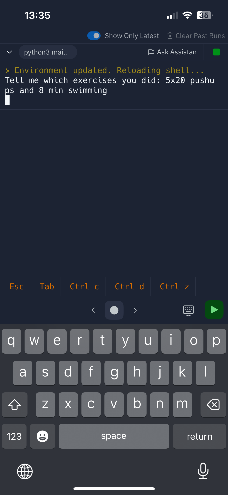
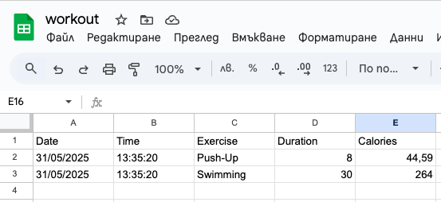

## Topics
- Python DateTime strftime()
- APIs and making POSTR Requests
- Authorization Headers
- Environment Variables

## Workout Tracking Using Google Sheets

    

In order to be able to post our workout data while we're out and about, it would be easier if we can access the console and run the code in a browser.

We can do this using [Repl.it](https://replit.com/~)

This is a free tool but requires email signup. So it's completely optional if you want to do this. It's not so much for learning Python, but it would be cool to have this "app" accessible from a web browser on mobile.

Step 1: Step 1: Sign up for a free account on https://replit.com/

Step 2: Create a new Repl and name it Google-Workouts

    

Step 3 - Copy and paste all your code into main.py on Replit.

    

However, because Repl.it projects are public, we don't want other people to see our API keys and secrets.

Step 4 - Add environment variables to Replit and store your Environment Variables by going into the Secrets tab and adding each environment variable as a key value pair:

[Replit Workspace - Workspace Features - Secrets](https://docs.replit.com/replit-workspace/workspace-features/secrets)

    

    

Step 5 - Now you can open up the same project on your mobile browser and click run to use the app on the go!

    

    

