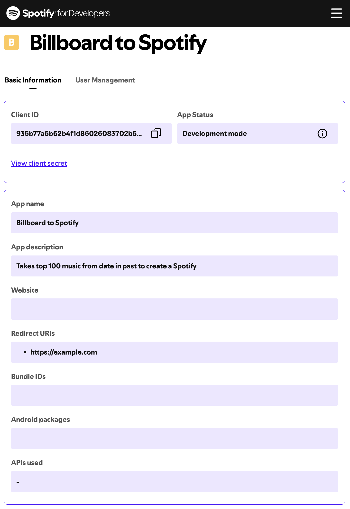
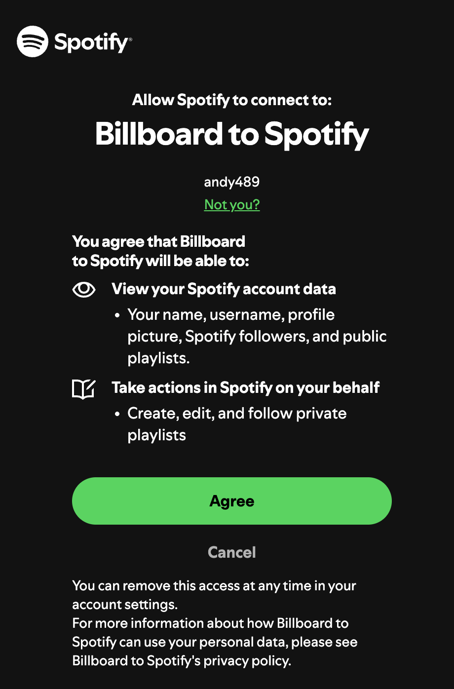
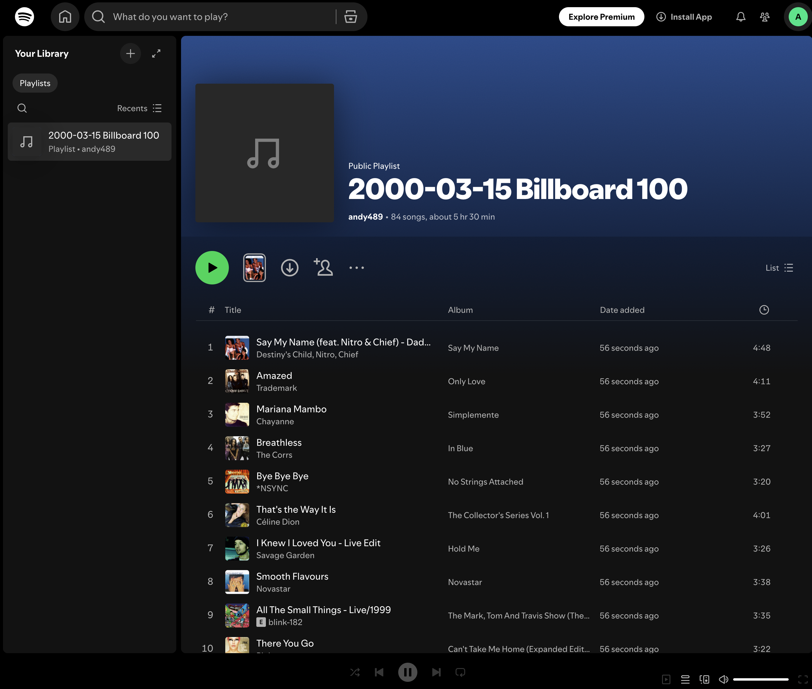

## Topic

- Musical Time Machine Project

## Musical Time Machine Project

<h3>
    <a href="main.py">Project code</a>
</h3>

<ol>
    <li>
        
Create a Spotify App:
            

            
        

    </li>
    <li>
        

            If oauth2 is successful, 
            you should see the page below 
            show up automatically (be sure to click Agree):
            

            
        

    </li>
    <li>
        
Enjoy your Spotify Playlist:
            

            
        

    </li>
</ol>

