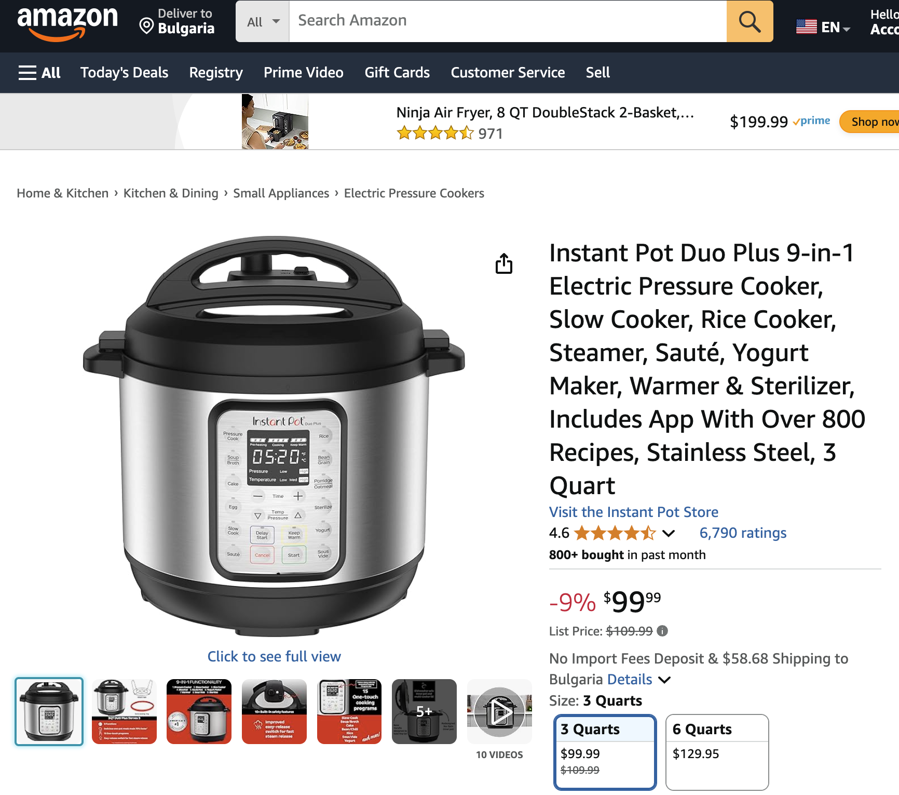
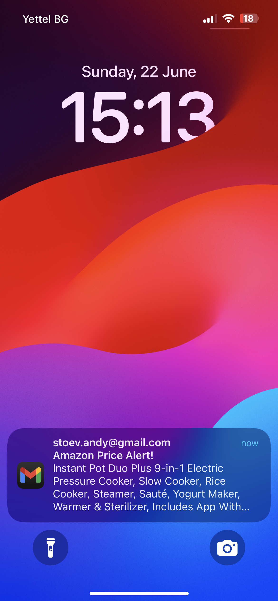
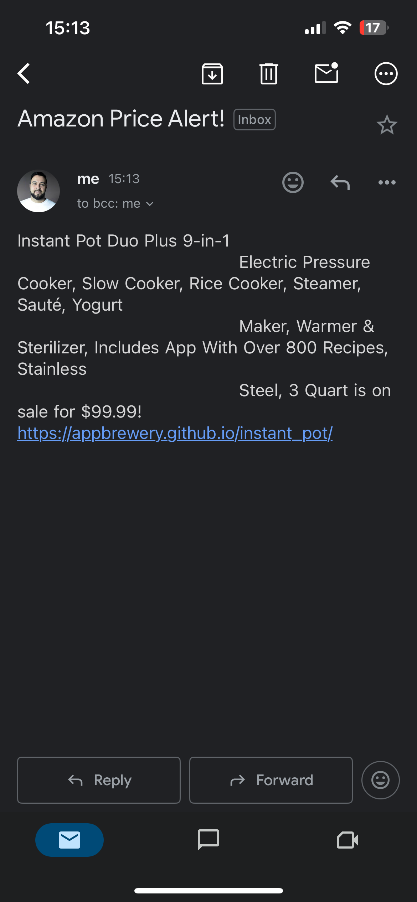

## Topic

- Automated Amazon Price Tracker

## Amazon Price Tracker Project

<h4>
    <a href="main.py">Project code</a>
</h4>

<ol>
    <li>
        

            Target product:
             

            

                
                <h3 style="margin-top: 10px;">Instant Pot Duo 7-in-1</h3>
                
Electric Pressure Cooker, Slow Cooker, Rice Cooker, Steamer, Sauté, Yogurt Maker and Warmer

                <a href="https://www.amazon.com/dp/B075CYMYK6" 
                    style="background: #232F3E; color: white; padding: 5px 10px; text-decoration: none; 
                        border-radius: 3px; display: inline-block; margin-top: 10px;">
                    View on Amazon (Practice Page)
                </a>
                &nbsp;&nbsp;
                <a href="https://www.amazon.com/dp/B075CYMYK6" 
                    style="background: #FF9900; color: white; padding: 5px 10px; text-decoration: none; 
                        border-radius: 3px; display: inline-block; margin-top: 10px;">
                    View on Amazon (Live Page)
                </a>
            

        

    </li>
    <li style="font-size: 1.3em">
        

            Project Result:
            

            
        

    </li>
    <li style="font-size: 1.2em">
        
Result Contents:
            

            
        

    </li>
</ol>