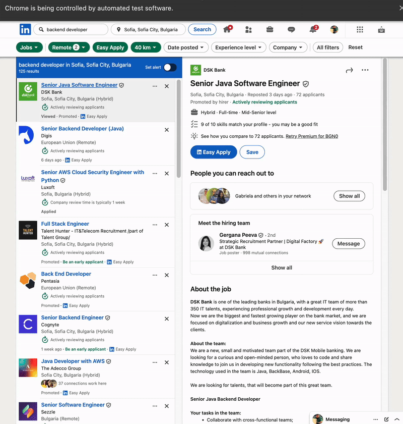
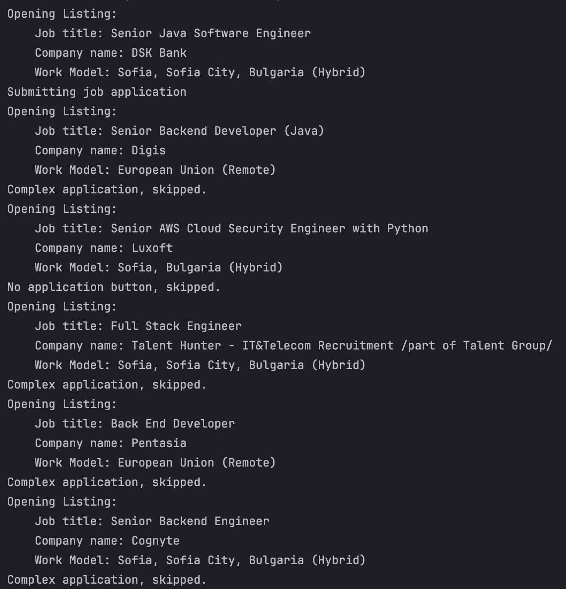

## Topic

- Automating Job Applications on LinkedIn

## Job Applier Bot

<h3>
    <a href="main.py">Project code</a>
</h3>

<ul style="font-size: 1.3em">
    <li>
        

            Your selenium bot that applies for jobs for you because you're a lazy programmer:
            

            
        

    </li>
    <li>
        

            Terminal Output:
            

            
        

    </li>
</ul>

