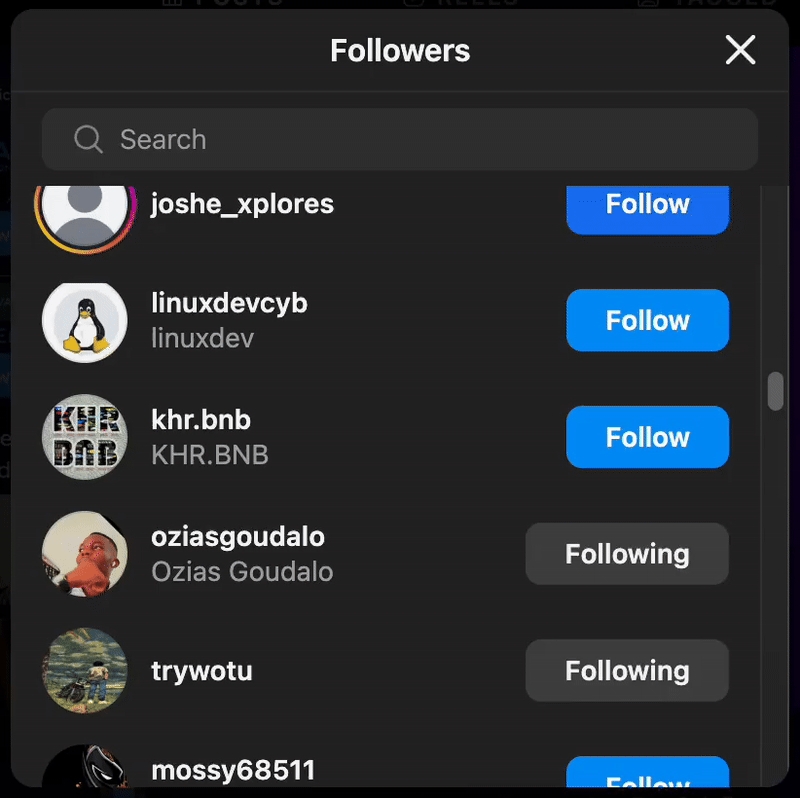

## Topic

- Instagram Follower Bot

## Instagram Follower Bot

<h3>
    

        <a href="main.py">main.py</a>
    

</h3>

<ul style="font-size: 1.2em">
    <li>
        

            Your Instagram bot that follows for you:
            

            
        

    </li>
</ul>