## Topic

- Data Entry Job Automation - Capstone Project

## Zillow Data Entry

<h3>
    

        <a href="main.py">main.py</a>
    

</h3>

<h2>
    Set up your own Google Form
</h2>

    

        First, you need to create a new form in Google Forms,
    

    <ol>
        <li>
            Go to 
            <a href="https://docs.google.com/forms/">https://docs.google.com/forms/</a>
            and create your own form:
            

                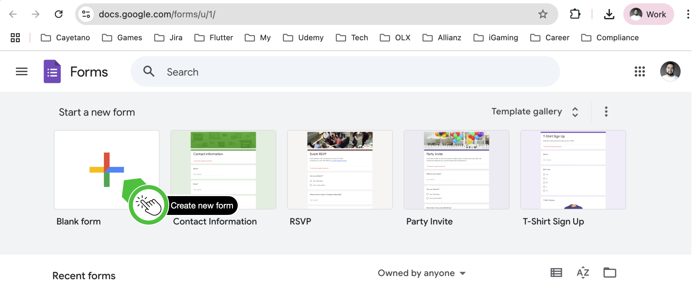
            

        </li>
        <li>
            Add 3 questions to the form, make all questions "short answer":
            

                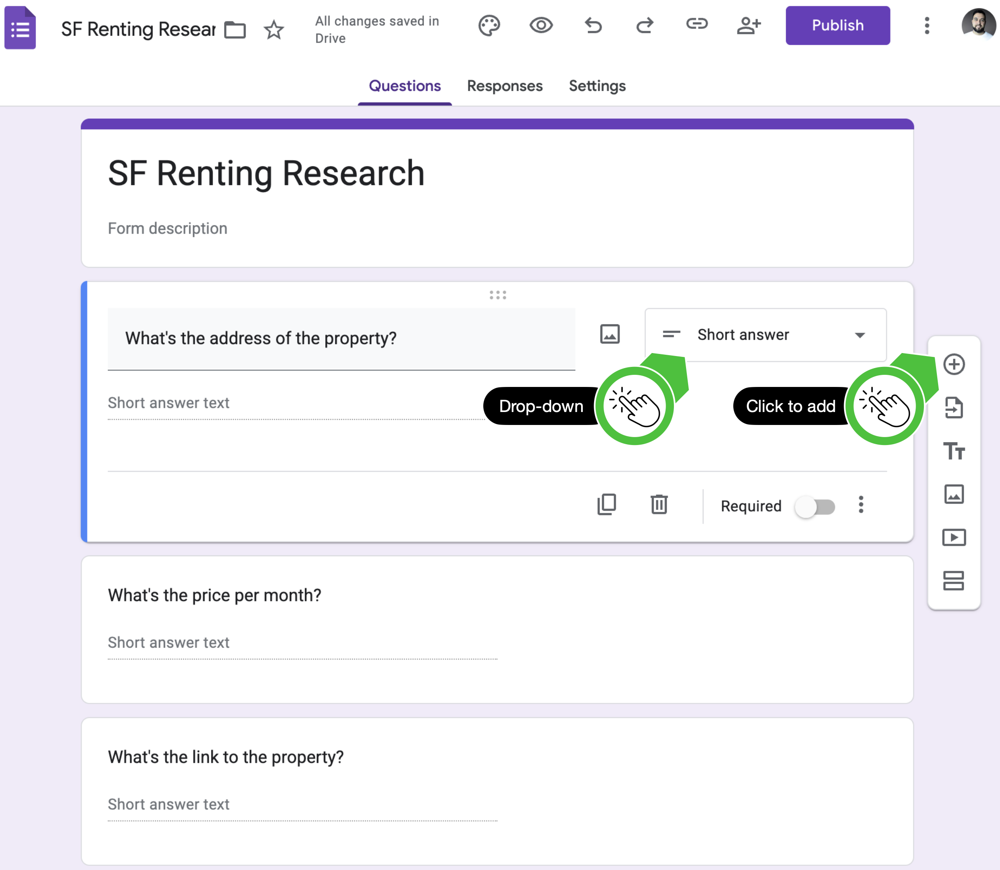
            

        </li>
        <li>
            Click send and copy the link address of the form. You will need to use this in your program.
            

                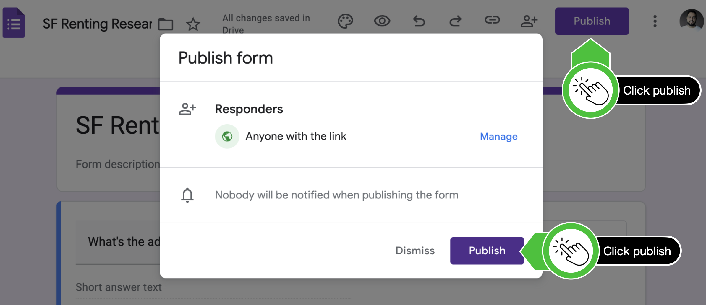
            

            

                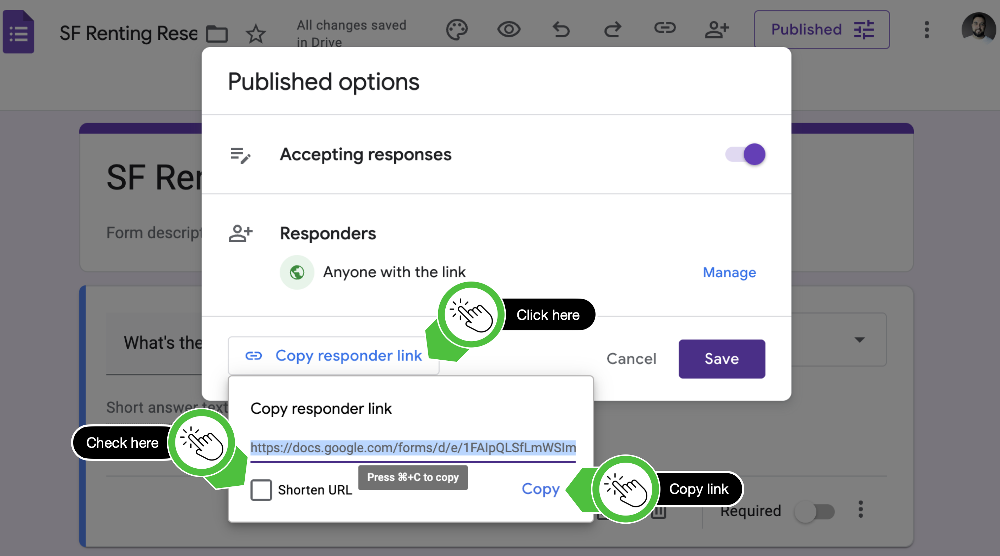
            

        </li>
    </ol>

<h2>
    Go to our Zillow-Clone Website (or use live search)
</h2>

     <ol start="4">
        <li>
            Go to 
            <a href="https://appbrewery.github.io/Zillow-Clone/">https://appbrewery.github.io/Zillow-Clone/</a>
            and see how the website is structured. This is where you'll be scraping the data from:
            

                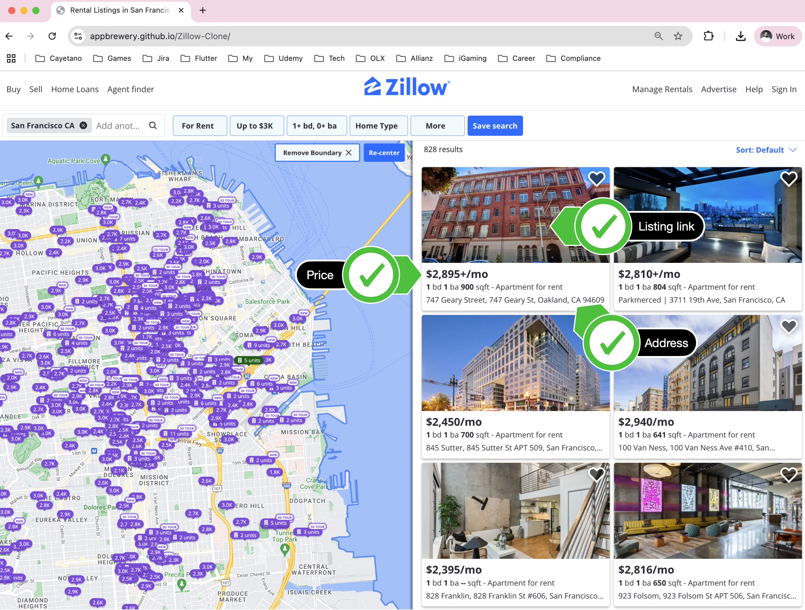
            

        </li>
    </ol>

<h2>
    BeautifulSoup Requirements
</h2>

    <ul>
        <li>
            Use BeautifulSoup/Requests to scrape all the listings from the Zillow-Clone web address (Step 4 above).
        </li>
        <li>
            Create a list of links for all the listings you scraped. e.g.
        </li>
        

            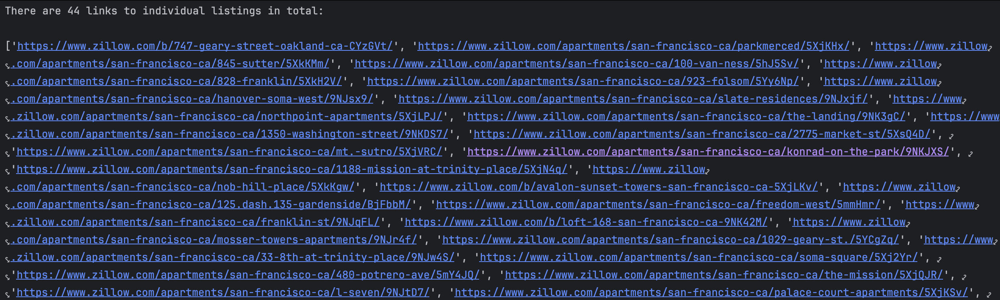
        

        <li>
            Create a list of prices for all the listings you scraped. e.g.
        </li>
        

            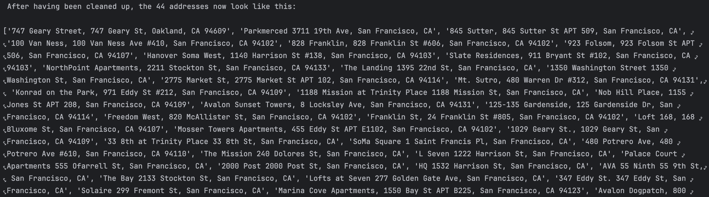
        

    </ul>   
    Clean up the strings, by removing any "+" symbols and other information so that you are only left with a dollar price. The price should look like "$1,234" instead of "$1,234+ /mo"
    <ul>
        <li>
            Create a list of addresses for all the listings you scraped. e.g.
        </li>
        

            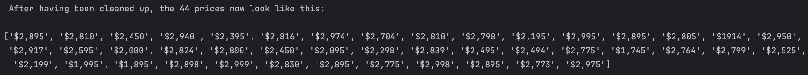
        

    </ul> 
    Clean up the address data as well. Remove any newlines, pipe symbols |, and unnecessary whitespace.

<h3>
    Selenium Requirements
</h3>

    <ul>
        <li>
            Use Selenium to fill in the form you created (step 1,2,3 above). Each listing should have its price/address/link added to the form. You will need to fill in a new form for each new listing. e.g.
        </li>
        

            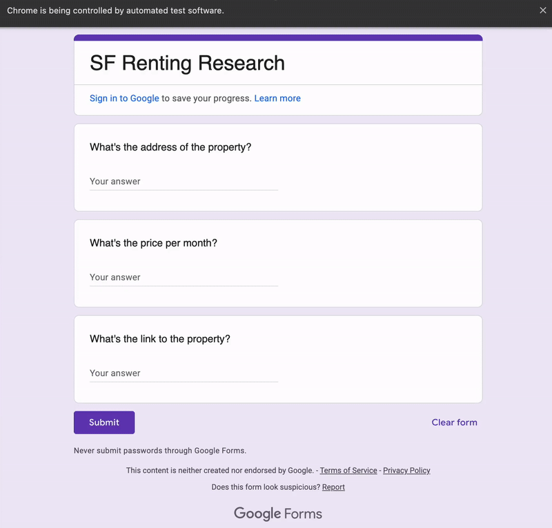
        

        <li>
            Collect responses (observe selenium bot result):
        </li>
        

            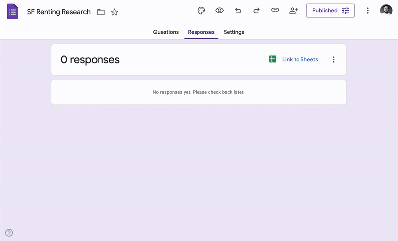
        

        Once all the data has been filled in, click on the "Sheet" icon to create a Google Sheet from the responses to the Google Form. You should end up with a spreadsheet with all the details from the properties.
    </ul>

    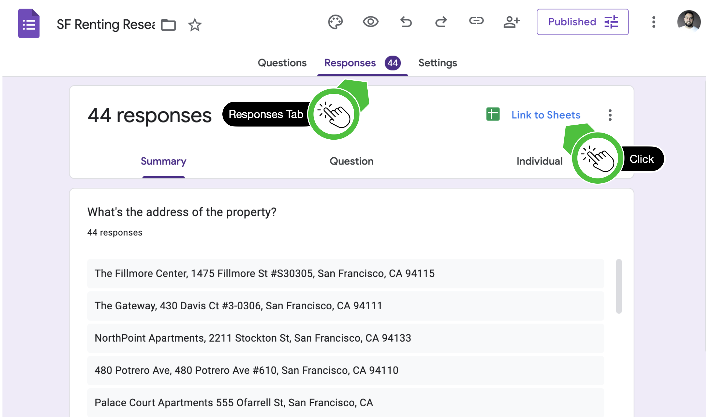

<h3>
    Objective 🎯
</h3>

    You should end up with a spreadsheet that looks something like this.

    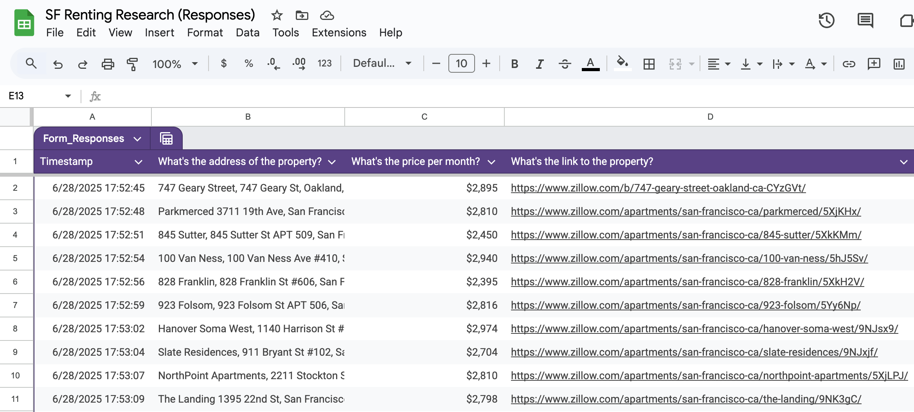

<h3>
    Resources for this project
</h3>

    <a href="https://appbrewery.github.io/Zillow-Clone/">🔗 Zillow Clone Site</a>

<h3>
    Useful or interesting links that contributed to the idea for the project
</h3>

    <a href="https://www.indeed.com/jobs?q=data+entry&l=remote&vjk=5bdca26151adaeeb">🔗 Data Entry Jobs on Indeed</a> 
    <a href="https://www.reddit.com/r/Python/comments/8uxifv/has_anyone_automated_their_job_completely/">🔗 Automating Your Job Reddit</a> 
    <a href="https://workplace.stackexchange.com/questions/93696/is-it-unethical-for-me-to-not-tell-my-employer-i-ve-automated-my-job">🔗 Automated Job Story</a> 
    <a href="https://www.zillow.com/san-francisco-ca/rentals/">🔗 Zillow Property Search</a> 
    <a href="https://docs.google.com/forms/u/0/">🔗 Google Forms</a>

