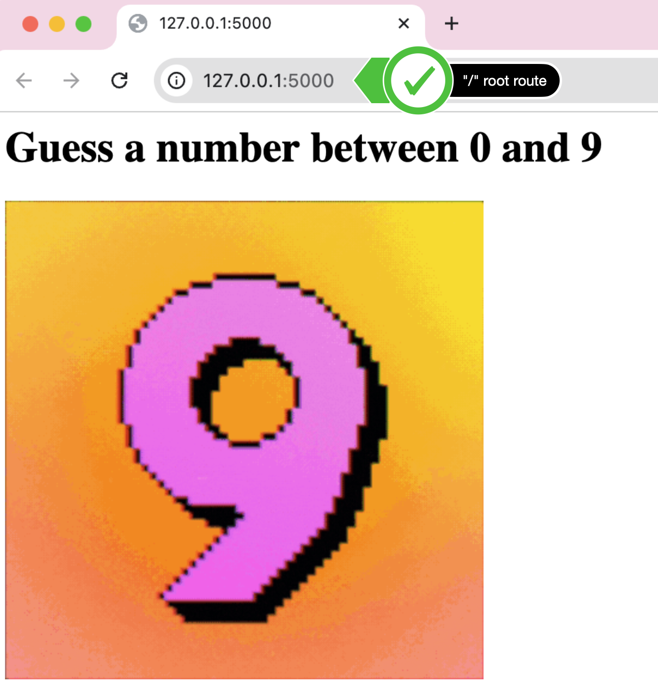
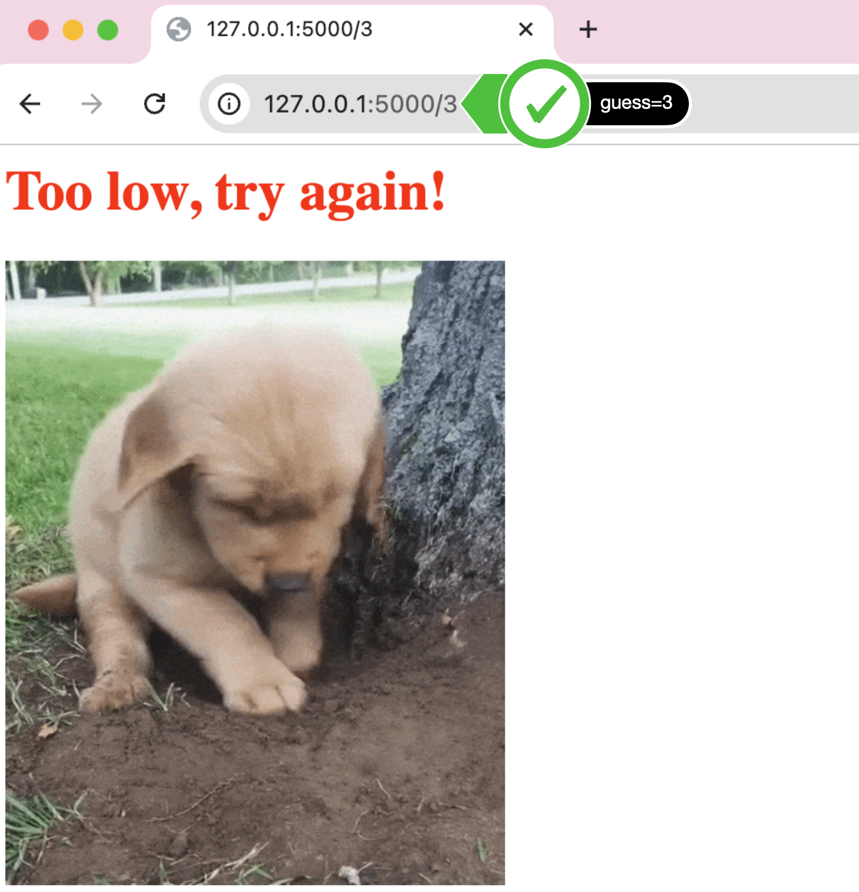
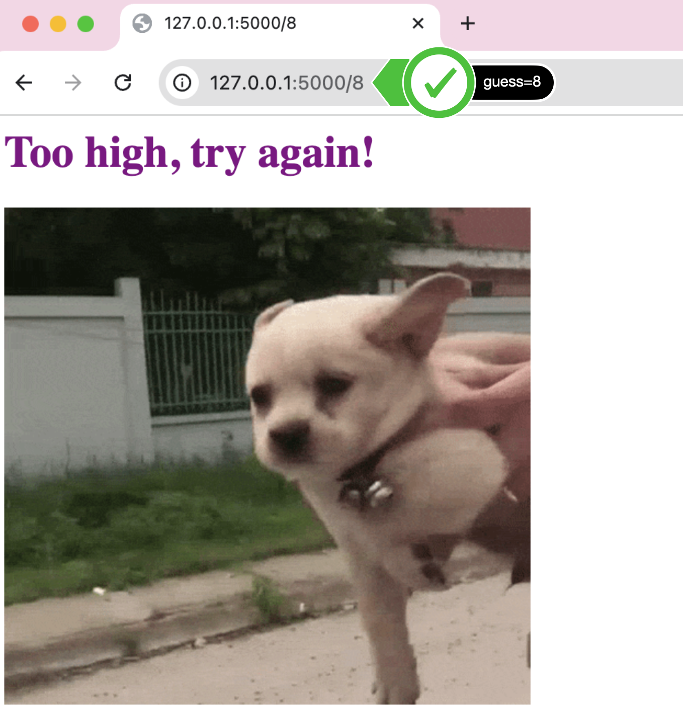
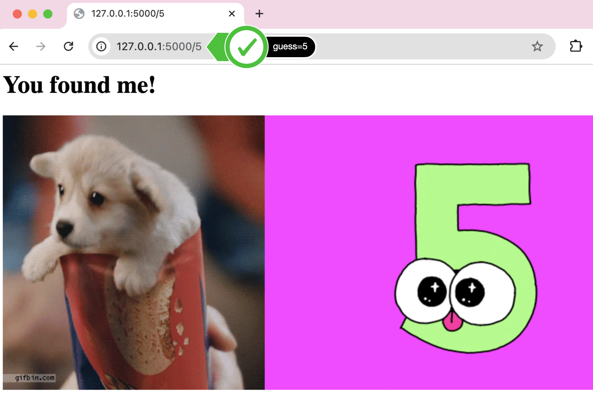

## Topic

- Advanced Decorators
- Rendering HTML
- Parsing URLs
- Flask Debugging

## Higher-Lower Game

<h3>
    

        <a href="higher-lower/server.py">server.py</a>
    

</h3>

    

        Complete the final project of the day, the higher lower game that we created in day 14, 
        but now with a real website.
    

    <ol>
        <li>
            Create a new project in PyCharm called <b>higher-lower</b>, add a server.py file. 
        </li>
        <li>
            Create a new Flask application where the home route displays an &lt;h1&gt; that says 
            "Guess a number between 0 and 9" and display a gif of your choice from 
            <a href="https://giphy.com/">giphy.com</a>.
            Alternatively use 
            <a href="https://media.giphy.com/media/3o7aCSPqXE5C6T8tBC/giphy.gif">this one</a> 
            on Giphy:
            

                
            

        </li>
        <li>
            Generate a random number between 0 and 9 or any range of numbers of your choice.
        </li>
        <li>
            Create a route that can detect the number entered by the user e.g "URL<b>/3</b>" or "URL<b>/9</b>" 
            and checks that number against the generated random number. If the number is too low, tell the user 
            it's too low, same with too high or if they found the correct number. try to make the &lt;h1&gt; text a 
            different color for each page. e.g. If the random number was 5 &rarr; 
            <ul>
                <li>
                    3 is too low:
                    

                        
                    

                </li>
                <li>
                    8 is too high
                    

                        
                    

                </li>
                <li>
                    5 is right
                    

                        
                    

                </li>
            </ul>
        </li>
    </ol>

<h3>
    Flask Docs
</h3>

    <ul>
        <li>
            <a href="https://flask.palletsprojects.com/en/stable/quickstart/#routing">Routing</a>
        </li>
        <li>
            <a href="https://flask.palletsprojects.com/en/stable/quickstart/#variable-rules">Variable Rules</a>
        </li>
    </ul>

<h3>
    Search all the GIFs and Stickers
</h3>

    <ul>
        <li>
            <a href="https://giphy.com/">Giphy</a>
        </li>
    </ul>

