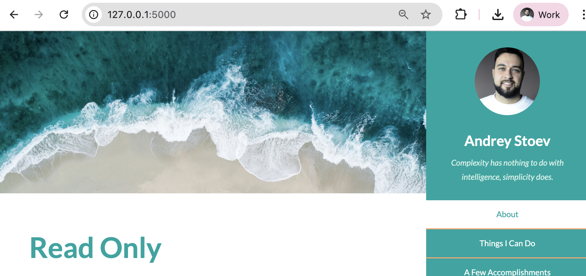

## Topic

- Static files
- HTML/CSS File Rendering
- Personal Name Card Site

## Name Card Website Template

<h3>
    

        <a href="identity/server.py">server.py</a>
    

</h3>

    

        We're going to be using one of the templates on HTML 5 Up to create a web-based name card. 
        Like the old-school paper ones, but better.
    

    

        
    

    <ol>
        <li>
            Download <a href="https://html5up.net/read-only">html5up's "Read Only"</a> template from this lesson's resources 
            (PS: you can also browse the live demo sites on https://html5up.net/ and use a different template 
            like "Astral" or "Ethereal"...)
        </li>
         
        <li>
            Create a new PyCharm project called identity and create a new Flask Application from scratch.
        </li>
         
        <li>
            Create the necessary folders and move the relevant files from the download in step1.
        </li>
         
        <li>
            Get the website to work when you access the root route ("/")
        </li>
         
        <li>
            Personalise the website, change the background image, change the text, change the links, make it your own.
        </li>
        
This is what you're aiming for:

        

            
        

    </ol>

<h3>
    Rendering HTML Files with Flask
</h3>

    <ul>
        <li>
            <a href="https://flask.palletsprojects.com/en/stable/quickstart/#rendering-templates">Flask Docs: Rendering Templates</a>
        </li>
        <li>
            <a href="https://flask.palletsprojects.com/en/stable/patterns/favicon/">Adding a favicon</a>
        </li>
    </ul>

<h3>
    Assets
</h3>

    <ul>
        <li>
            <a href="https://html5up.net/">HTML5 UP Website Templates</a>
        </li>
        <li>
            <a href="https://simpleicons.org/">Simple Icons</a>
        </li>
        <li>
            <a href="https://unsplash.com/">Unsplash: Beautiful Free Images & Pictures</a>
        </li>
    </ul>

<h3>
    Useful
</h3>

    <ul>
        <li>
            In Console (F12) <code>document.body.contentEditable=true</code>
        </li>
    </ul>

