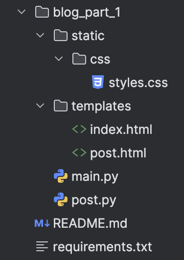
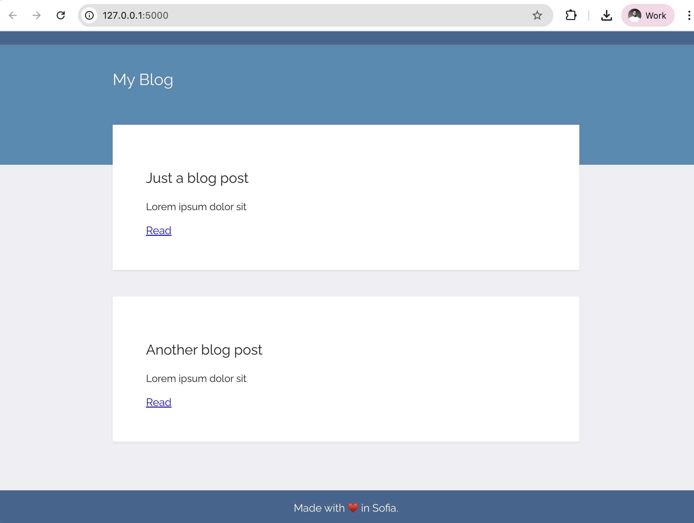
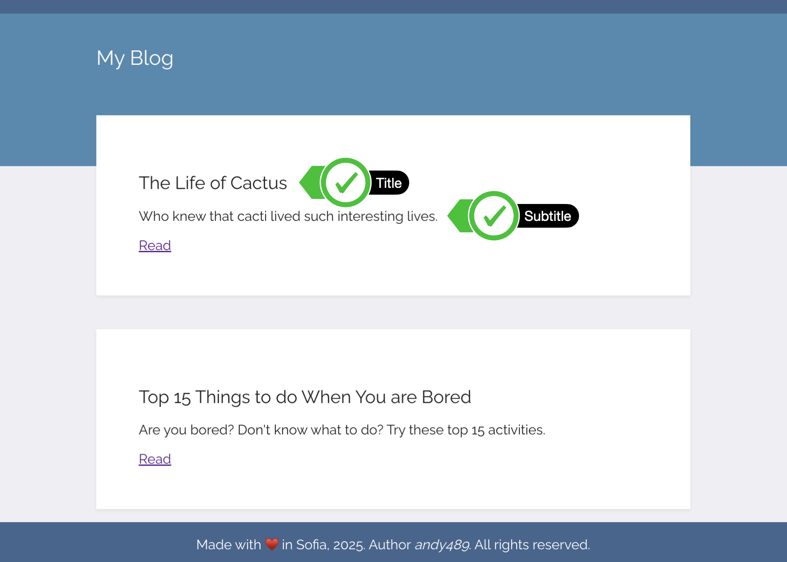
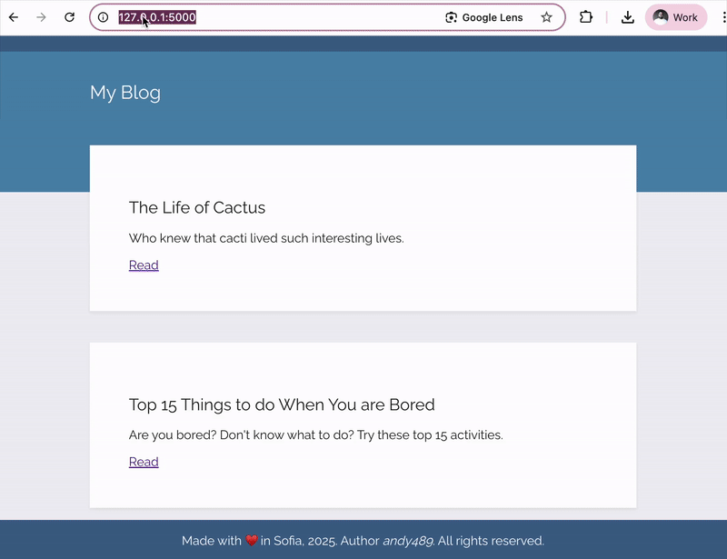

## Topic

- URL Building
- Templating with Jinja in Your Flask Application

## Blog Capstone Project Part 1 - Templating

<h3>
    

        <a href="blog_part_1/server.py">server.py</a>
    

</h3>

    <ol>
        <li>
            Head over to the course resources and download the starting files for this project.
        </li>
         
        

            
        

        <li>
            Run the <b>server.py</b> file, and you should see the following styling and website rendered:
        </li>
         
        

            
        

         
        <li>
            Using the API for our 
            <a href="https://www.npoint.io/docs/c790b4d5cab58020d391">
                blog posts we created on n:Point
            </a>
            , render all the blogs' title and subtitles on the home page. e.g
        </li>
         
        

            
        

         
        <li>
            Make a <b>"Read"</b> anchor tag at the end of each blog post preview link to a page with the entire blog - 
            <code>title</code>, <code>subtitle</code> and <code>body</code>. The individual blog posts should 
            live at the path: URL/post/blog_id
             
            e.g.
        </li>
        

            
        

    </ol>

<h3>
    Using Jinja to Produce Dynamic HTML Pages
</h3>

    <ul>
        <li>
            <a href="https://flask.palletsprojects.com/en/stable/quickstart/#rendering-templates">Flask Docs: Rendering Templates</a>
        </li>
        <li>
            <a href="https://jinja.palletsprojects.com/en/stable/templates/">Jinja: Template Designer Documentation</a>
        </li>
        <li>
            <a href="https://updateyourfooter.com/">Update Your Footer</a>
        </li>
    </ul>

<h3>
    Combining Jinja Templating with APIs
</h3>

    <ul>
        <li>
            <a href="https://genderize.io/">Genderize API</a>
        </li>
        <li>
            <a href="https://agify.io/">Agify API</a>
        </li>
    </ul>

<h3>
    Multiline Statements with Jinja
</h3>

    <ul>
        <li>
            <a href="https://flask.palletsprojects.com/en/stable/quickstart/#routing">Flask Docs: Routing</a>
        </li>
        <li>
            <a href="https://www.npoint.io/docs/c790b4d5cab58020d391">"npoint" Example Blog Data</a>
            <ul>
                <li>
                    <a href="https://api.npoint.io/c790b4d5cab58020d391">Blog Data as Rest Service: Endpoint</a>
                </li>
            </ul>
        </li>
        <li>
            <a href="https://www.npoint.io/">Create your own bin with npoint.io</a>
        </li>
    </ul>

