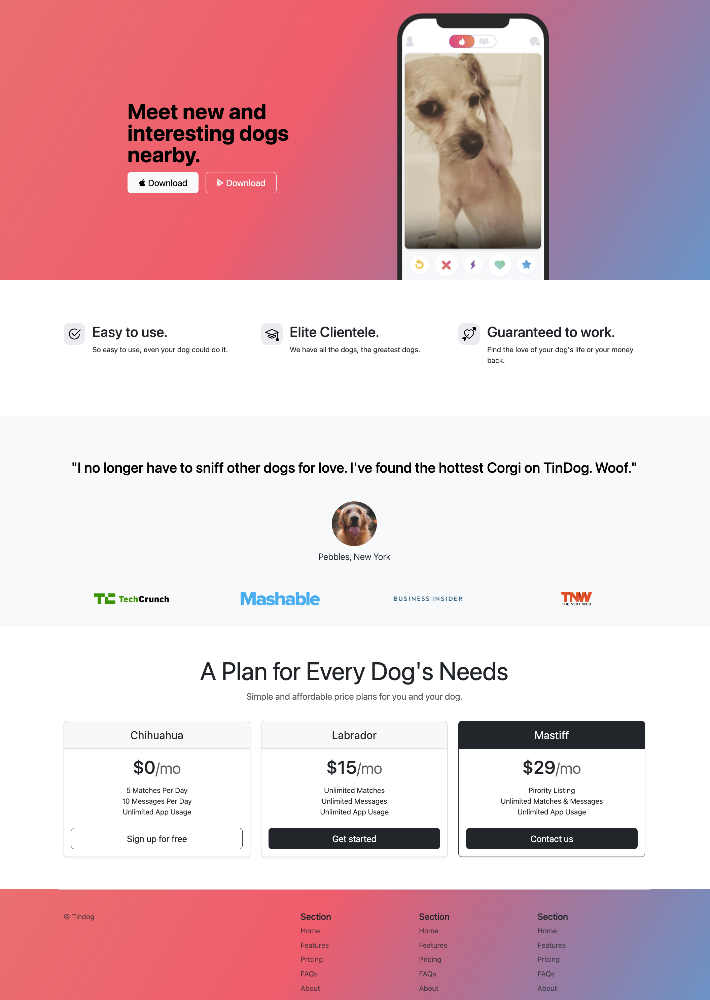

## Topic

- External Layout Systems - Bootstrap Framework
- Bootstrap Elements

## Startup Website for TinDog

<h3>
    

        <a href="tin_dog/index.html">index.html</a>
    

</h3>

    

<h3>
    Using Jinja to Produce Dynamic HTML Pages
</h3>

    <ul>
        <li>
            <a href="https://getbootstrap.com/">Main Bootstrap Site</a>
        </li>
        <li>
            <a href="https://getbootstrap.com/docs/5.3/getting-started/introduction/">Bootstrap Documentation</a>
        </li>
    </ul>

