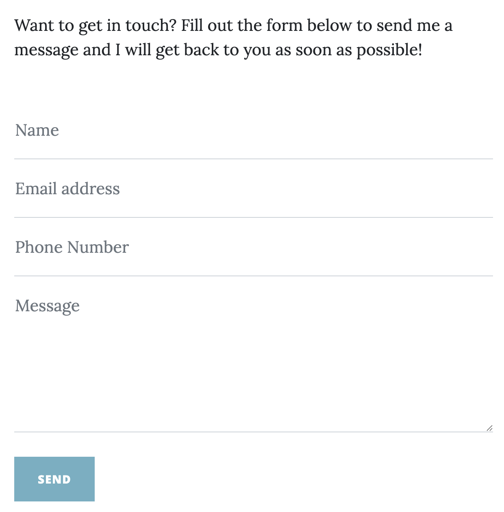
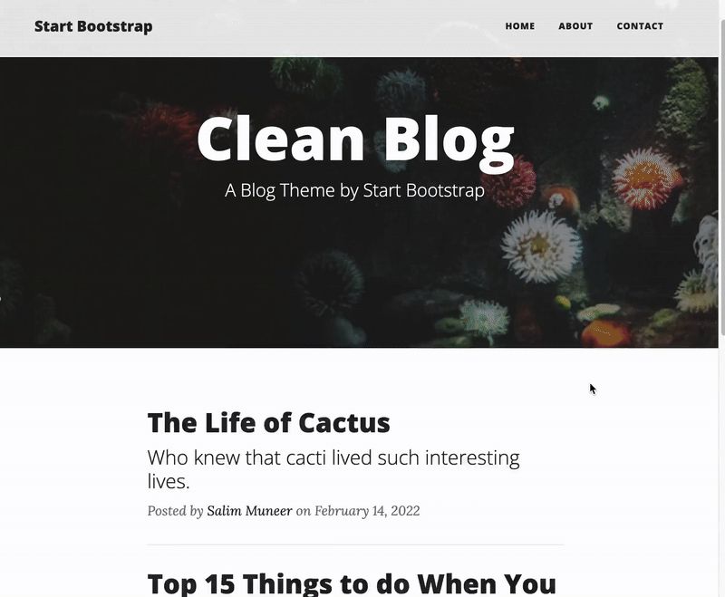

## Blog Capstone Project Part 2 - Adding Styling

<h3>
    

        <a href="">___</a>
    

</h3>
<h3>
    Blog upgrade
</h3>

    

    

        Previously we've built a simple blog with simple CSS styling. It had no fancy animations and was not mobile 
        responsive. Now that we've learnt all about Bootstrap and how much time it can save us, we're going to upgrade 
        our blog with the power of Bootstrap.
    

    

        The best part? We don't even have to write the Bootstrap code.
    

    <h3>Bootstrap Templates</h3>
    

        On the internet, there are hundreds of thousands of free Bootstrap templates.
        Beautifully designed websites using Bootstrap that are ready to go. All we need is to understand how Bootstrap 
        works (Day 58) and then we can simply customise these beautiful websites for our own purposes.
    

    
e.g.

    <ul>
        <li>
            <a href="https://bootstrapmade.com/">https://bootstrapmade.com/</a>
        </li>
        <li>
            <a href="https://getbootstrap.com/docs/5.0/examples/">https://getbootstrap.com/docs/5.0/examples/</a>
        </li>
        <li>
            <a href="https://www.creative-tim.com/bootstrap-themes/free">https://www.creative-tim.com/bootstrap-themes/free</a>
        </li>
    </ul>
    <h3>What you Will Build</h3>
    
By the end of today, you will build a blog website with these features:

    <ul>
        <li>
            <b>multi-page</b> website with an <b>interactive</b> navigation bar:
        </li>
        

            
        

        <li>
            <b>dynamically</b> generated blog post pages with full screen titles:
        </li>
        

            
        

        <li>
            Fully <b>mobile responsive</b> with an adaptive navigation bar:
        </li>
        

            
        

    </ul>

