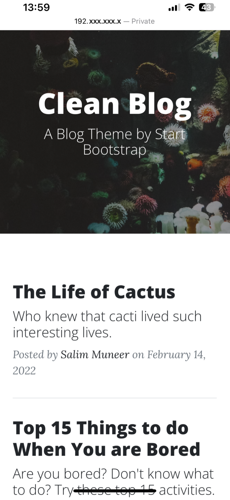
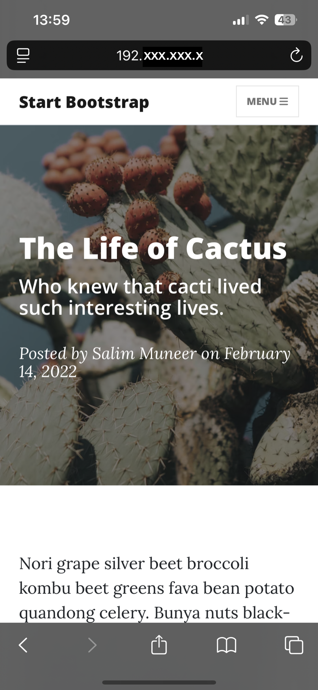

## Blog Capstone Project Part 2 - Adding Styling

<h3>
    

        <a href="./server.py">server.py</a>
    

</h3>
<h3>
    Blog upgrade
</h3>

    

    

        Previously we've built a simple blog with simple CSS styling. It had no fancy animations and was not mobile 
        responsive. Now that we've learnt all about Bootstrap and how much time it can save us, we're going to upgrade 
        our blog with the power of Bootstrap.
    

    

        The best part? We don't even have to write the Bootstrap code.
    

    <h3>Bootstrap Templates</h3>
    

        On the internet, there are hundreds of thousands of free Bootstrap templates.
        Beautifully designed websites using Bootstrap that are ready to go. All we need is to understand how Bootstrap 
        works (Day 58) and then we can simply customise these beautiful websites for our own purposes.
    

    
e.g.

    <ul>
        <li>
            <a href="https://bootstrapmade.com/">https://bootstrapmade.com/</a>
        </li>
        <li>
            <a href="https://getbootstrap.com/docs/5.0/examples/">https://getbootstrap.com/docs/5.0/examples/</a>
        </li>
        <li>
            <a href="https://www.creative-tim.com/bootstrap-themes/free">https://www.creative-tim.com/bootstrap-themes/free</a>
        </li>
    </ul>
    <h3>What are we going to build?</h3>
    
A blog website with these features:

    <ul>
        <li>
            <b>multi-page</b> website with an <b>interactive</b> navigation bar:
        </li>
        <li>
            <b>dynamically</b> generated blog post pages with full screen titles:
        </li>
        <li>
            Fully <b>mobile responsive</b> with an adaptive navigation bar:
        </li>
         
        

            
        

    </ul>

<h2>
    Access the server from any device on the network
</h2>
<ul style="font-size:1.2em">
    <li>
        <code>app.run(debug=True, host='0.0.0.0', port=5000)</code>
    </li>
    <ol style="list-style-type: decimal;">
        <li>
            <code>app.run()</code>
            <ul>
                <li>
                    This starts the Flask development server for your web application.
                </li>
                <li>
                    <code>app</code> is typically an instance of the Flask class (e.g., <code>app = Flask(__name__))</code>.
                </li>
            </ul>
        </li>
        <li>
            <code>debug=True</code>
            <ul>
                <li>
                    <b>Enables debug mode</b>, which provides:
                    <ul>
                        <li>Automatic reloading of the server when you modify code (no need to manually restart).</li>
                        <li>Detailed error pages with stack traces and interactive debugging if an error occurs.</li>
                    </ul>
                </li>
                <li>
                    <b>Warning:</b> Debug mode should only be used in development, not in production, 
                    as it can expose sensitive information.
                </li>
            </ul>
        </li>
        <li>
            <code>host='0.0.0.0'</code>
            <ul>
                <li>
                    By default, Flask binds to <code>localhost</code> (<code>127.0.0.1</code>), 
                    meaning the server is only accessible from your local machine.
                </li>
                <li>
                    Setting <code>host='0.0.0.0'</code> makes the server accessible from any device on the network 
                    (e.g., other computers or mobile devices on the same LAN).
                </li>
                <li>Useful for testing on multiple devices or in containerized environments (like Docker).</li>
            </ul>
        </li>
        <li>
            <code>port=5000</code>
            <ul>
                <li>Specifies that the server should run on port <b>5000</b> 
                (Flask's default port is <code>5000</code>, but you can change it if needed).
                </li>
                <li>
                    If the port is already in use, you'll get an error and may need to choose another 
                    (e.g., <code>port=5001</code>).
                </li>   
            </ul>
        </li>
    </ol>
</ul>

<h2>
    Check your IP address
</h2>
<ol style="font-size:1.2em">
    <li>
        <code>ipconfig getifaddr en0</code>
    </li>
    <li>
        Open a web browser on your phone (Chrome, Safari, etc.). Enter your computer's IP followed by the port:
        <code>http://&lt;your-computer-ip&gt;:&lt;port&gt;</code>
    </li>
     
    

        
    

     
    

        
    

</ol>