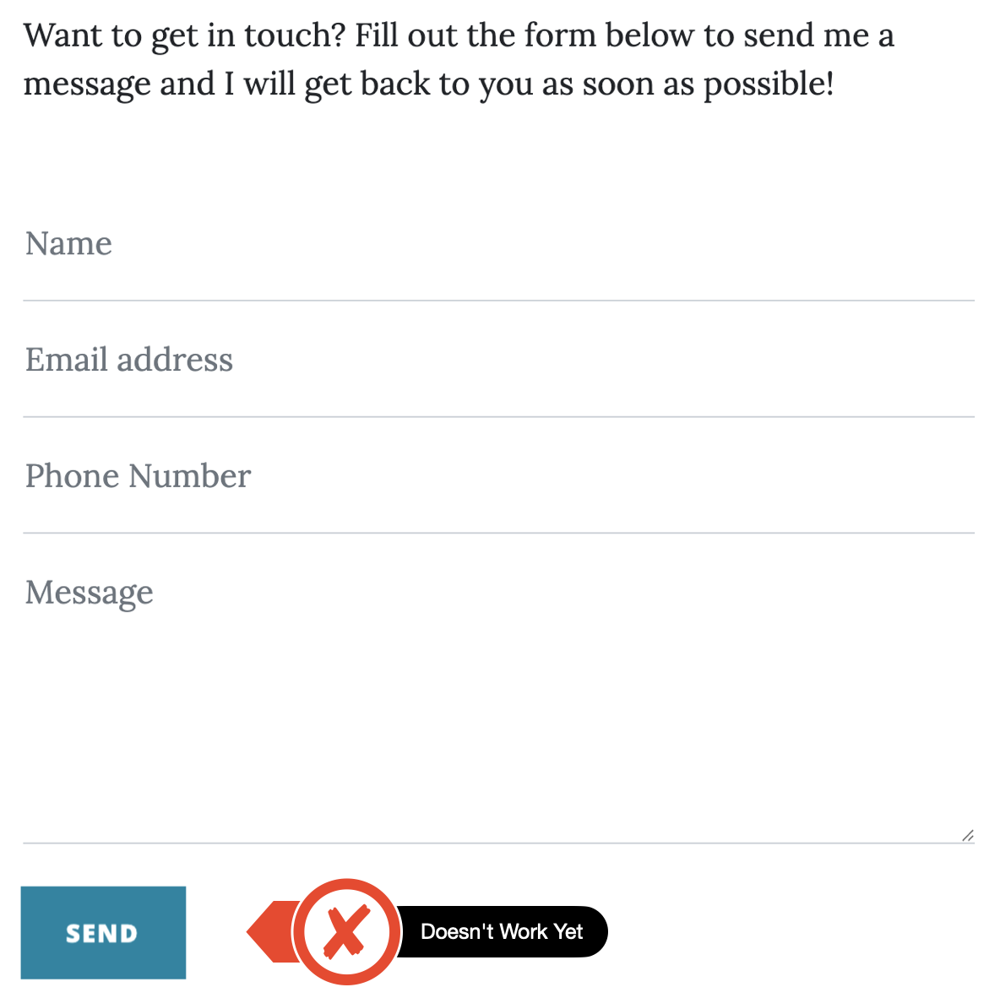
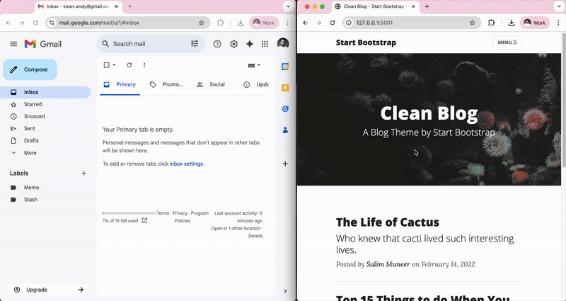

## Blog Capstone Project Part 2 - Adding Styling

<h3>
    

        <a href="./server.py">server.py</a>
    

</h3>
<h3>
    Blog upgrade
</h3>

    

    

        We already built an upgraded version of our blog website that uses Bootstrap for styling. 
        The only part of the website that doesn't work is the contact form on the Contact Page.
        This is because we need to learn about submitting HTML forms and catching the submitted data in our Flask server. 
    

    <h3>HTML Forms in Flask</h3>
    

        So the goal for today is to understand how HTML forms are submitted and how to use the data from the form to 
        actually send an email to ourselves with the data submitted by the user.
    

<h3>Sending Email with smtplib</h3>

    

        We've learnt how to send email using smtplib already (e.g. Day 32), let's use this knowledge to make the 
        contact form complete and actually send us (website owner) an email when a user is trying to get in touch. 
    

    

        Result: 
    

    

        
    

https://www.w3schools.com/tags/att_form_method.asp

https://www.w3schools.com/tags/att_form_action.asp