## Building Advanced Forms with Flask-WTForms

<h3>
    

        <a href="./server.py">server.py</a>
    

</h3>

    

    

        <b>CHALLENGE</b>: Read 
        <a href="https://flask-wtf.readthedocs.io/en/1.0.x/quickstart/">
            Flask-WTF Quickstart - Creating Forms
        </a> and use it to figure out how to create a simple login form.
    

    

        SPECIFICATIONS:
    

    <ul>
        <li>
            It must have an <code>email</code> and <code>password</code> field.
        </li>
        <li>
            They can both be <code>StringFields</code>.
        </li>
        <li>
            You don't have to worry about <code>validators</code>.
        </li>       
        <li>
            Both <code>email</code> and <code>password</code> inputs should be size <b>30</b>. (This describes the width of the input).
        </li>
        <li>
            You should <b>not</b> need to create any <code>&lt;label&gt;</code> or <code>&lt;input&gt;</code> elements manually using HTML.
        </li>
    </ul>
    

        HINT: If you want to add csrf protection, you will need to add the following code in your login.html:
    

    

        <code>{{ form.csrf_token }}</code>
    

    

        and you will need to create a 
        <a href="https://stackoverflow.com/questions/22463939/demystify-flask-app-secret-key">secret key</a> 
        in your main.py, which will be used to generate the csrf_token. e.g.
    

    

        <code>app.secret_key = "some secret string"</code>
    

    

        This is what you're aiming for:
    

    

        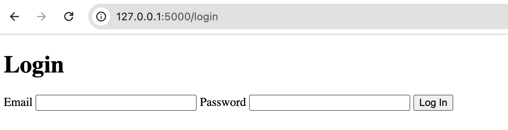
    

    <h2>Code Improvements for Our WTForms</h2>
    <h3>A Few Code Improvements</h3>
    <ol>
         
        <li>We can change the <code>password</code> input to use a <code>PasswordField</code> from WTForms, this will 
        obscure the text typed into the input.</li>
         
        

            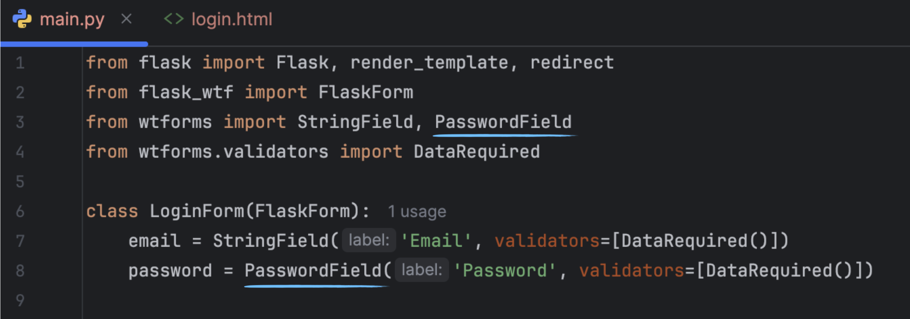
        

         
        

            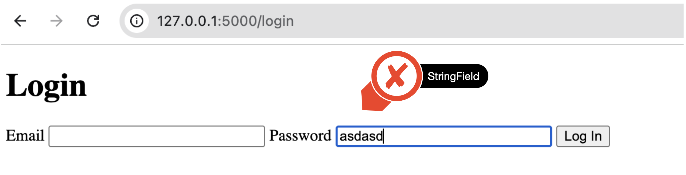
        

         
        

            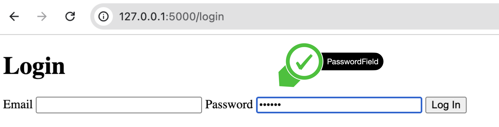
        

        
There are plenty of other fields you can read about in the WTForms documentation:
            <a href="https://wtforms.readthedocs.io/en/3.0.x/fields/#basic-fields">
                https://wtforms.readthedocs.io/en/3.0.x/fields/#basic-fields
            </a>
        

        <li>
            

                The arguments given when creating a <code>StringField</code> or <code>PasswordField</code> is for the 
                <code>label</code> property of the form field. Even though the Quickstart doesn't add it, I prefer adding 
                the keyword argument when it's not clear what the argument is for.
            

            

                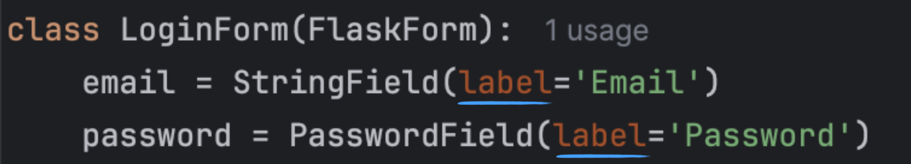
            

            

                This is the <code>label</code> property in use in login.html when our <code>form</code> object 
                is passed over.
            

            

                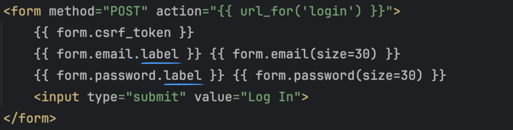
            

        </li>
        <li>
            

                You might have already done this, but in the Quickstart, they set the form action to <code>"/"</code>, 
                which is a static path. It's always a good idea to use dynamically built urls like this:
            

            

                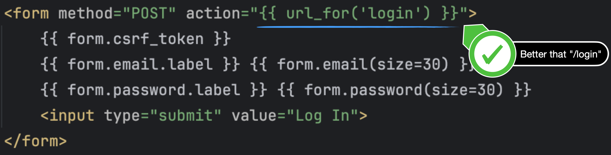
            

        </li>
        <li>We can also better format the layout of the labels and inputs in our WTForms 
            generated form by using normal HTML elements.
            
e.g.

            

                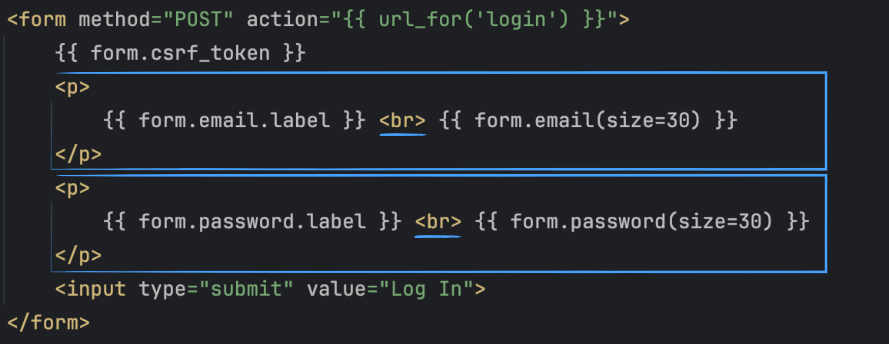
            

            
This will result in the following layout:

             
            

                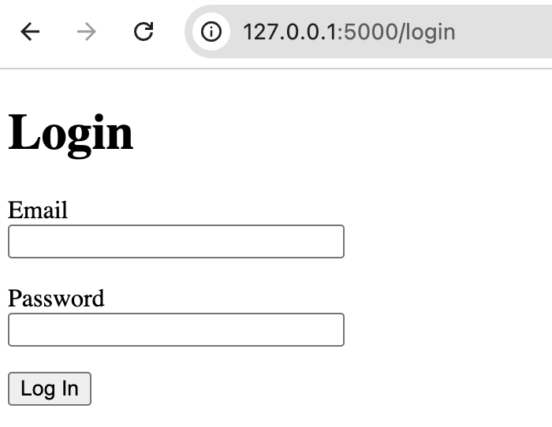
            

        </li>
        <li>
            Finally, did you spot the <code>SubmitField</code> when you were looking at the 
            <a href="https://wtforms.readthedocs.io/en/3.0.x/fields/#basic-fields">documentation</a> in Step 1 ? 
            This can be used to replace the submit input/button.
             
             
            

                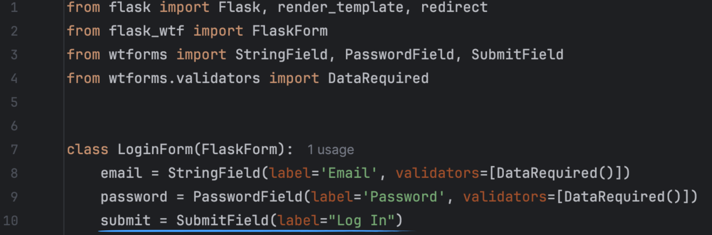
            

             
            

                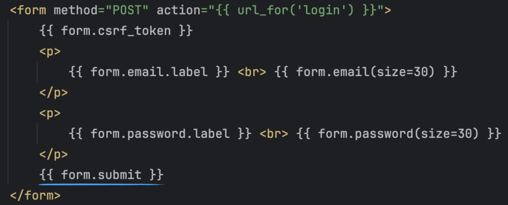
            

        </li>
    </ol>
    <h3>Adding Validation to Forms with Flask-WTF</h3>
    

        One of the biggest reasons why we would choose WTForms over HTML Forms is the built-in validation. 
        Instead of us having to write our own validation code e.g. emails should contain a "@" and a "." 
        to be valid or make sure that passwords are minimum of 8 characters, we can use all these 
        validation rules straight out of the box from WTForms.
    

    <ol>
        <li>We can add validator objects when we create each field in our form. e.g.</li>
         
        

            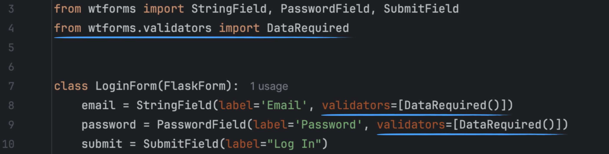
        

        
<a href="https://wtforms.readthedocs.io/en/3.0.x/crash_course/#validators">Documentation</a>

        

            The <code>validators</code> parameter accepts a <b>List</b> of validator <b>Objects</b>. DataRequired 
            makes the two fields required fields, so the user must type something, otherwise an error will be generated.
        

        

            When a form is submitted, there may be a number of errors, so a List of <code>errors</code> can be 
            generated and passed over to our form HTML as a property on the field which generated the error, e.g.
        

        
<code>form.&lt;field&gt;.errors</code>

        <li>We can tap into these errors and loop through them to show some text when an error appears.</li>
        
<a href="https://wtforms.readthedocs.io/en/3.0.x/crash_course/#displaying-errors">Documentation</a>

        

            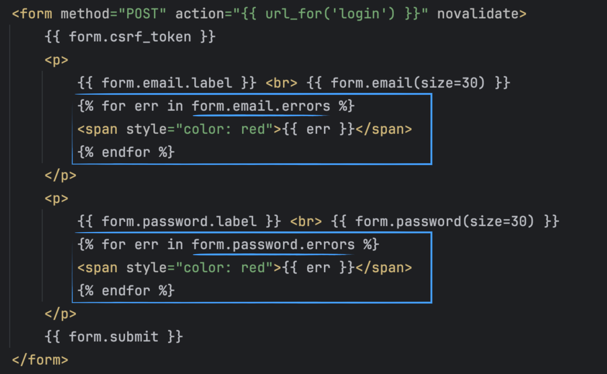
        

        <li>The final step is to tell our form to validate the user's entry when they hit submit. 
        So we have to edit our route and make sure it is able to respond to <code>POST</code> requests and then 
        to <code>validate_on_submit().</code>
        </li>
         
        

            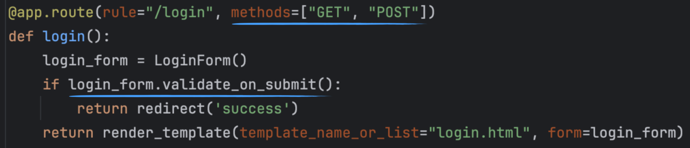
        

        

            If you tried to test your form at the moment, you will see that if you leave a field empty, 
            it might give you a pop-up e.g. on Chrome:
        

        

            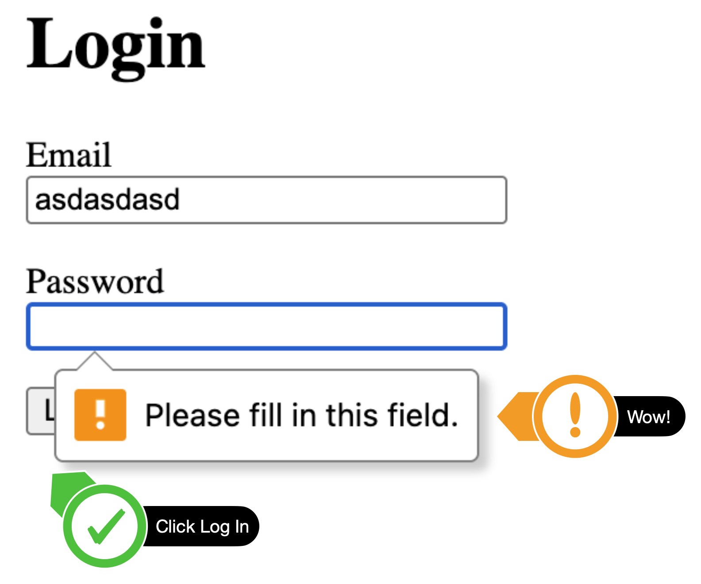
        

        

            This behaviour is not from our validator, in fact it's a built-in mechanism that varies from 
            browser to browser. You'll see something different on Firefox or Safari. But If your user is 
            running Internet Explorer, they won't see any validation.
        

        <li>
            In order to make sure that we are giving all users field validation, we have to switch off the browser 
            validation, and we do that with an attribute on the form element called <code>novalidate</code>.
        </li>
         
        

            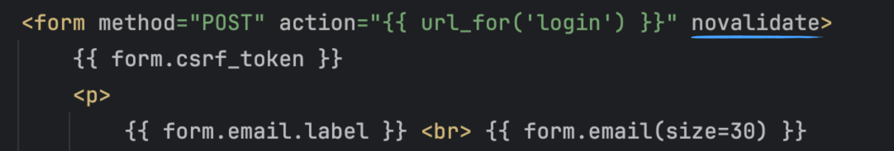
        

        

            Now test your validation, it should give you a warning in red if you leave any field empty 
            and click "Log In". e.g.
        

        

            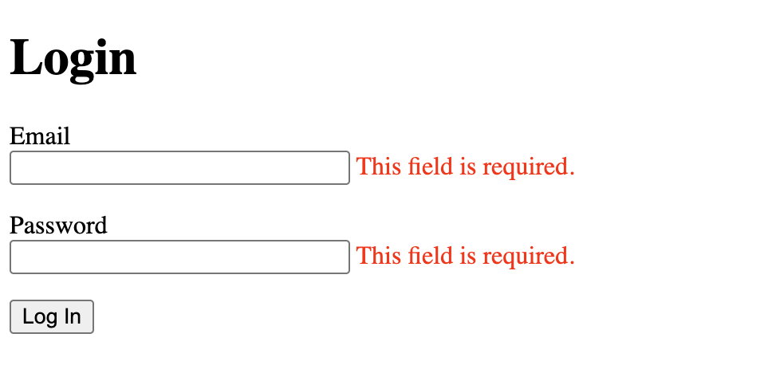
        

        

            CHALLENGE: Using <a href="https://wtforms.readthedocs.io/en/3.0.x/validators/#module-wtforms.validators">
            the documentation on WTForm validators</a>, add <code>Email</code> validation to the email field 
            so that you must type a <code>valid email</code> (with "@" and ".") otherwise you get an error. 
            Also add <code>Length</code> validation to the password, so you must type at least <b>8 characters</b>.
        

        
e.g. Email without "@" and 4 character password:

        

            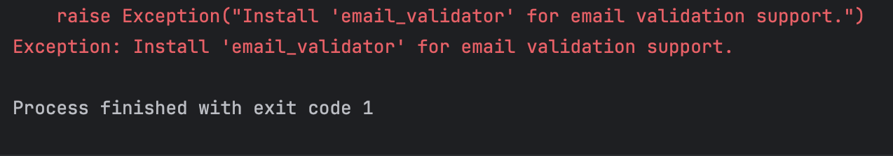
        

        

            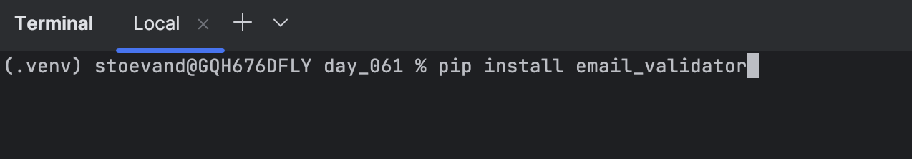
        

        

            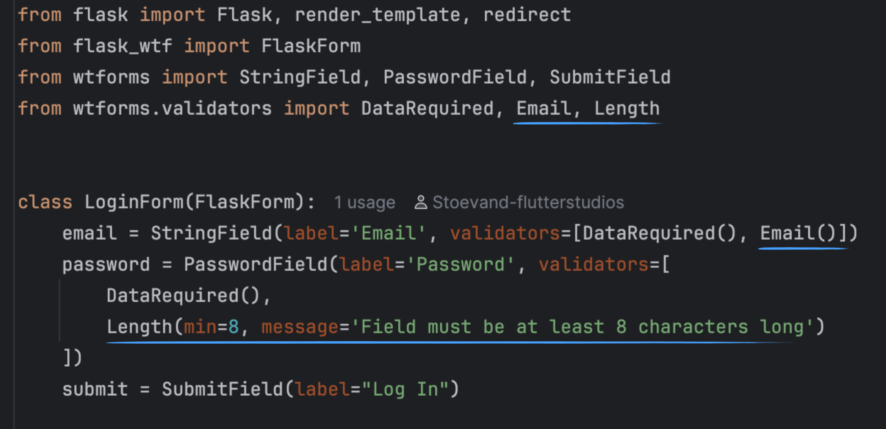
        

        

            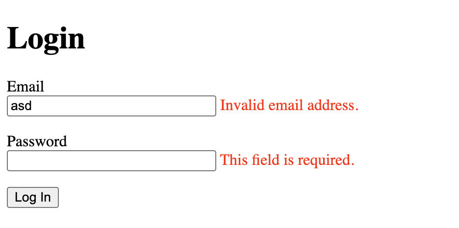
        

    </ol>
    <h3>
        Receiving Form Data with WTForms
    </h3>https://wtforms.readthedocs.io/en/3.0.x/crash_course/#how-forms-get-data
    

        We saw that when using a basic HTML form, we can use the request object from Flask to access 
        the key-value pairs that were entered into the form when the POST request was made.
    

    

        With WTForms, it's even easier to get hold of the form data. All you have to do is to tap into the
    

    
<code>&lt;form_object&gt;.&lt;form_field&gt;.data</code>

    
<a href="https://wtforms.readthedocs.io/en/3.0.x/crash_course/#how-forms-get-data">Documentation</a>

    

        But one thing we should check before printing the field data is whether if the form has been submitted 
        (POST request) or if it's GET request when the form is being rendered.
    

    
Previously we used

    
<code>if request.method == "POST"</code>

    

        Now, we're simply going to check the return value of <code>validate_on_submit()</code> which will be 
        <code>True</code> if validation was <b>successful after the user submitted the form</b>, 
        or <code>False</code> if it failed.
    

    

        
    

    

        CHALLENGE: Update the <code>/login</code> route in <b>main.py</b> so that if the form was <b>submitted</b> and 
        <b>validated</b> and their <b>credentials</b> matched the following:
    

    
email: <b>admin@email.com</b>

    
password: <b>12345678</b>

    
email: <b>admin@email.com</b>

    
then show them the <b>success.html</b> page.

    
Otherwise, show them the <b>denied.html</b> page

    
e.g.

    

        <h4>Access Denied</h4>
        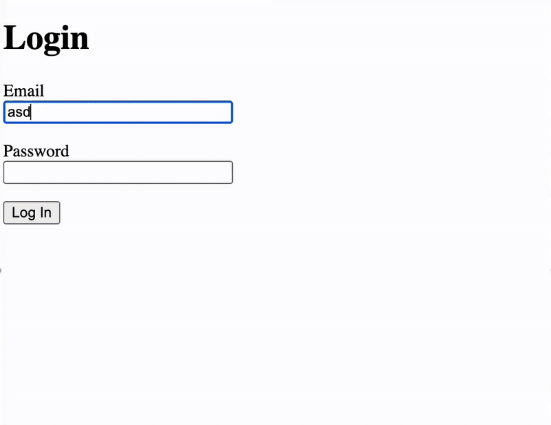
    

    

        <h4>Access Granted</h4>
        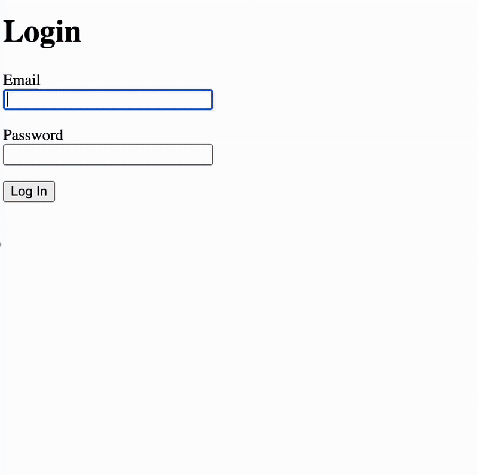
    

    <h3>Inheriting Templates Using Jinja2</h3>
    

        Previously, we saw that we can inject a header.html and footer.html using Jinja and the code might 
        look something like this:
    

    <code></code>
     
    <code>Web page content</code>
     
    <code></code>
    

        This is a really flexible way of using Jinja to Template a website. It means that if your header and 
        footer stay the same then you can just insert them into all your webpages.
    

    <h3>Template Inheritance</h3>
    

        However, often you'll find that you actually want to use the same design template for your entire website, 
        but you might need to change some code in your header or footer. In these cases, it's better to use 
        <b>Template</b> Inheritance instead.
    

    

        Template inheritance is similar to Class inheritance, you can take a parent template and extend its styling 
        in your child web pages.
    

    

        For example, if we create a base.html file that has the following code:
    

    

        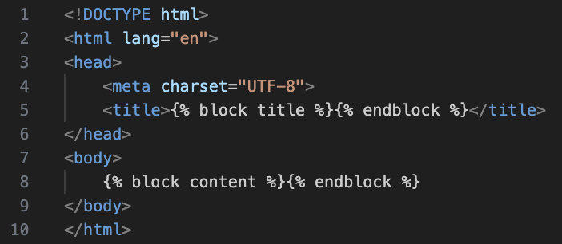
    
  
    

        It has predefined areas (or blocks) where new content can be inserted by a child webpage inheriting 
        from this template.
    

    <ol>
        <li>
            We could re-write the success.html page to inherit from this base.html template:
            

                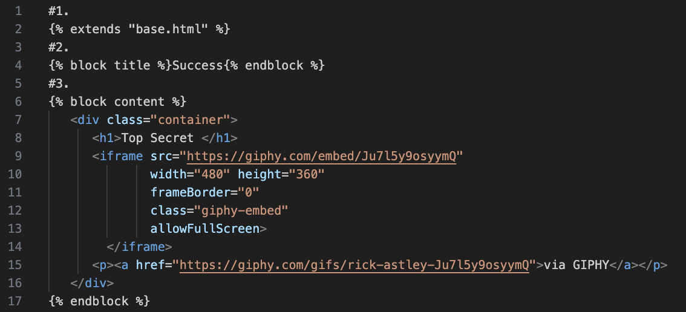
            

            

                
#1. This line of code tells the templating engine (Jinja) to use "base.html" as the template for this page.

                
#2. This block inserts a custom title into the header of the template.

                
#3. This block provides the content of the website. The part that is going to vary between webpages.

            

        </li>
        <li>
            CHALLENGE: Try doing the same thing for denied.html, making sure that it uses the base.html as the 
            template and it has a custom title and content.
        </li>
    </ol>
    <h3>Super Blocks</h3>
    
When we inherit from Python classes, you often see <code>super.init()</code>

    

        The super keyword refers to the parent that the child is inheriting from. 
        e.g If Simba inherits from Mufasa, then Mufasa is the super.
    

    

        
    

    

        When we are inheriting templates. Sometimes, there's some part of the template that we want to keep, but we also want to add to it. So we can use super blocks in this case.
    

    <ol start="3">
        <li>Add the following code to your base.html:</li>
        

            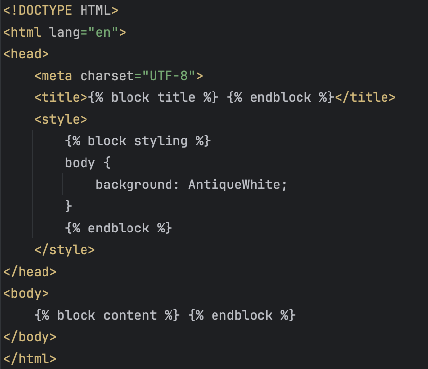
        

        
We named this block "<code>styling</code>" but we can call it anything we want.

        
We just need to make sure that we close all blocks with <code></code> 

        
 
            Now we reload our website, we should see that both the success page and the denied page will have a 
            "AntiqueWhite" background. (We covered inline, internal and external styling in the CSS section of this course - Day 43).
        

        

            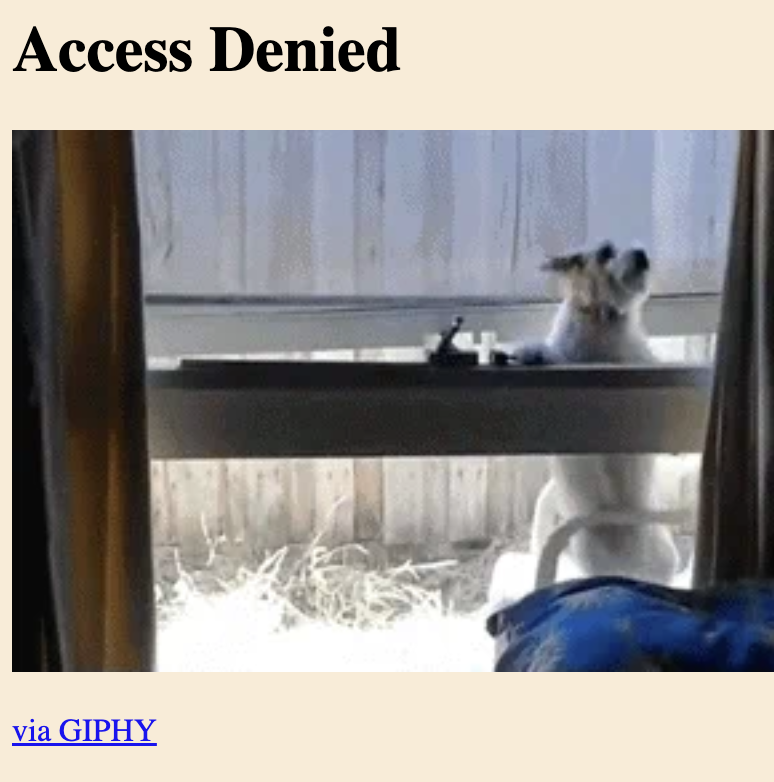
        

        

            So now you can see how easy it is to modify all web pages in your website if you use the same template. 
            But what if on the denied page we also wanted to make the <code>&lt;h1&gt;</code> red? 
            We would need to modify the internal styling in the <code>&lt;style&gt;</code> tag. 
            But that code is in the base.html template. Luckily we have super blocks.
        

        <li>
            On the <b>denied.html</b> page, add a super block using <code>{{ super() }}</code>, this will inject all 
            the code in the styling block to this child page. Then afterwards before the <code></code>, 
            we can add some more styling to change the colour of the <code>&lt;h1&gt;</code>.
        </li>
        <li>
            Similar to what you've done with the other html files, using Jinja templating make the success.html 
            file a child template of the base.html as well. 
        </li>
    </ol>
    <h2>Using Bootstrap-Flask as an Inherited Template</h2>
    

        There was a reason why we learnt about inherited templates! We need to improve the appearance of our website. 
        At the moment it looks like it was born in the 90s.
    

    

        
    

    <h3>Bootstrap-Flask</h3>
    

        The way that we're going to quickly improve the appearance of our website is of course through that super useful 
        tool we learnt about on Day 58 - Bootstrap. Previously we saw that we could simply include a link to the 
        Bootstrap CSS code in the header of our website. But there's an even easier way. We can use the 
        Bootstrap-Flask Python extension.
    

    <ol>
        <li>Install Bootstrap-Flask to your project using pip:</li>
        
<code>pip install bootstrap-flask</code>

        <li>
            CHALLENGE: Delete the super block in your denied.html file and use the 
            <a href="https://bootstrap-flask.readthedocs.io/en/stable/">Bootstrap-Flask 
            documentation</a> to convert our denied.html, success.html, login.html and index.html 
            to use Bootstrap as the template.
            

                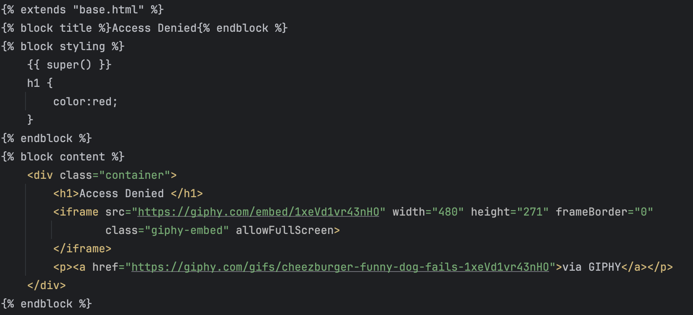
            

            <ul>
                <li>Follow the documentation to initialise bootstrap-flask in your main.py</li>
                <li>Load the bootstrap css inside your base.html.</li>
            </ul>
        </li>
        
This is what your website should look like if you complete the challenge:

        

            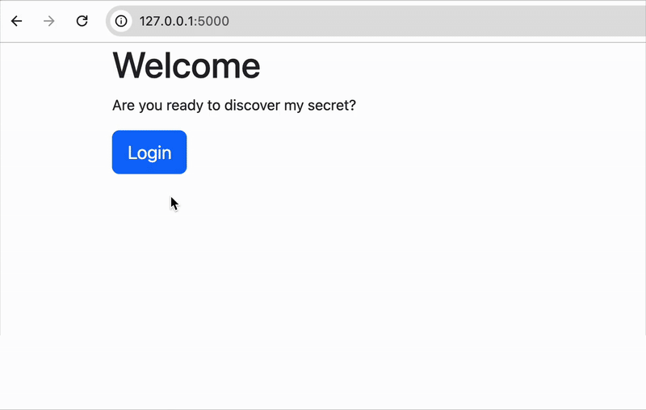
        

    </ol>
    <h2>Bootstrap-Flask Supports WTForms</h2>
    

        One of the main reasons why we're using Bootstrap-Flask in this project is because it has one of the most 
        convenient methods for generating forms with WTForms.
    

    

        Literally, in 1 line of code, you can create your form. It's as simple as:
    

    
<code>{{ render_form(form) }}</code>

    

        What this line of code will do is generate all the labels, inputs, buttons, styling for your form 
        just by taking the WTForm object that was passed to the template (<code>form</code>).
    

    
You can simply delete the entire &lt;form&gt; element.

    

        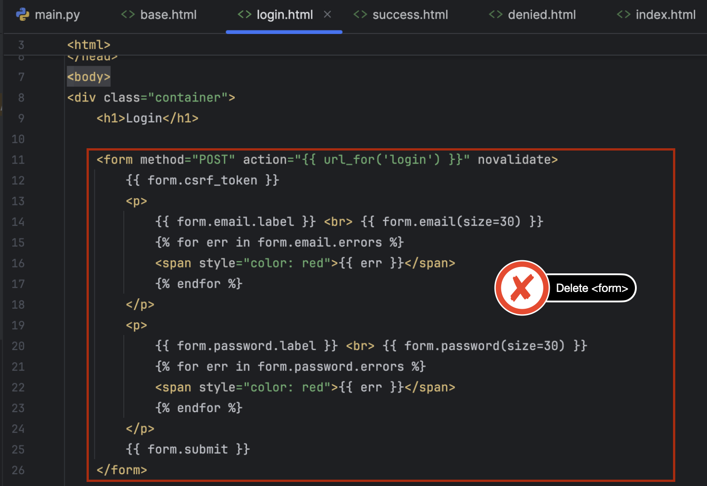
    

    

        Then, add a line to import the <a href="https://bootstrap-flask.readthedocs.io/en/stable/macros/#render-form">
            render_form()
        </a> function from bootstrap-flask and use the <code>render_form()</code> to generate your <code>form</code>.
    

    

        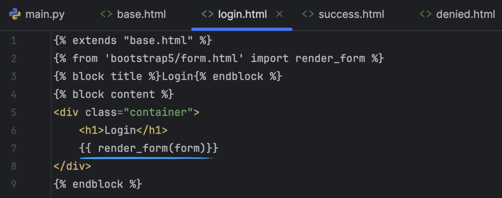
    

    

        Run your code and see the entire form laid out for you with zero effort. 
        Also, check out the error messages from validation!
    

    

        Now you might wonder, why did I put you through all that hassle to learn how to create a WTForm from 
        scratch when I knew all along that you can just use the Bootstrap-Flask <code>render_form()</code>? 
        Because everything is dandy as long as it works. This render_form macro is a black box. It's magic. 
        Which is great, but what happens if your form breaks? What if it's not doing what you expect it to? 
        How would you debug magic?
    

    

        That's why it's so important to understand how things work under the hood. 
        Once you understand it, you can take all the shortcuts.
    

