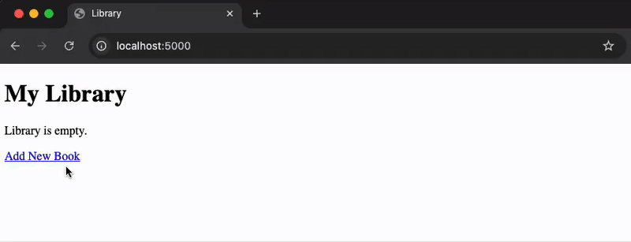
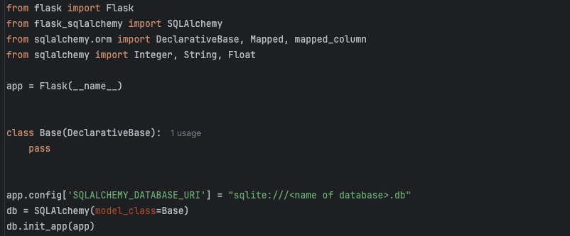
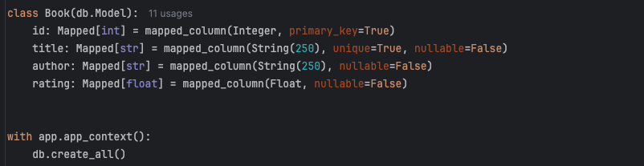
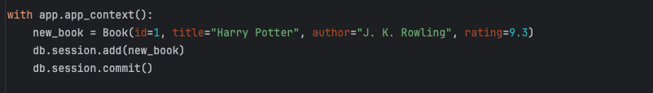
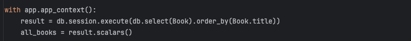
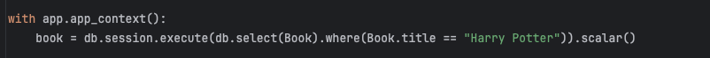
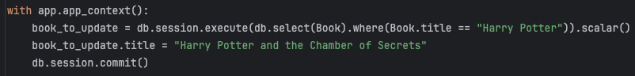
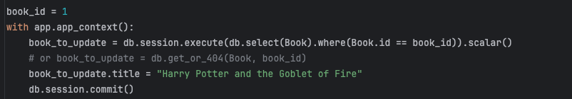
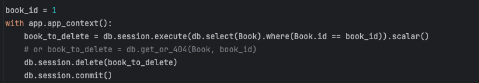

## Databases with SQLite and SQLAlchemy

# Virtual Bookshelf
<h3>
    

        <a href="./server.py">server.py</a>
    

</h3>

    

    

        Have you ever wanted to keep track of the books you have read and give each book a rating?
    

    

        This is not a new concept and there are plenty of companies that have built something for exactly this purpose.
    

    

        e.g. <a href="https://www.librarything.com/">https://www.librarything.com/</a>
    

    

        But in order to do this, we will need to use a database. We will create an SQLite database and perform:
        create, read, update and delete data in the database.
    

    
We'll also be hooking up our database with a Flask application to serve data whenever needed.

    <h2>CRUD Operations with SQLAlchemy</h2>
    <h3>Create a New Database</h3>
    

        
    

    

        As of flask-sqlalchemy version 3.1, you need to pass a subclass of DeclarativeBase to the constructor of the database.
    

    <h3>Create a New Table</h3>
    

        Next we define and create the model. 
        What is the <code>:</code> used for? 
        Explicitly declaring a variable type. 
        Below we are explicitly saying that <code>id</code> is of type <code>Mapped</code>. 
        SQLAlchemy uses the generic <code>Mapped</code> so that it can 
        <a href="https://docs.sqlalchemy.org/en/20/orm/declarative_tables.html#using-annotated-declarative-table-type-annotated-forms-for-mapped-column">type check</a>
        the data that will be stored in the database.
    

    

        
    

    

        In addition to these things, the most crucial thing to figure out when working with any new database 
        technology is how to CRUD data records.
    

    <ul>
        <li><b>C</b>reate</li>
        <li><b>R</b>ead</li>
        <li><b>U</b>pdate</li>
        <li><b>D</b>elete</li>
    </ul>
    

        Let's go through each of these using SQLite and SQLAlchemy:
    

    <h3><u>Create</u> A New Record</h3>
    

        
    

    
NOTE: When creating new records, the primary key fields is optional. you can also write:

    
<code>new_book = Book(title="Harry Potter", author="J. K. Rowling", rating=9.3)</code>

    
the <code>id</code> field will be auto-generated.

    <h3><u>Read</u> All Records</h3>
    

        
    

    

        To read all the records we first need to create a "query" to select things from the database. 
        When we execute a query during a database session we get back the rows in the database (a <code>Result</code> 
        object). We then use <code>scalars()</code> to get the individual elements rather than entire rows.
    

    <h3><u>Read</u> A Particular Record By Query</h3>
    

        
    

    
To get a single element we can use <code>scalar()</code> instead of <code>scalars()</code>.

    <h3><u>Update</u> A Particular Record By Query</h3>
    

        
    

    <h3><u>Update</u> A Particular Record By PRIMARY KEY</h3>
    

        
    

    

        Flask-SQLAlchemy also has some handy 
        <a href="https://flask-sqlalchemy.palletsprojects.com/en/stable/queries/#queries-for-views">
            extra query methods
        </a> like <code>get_or_404()</code> that we can use. 
        Since Flask-SQLAlchemy version 3.0 the previous query methods like <code>Book.query.get()</code> 
        have been deprecated.
    

    <h3><u>Delete</u> A Particular Record By PRIMARY KEY</h3>
    

        
    

    

        You can also delete by querying for a particular value e.g. by title or one of the other properties. 
        Again, the <code>get_or_404()</code> method is quite handy.
    

