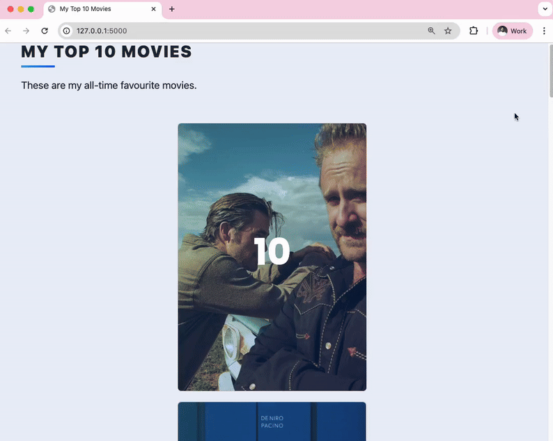
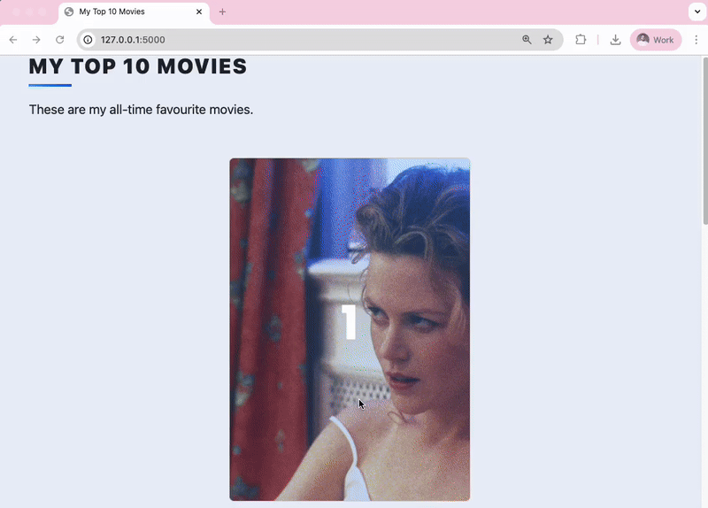
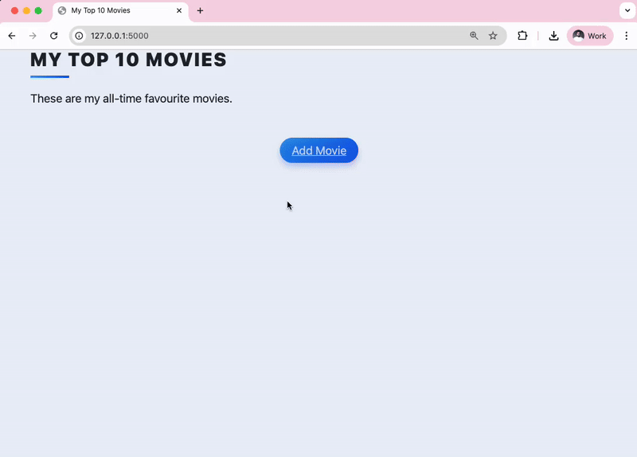
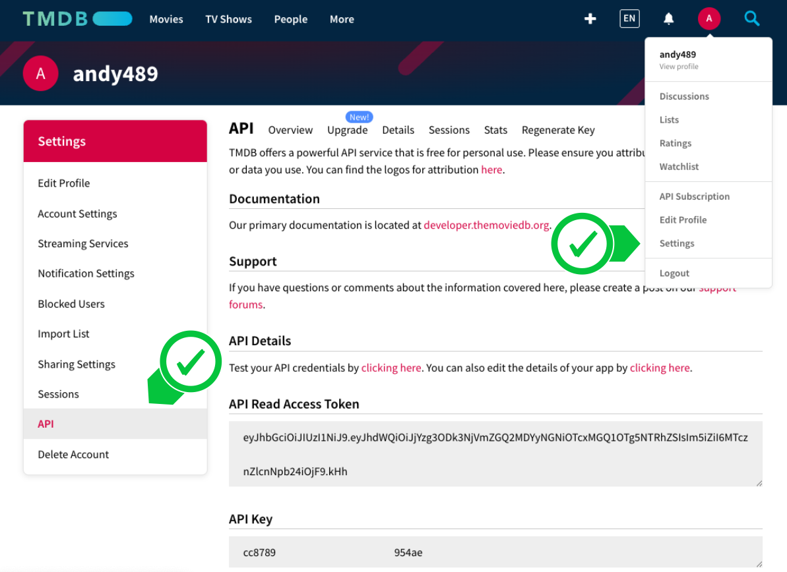
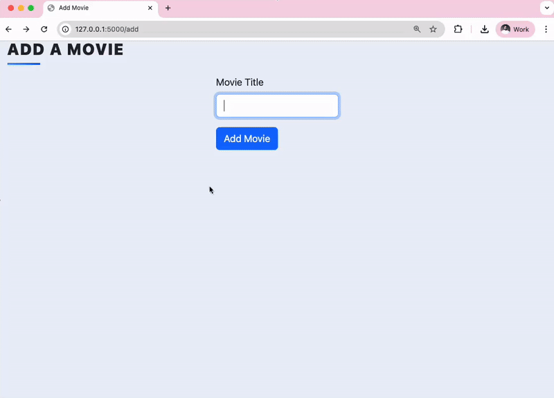
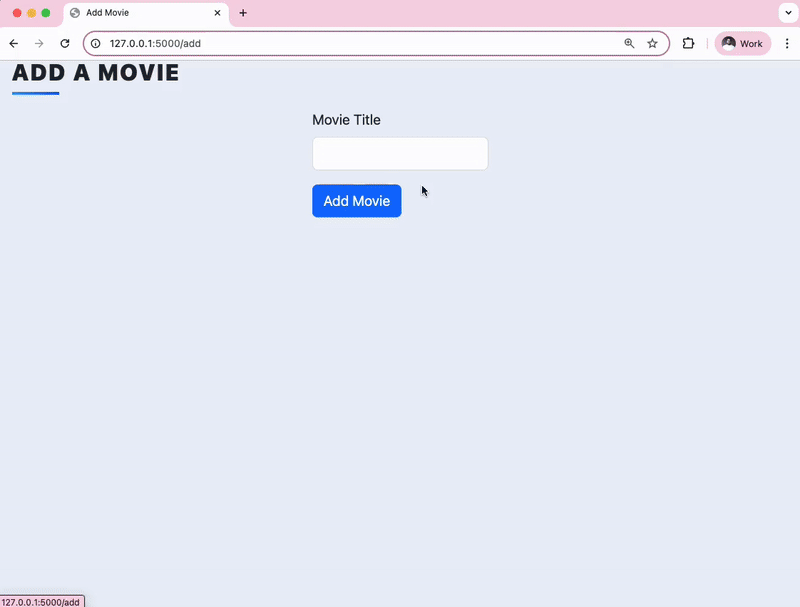
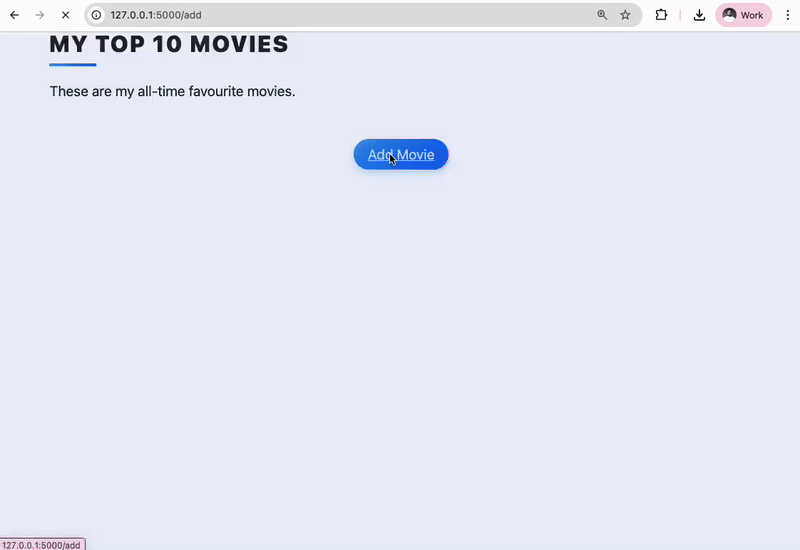
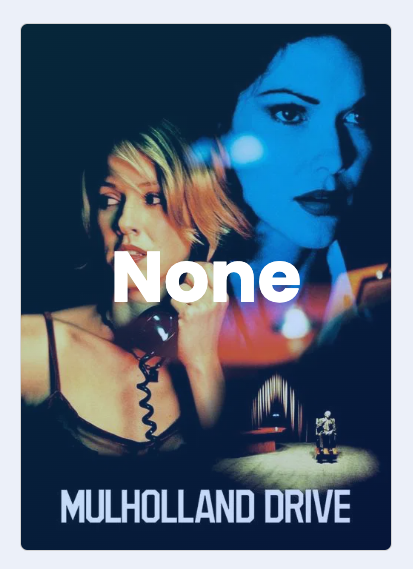
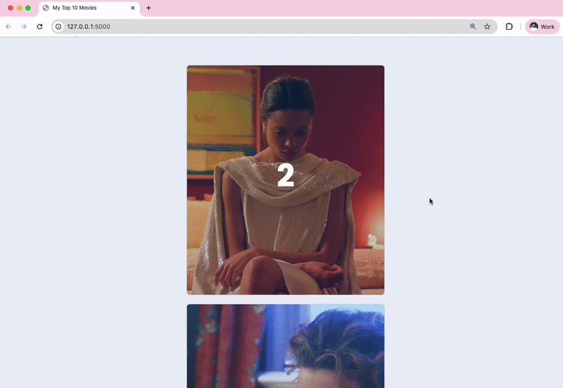
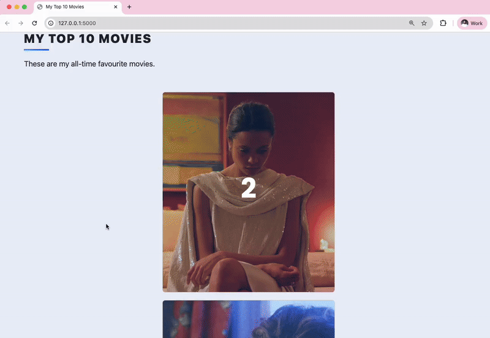

# Top 10 Movies Website

<h3>
    <a href="./server.py">server.py</a>
</h3>

    

    

        Have you ever seen websites that compile lists of their top favourite movies of all time?
    

    
e.g.

    

        British Film Institute: <a href="https://www2.bfi.org.uk/greatest-films-all-time">https://www2.bfi.org.uk/greatest-films-all-time</a>
    

    

        Empire: <a href="https://www.empireonline.com/movies/features/best-movies-2/">https://www.empireonline.com/movies/features/best-movies-2/</a>
    

    

        New York Times: <a href="https://www.imdb.com/list/ls058705802/">https://www.imdb.com/list/ls058705802/</a>
    

    
In fact, there are companies who have built their entire business around helping people build lists of their favourite things.

    
e.g.

    
<a href="https://www.listchallenges.com/">https://www.listchallenges.com/</a>

    

        We are going to build a website just like that using Flask/WTForms/SQLite/SQLAlchemy and more. 
        It will allow us to create a beautiful website that lists our top 10 films of all time. 
        As we watch more movies, we can always update our list and keep track of which movies to recommend people.
    

    <h3>
        Edit a Movie's Rating and Review
    </h3>
    

        There is an edit button on the back of the movie card, you should be able to click on it and change your 
        rating and review.
    

    
e.g.

    

        
    

    <ol>
        <li>
            
Use WTForms to create the RateMovieForm. Use this to create a Quick Form to be rendered in edit.html.

            

                NOTE: You don't need to change the code in edit.html, it already has everything you need to render your 
                Quick Form. This is so that students don't just create a simple HTML form.
            

            

                If you've forgotten how to work with WTForms and Bootstrap-Flask, you can go back a few lessons and 
                review the content there or just use the documentation:
            

            <ul>
            <li>
                

                    <a href="https://bootstrap-flask.readthedocs.io/en/stable/macros/#render-form">
                        https://bootstrap-flask.readthedocs.io/en/stable/macros/#render-form
                    </a>
                

            </li>
            <li>
                

                    <a href="https://wtforms.readthedocs.io/en/3.2.x/">https://wtforms.readthedocs.io/en/3.2.x/</a>
                

            </li>
            </ul>
        </li>
        <li>
            

                Once the form is submitted and validated, add the updates to the corresponding movie entry in the 
                database. Here's more documentation on SQLAchemy:
            

            <ul>
                <li>
                    

                        <a href="https://flask-sqlalchemy.palletsprojects.com/en/stable/queries/#queries-for-views">
                            https://flask-sqlalchemy.palletsprojects.com/en/stable/queries/#queries-for-views
                        </a>
                    

                </li>
            </ul>
        </li>
    </ol>
    <h3>Delete Movies from the Database</h3>
    

        On the back of each movie card there is also a Delete button. Make this button work and allow the movie 
        entry to be deleted from the database.
    

    
e.g.

    

        
    

    <h3>Add New Movies Via the Add Page</h3>
    

        We should be able to add any film and use an API to fetch the poster image, year of release and movie 
        description.
    

    <ol>
        <li>
            

                Make the add page render when you click on the Add Movie button on the Home page. The Add page should 
                render a WTF form that only contains 1 field - the title of the movie.
            

            
e.g.

            

                
            

        </li>
        <li>
            When the user types a movie title and clicks "Add Movie", your Flask server should receive the movie title. 
            Next, you should use the requests library to make a request and search The Movie Database API for all the 
            movies that match that title.
            <ul>
                <li>
                    You will need to sign up for a free account on 
                    <a href="https://www.themoviedb.org/">The Movie Database</a>.
                </li>
                <li>
                    

                        Then you will need to go to Settings -> API and get an API Key. Fill out their form, get the 
                        API key, and then copy that API key into your project.
                    

                    

                        
                    

                </li>
                <li>
                    
You will need to read the documentation on The Movie Database to figure out how to request for 
                    movie data by making a search query.

                    

                        <a href="https://developers.themoviedb.org/3/search/search-movies">
                            https://developers.themoviedb.org/3/search/search-movies
                        </a>
                    

                </li>
                

                    HINT 1: The "Try it out" tab on the API docs is particularly useful to see the structure of the 
                    request and the data you can expect to get back.
                

                

                    HINT 2: We covered how to make API requests a long time ago on Day 33, it might be worth reviewing 
                    the knowledge there if you get stuck.
                

                <li>
                    Using the data you get back from the API, you should render the <code>select.html</code> page and add all 
                    the movie title and year of release on to the page. This way, the user can choose the movie they want to 
                    add. There are usually quite a few movies under similar names.
                </li>
                
e.g.

                

                    
                

            </ul>
        </li>
        <li>
            Once the user selects a particular film from the select.html page, the id of the movie needs to be 
            used to hit up another path in the Movie Database API, which will fetch all the data they have on 
            that movie. e.g. Poster image URLs.
            <ul>
                <li>
                    Use the id of the movie that the user selected to make a request to the get-movie-details path.
                    

                        <a href="https://developers.themoviedb.org/3/movies/get-movie-details">
                            https://developers.themoviedb.org/3/movies/get-movie-details
                        </a>
                    

                    

                        The data you get back from the API should be used to populate the database with the new 
                        entry. The properties you will populate are:
                    

                    <ul>
                        <li>title</li>
                        <li>img_url</li>
                        <li>year</li>
                        <li>description</li>
                    </ul>
                    

                        Once the entry is added, redirect to the home page, and it should display the new movie as 
                        a card. Some data will be missing, that's ok.
                    

                    
e.g.

                    

                        
                    

                </li>   
            </ul>
        </li>
        <li>
            

                Instead of redirecting to the home page after finding the correct film, redirect to the edit.html page. 
                Because the parts of the movie entry that are missing are the rating and review. The form on the edit 
                page will contain these two fields. Update the movie entry in the database with this new data.
            

            
e.g.

            

                
            

        </li>
    </ol>
    <h3>Sort and Rank the Movies By Rating</h3>
    

        At the moment the front of the movie card says None in large letters. This is because we have not assigned a 
        <code>.ranking.</code>
    

    

        
    

    

        Instead, we want it to display the ranking of the movie according to our rating. For example if we gave 
        "Crash" a rating of <b>8.9</b> and "Eyes Wide Shut" was rated <b>9.3</b> and those are the only 2 movies 
        we've added then it should display:
    

    

        
    

    

        If we add another movie, and it had the highest rating among the movies, then it should be ranked according 
        to it's rating.
    

    
e.g. If Crash (8.9), Eyes Wide Shut (9.3), Closer (9.9)

    

        
    

    
But if we edit the rating so that it becomes: Crash (9.1), Eyes Wide Shut (9.0), Closer (8.9)

    
Then they should re-arrange according to their ratings.

    

        You can assign a movie ranking when you navigate to the home route (<code>/</code>).  
        You'll have to work with the objects (Result and 
        <a href="https://docs.sqlalchemy.org/en/20/core/connections.html#sqlalchemy.engine.ScalarResult">ScalarResult</a>) 
        that you're getting back from your database query. See if you can find a way to turn your data into a python list.
    

    

        HINT 1: Check out how <code>order_by()</code> is used in the example: 
        <a href="https://flask-sqlalchemy.palletsprojects.com/en/3.1.x/quickstart/#query-the-data">
            https://flask-sqlalchemy.palletsprojects.com/en/3.1.x/quickstart/#query-the-data
        </a>
    

    

        HINT 2: You don't need to change any code in index.html
    

    

        HINT 3: You only need to change the code in the <code>home()</code> function.
    

