# Introduction to Web Design

    
We have heard of the saying:

    

        <i>"Don't judge a book by its cover."</i>
    

    
At the same time we have heard of these saying:

    

        <i>"You only have 3 seconds to make a good impression."</i>
    

    
And when it comes to Web Design, the second is more accurate.

    
Let's look at the same site but with a different design

    <ul>
        <li>
            <a href="https://www.pennyjuice.com/">
                https://www.pennyjuice.com/
            </a>
            

                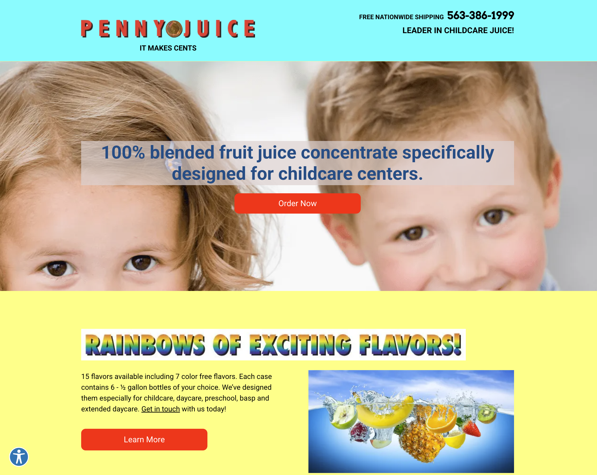
            

        </li>
        <li>
            <a href="https://www.behance.net/gallery/40393701/Penny-Juice-Rebrand">
                https://www.behance.net/gallery/40393701/Penny-Juice-Rebrand
            </a>
            

                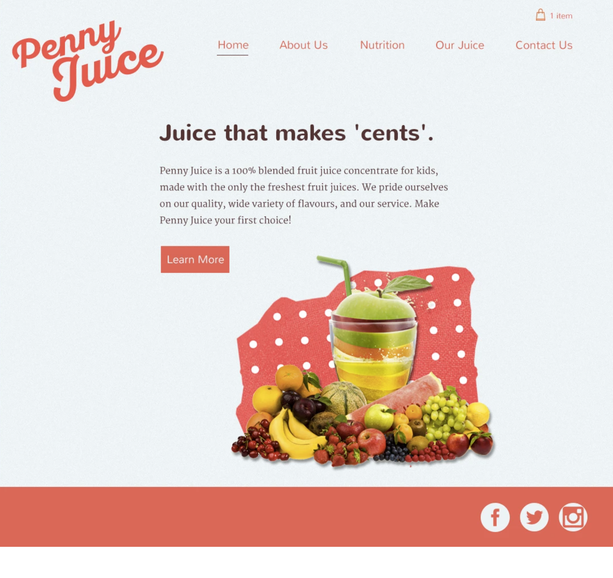
                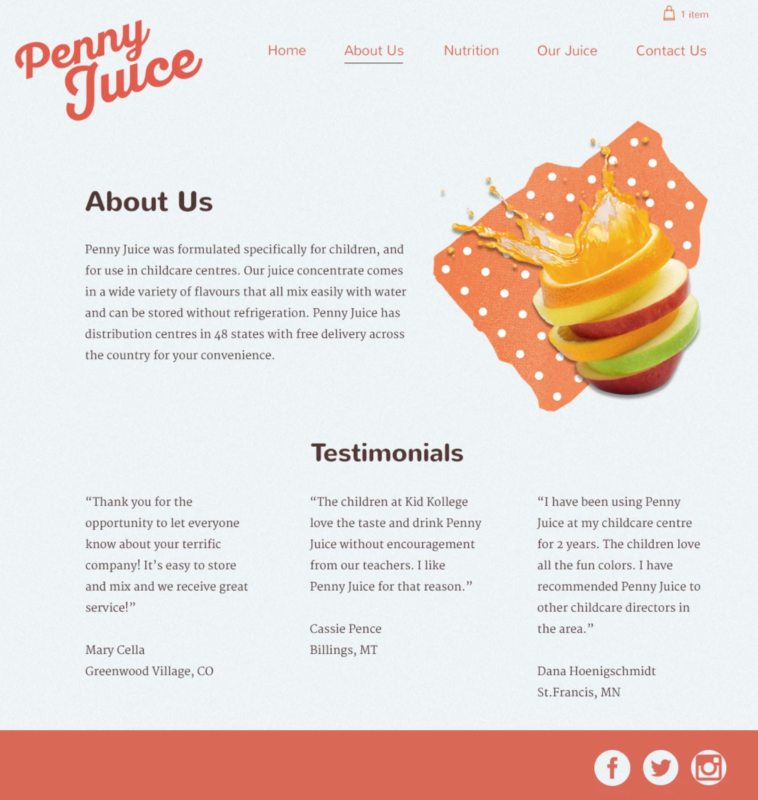
                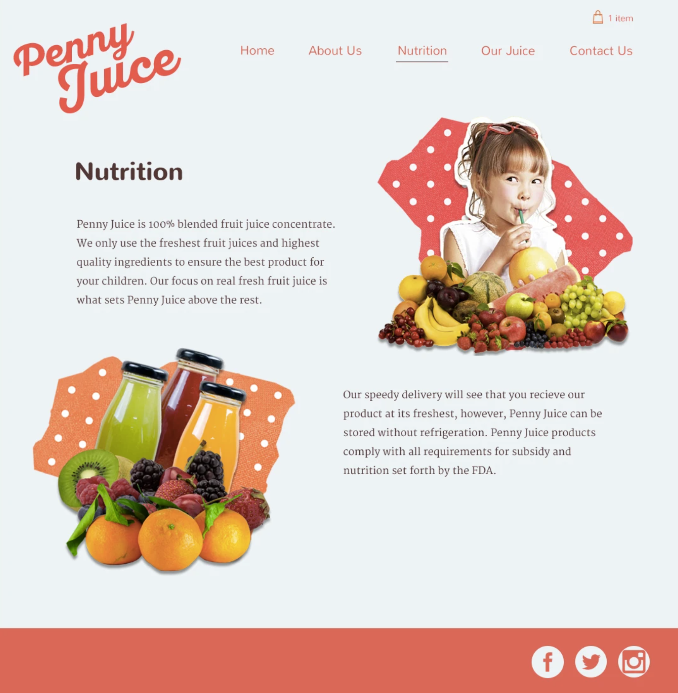
                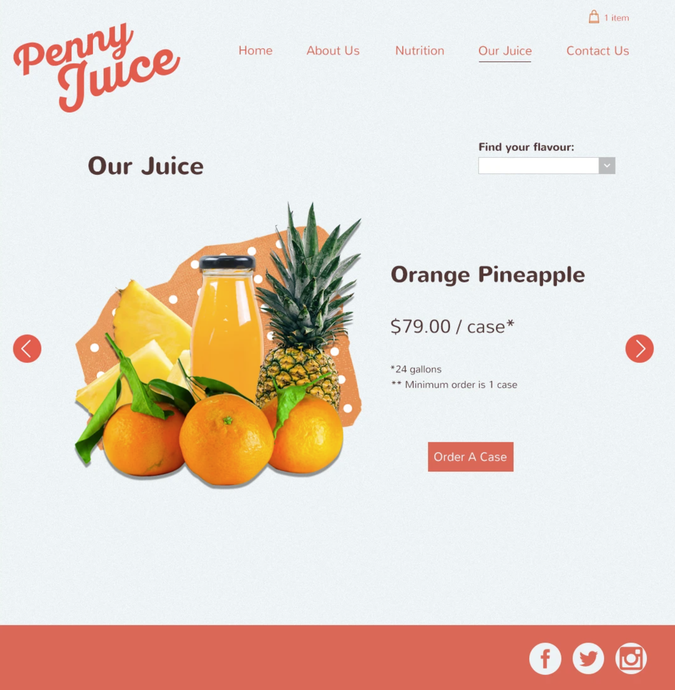
                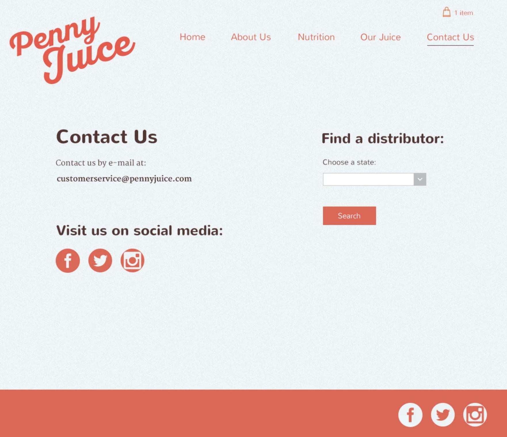
            

        </li>
    </ul>
    

        Ask yourself: If you were to buy this product from the company—if you were to purchase a carton of this 
        juice—how much would you pay for it?
    

    <h3>Understanding Color Theory</h3>
    

        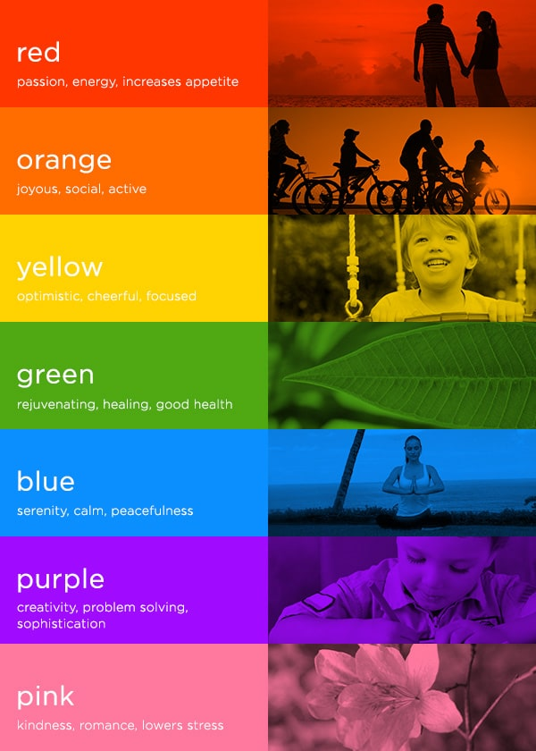
    

    

        Color Palettes for Designers and Artists:
        <a href="https://colorhunt.co/">https://colorhunt.co/</a>
    

    

        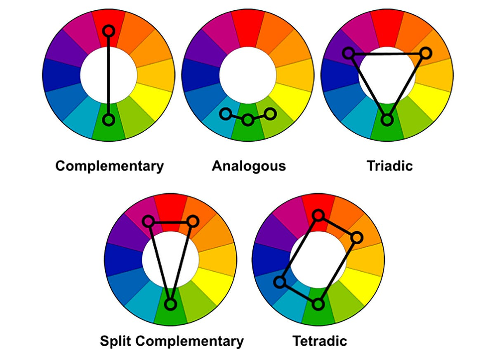
        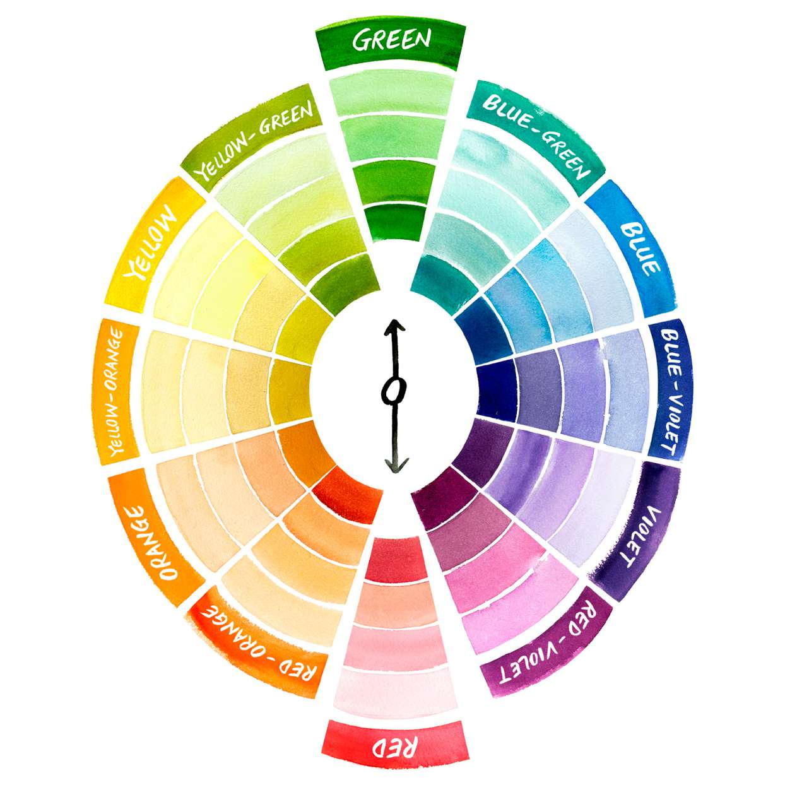
    

    <h3>Topography</h3>
    <h2>Understanding Topography and How to Choose Fonts</h2>
    <ul>
        <li>
            Serif Family
            <ul>
                <li>Old Style</li>
                <li>Transitional</li>
                <li>Modern</li>
                <li>Slab-Serif</li>
            </ul>
        </li>
        <li>
            Sans-Serif (More Readable)
            <ul>
                <li>Gill Sans is a Humanist sans-serif</li>
                <li>News Gothic is a Grotesque sans-serif typeface</li>
            </ul>
        </li>
    </ul>
    
Fonts also have moods:

    

        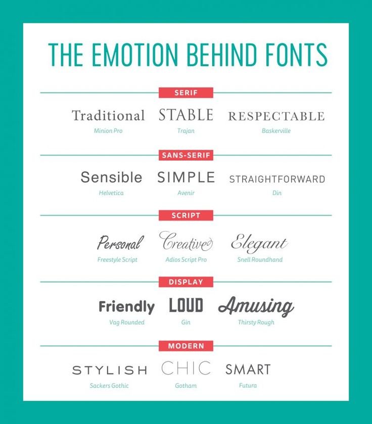
    
  
    
Readability and Legibility are important when choosing fonts.

    
Recommendation: to keep it cleaner and tighter - stick to two fonts.

    <h3>User Interface Design (UI)</h3>
    

        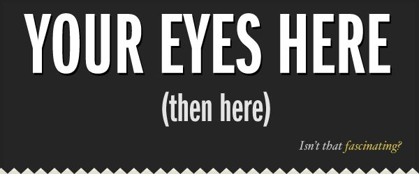
    
    
    

        <ol>
            <li>
                Hierarchy
                <ul>
                    <li>Color</li>
                    <li>Size</li>
                </ul>
            </li>
            <li>Layout</li>
            <li>Alignment</li>
            <li>White Space</li>
            <li>Audience</li>
        </ol>
    

    <h3>User Experience Design (UX)</h3>
    

        <ol>
            <li>Simplicity</li>
            <li>Consistency</li>
            <li>
                Reading Patterns
                <ul>
                    <li>F Layout</li>
                    <li>Z Layout</li>
                </ul>
            </li>
            <li>All Platform Design</li>
            <li>Don't Use Your Powers for Evil</li>
        </ol>
    

    

        <h4>Web Design in Practice</h4>
        <ul>
            <li><a href="https://www.canva.com/">canva.com</a></li>
            <li><a href="hotel_design.pdf">my hotel design</a></li>
        </ul>
    

