# Building Your Own REST API with RESTful Routing

    

        On day 33, we learnt about APIs and since then, we've used a number of public APIs. e.g. ISS location, 
        Trivia Questions and Twilio. In a lot of cases, the API allows us to tap into a particular website's 
        data or service.
    

    

        Many companies have collected valuable data e.g. Bitcoin prices, Restaurant reviews and provide an API for 
        developers to access this data for a price. Depending on how valuable the data/service is behind the API, 
        these APIs can charge anywhere from $9 to $99 per month for access. Some even charge per API call.
    

    

        What if you have access to some information that other people might want to use? E.g. You collected data on 
        all the cafés in a particular city and figured out which ones were suitable for remote-work? Then you could 
        create an API and charge people to access your data.
    

    
We are going to Build a full REST API from scratch using Flask.

    <h3>What is REST</h3>
    <ul>
        <li><b>RE</b>presentational</li>
        <li><b>S</b>tate</li>
        <li><b>T</b>ransfer</li>
    </ul>
    

        <h4>RESTful Routing</h4>
        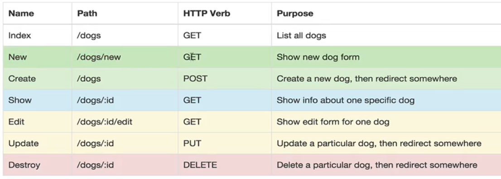
    

    <ul>
        <li>Use HTTP Request Verbs</li>
        <li>Use Specific Pattern of Routes/Endpoint URLs</li>
    </ul>
    <h3>HTTP GET - a Random Cafe</h3>
    

        Given our database consists of a bunch of cafés to remote-work from, one of the likely use cases of our 
        API is a developer who wants to serve up a random cafe for their user to go to. So we created a 
        <code>/random</code> route that serves up a random cafe.
    

    

        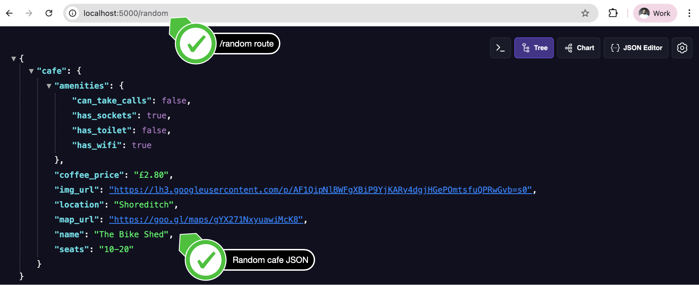
    
    
    <h3>HTTP GET - All the Cafés</h3>
    

        If someone was creating a website that lists all the cafes, then they would need to fetch all the cafes 
        in our database.
    

    

        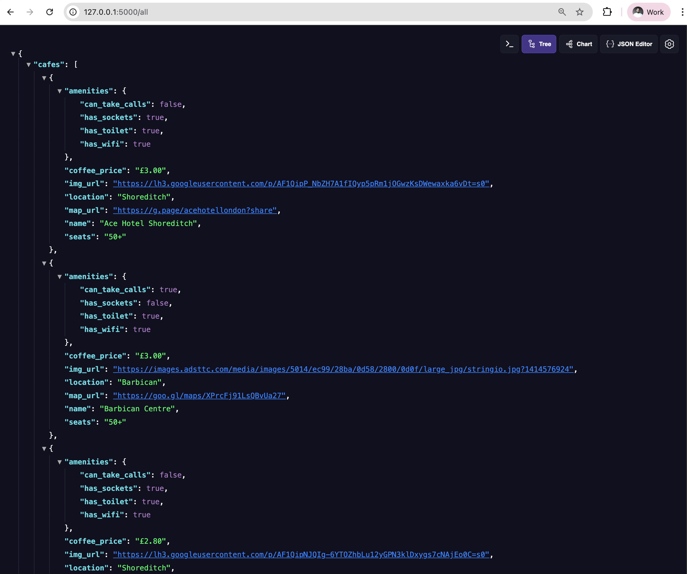
    
  
    <h3>HTTP GET - Find a Cafe</h3>
    

        If you look in the cafes.db, you can see the field location. This is the rough area where the café is located.
    

    

        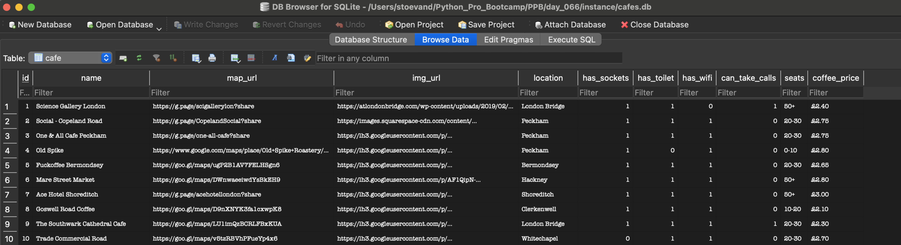
    
  
    
The user will make a GET request to your /search route and pass the location (loc) as a parameter.

    
The API will return all the cafes in a particular area.

    

        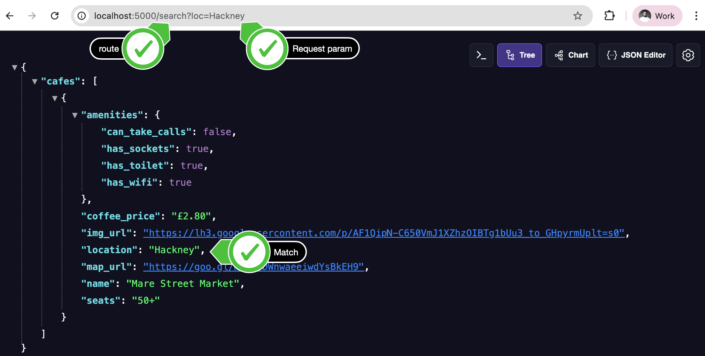
    
  
    <h3>Postman - The all-in-one API Testing Tool</h3>
    

        As you can imagine, if you need to test your API with a bunch of parameters, it can quickly get tiring 
        typing them all out in the URL bar of your browser. It's also super error-prone.
    

    

        So how do developers test their APIs? One of the best tools is 
        <a href="https://www.postman.com/downloads/">Postman</a>.
    

    
It allows you to add key-value pairs for your request parameters and it will automatically format your URL:

    

        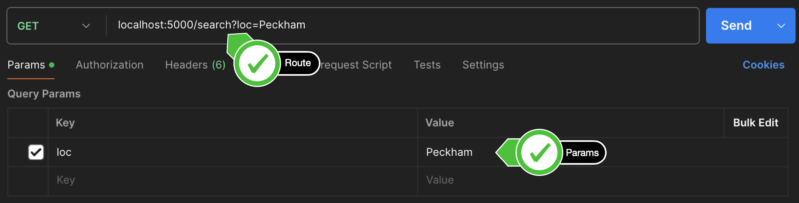
    
  
    
It will also allow you to automatically create documentation for your API:
        <a href="https://learning.postman.com/docs/publishing-your-api/documenting-your-api/">
            https://learning.postman.com/docs/publishing-your-api/documenting-your-api/
        </a>
    

    

        You can download Postman for free here: <a href="https://www.postman.com/downloads/">
            https://www.postman.com/downloads/
        </a>
    

    

        After you have successfully tested your API route, try creating a new collection called Cafes 
        and adding all the existing routes to the collection.
    

    

        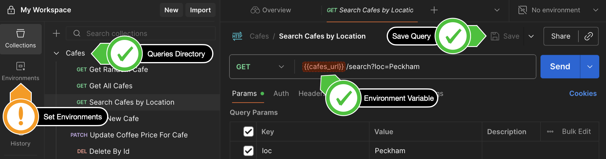
    
  
    <h3>HTTP POST - A New Cafe</h3>
    

        What if we wanted to add a new café to the database? e.g. There is a website where users can contribute 
        cafes they have discovered?
    

    
e.g. <a href="https://laptopfriendly.co/suggest">https://laptopfriendly.co/suggest</a>

    

        How would you test your API without building out a WTForm or HTML Form? Because that's likely where the 
        POST request is going to come from.
    

    
Luckily Postman makes this easy.

    

        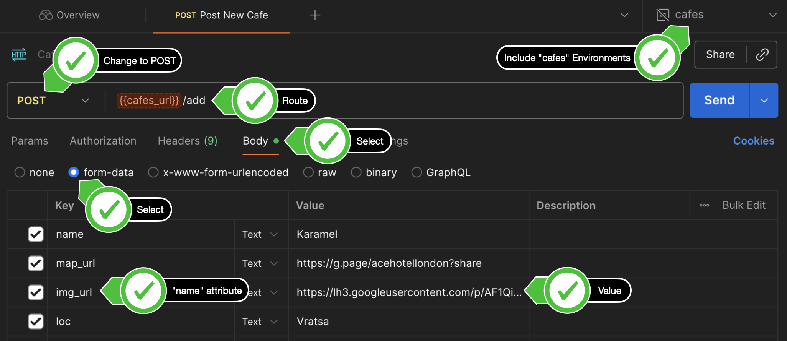
    
  
    

        The Key-Value pairs you enter into the Body tab in Postman is equivalent to 
        &lt;input&gt; elements.
    

    <h3>HTTP PUT vs. PATCH</h3>
    <ul>
        <li>
            PUT: Updating your database by sending an entire entry to replace the previous one.
        </li>
        <li>PATCH: Only sending the piece of data that needs to be updated.</li>
    </ul>
    <h3>HTTP PATCH - A Cafe's Coffee Price</h3>
    

        One of the fields in our café database is the price of a single black coffee. It's a good way for users 
        to gauge how expensive is the coffee shop. But cafes often change their prices. What if a user wanted 
        to submit a change in price at one of the cafes?
    

    

        If they knew the <code>id</code> of the café (which they can get by making a GET request to fetch data on all the 
        cafes), then they can update the <code>coffee_price</code> field of the café.
    

    

        In this situation, a <code>PATCH</code> request is probably more efficient, 
        as we don't need to change any of the rest of the cafe's data.
    

    

        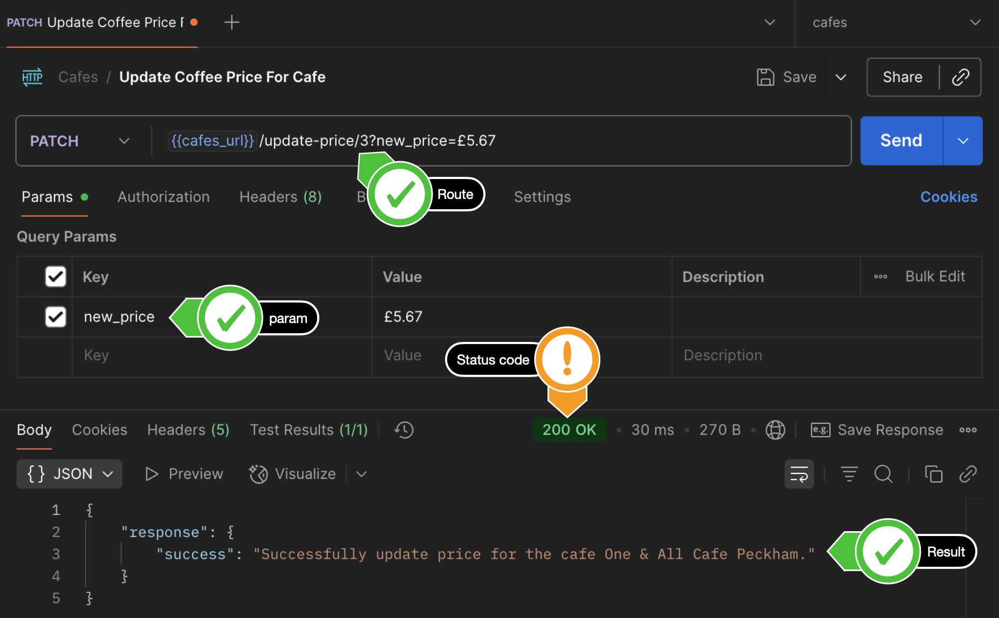
    
 
    <h3>HTTP DELETE - A Cafe that's Closed</h3>
    
We will make a DELETE request to our server and update the database.

    

        But we can't let just anyone delete things in our database. We might soon end up with someone 
        accidentally deleting everything.
    

    

        We can add a security feature by requiring an <code>api-key</code>. If they have the api-key 
        <code>"TopSecretAPIKey"</code> then they're allowed to make the delete request, otherwise, we tell them they 
        are not authorized to make that request. A 403 in HTTP speak.
    

    
Check out all the HTTP Codes: <a href="https://httpstatuses.com/">https://httpstatuses.com/</a>

    
e.g. The request via Postman might look like this:

    

        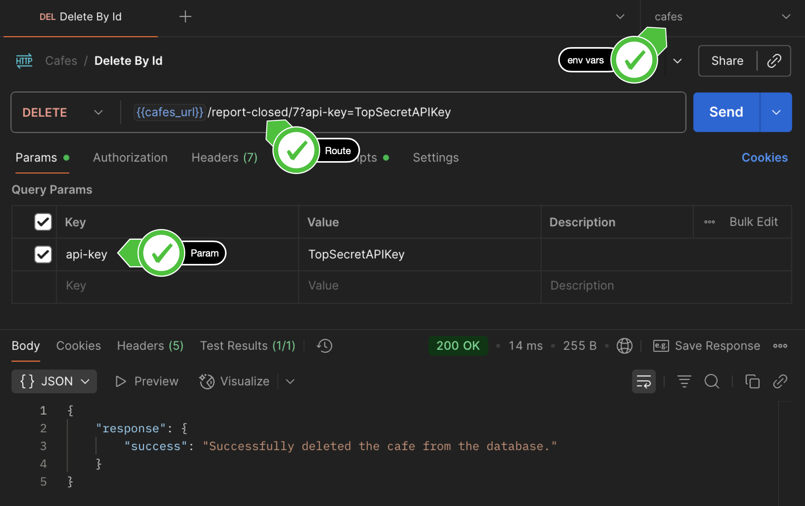
    
 
    
And if they have the wrong api-key:

    

        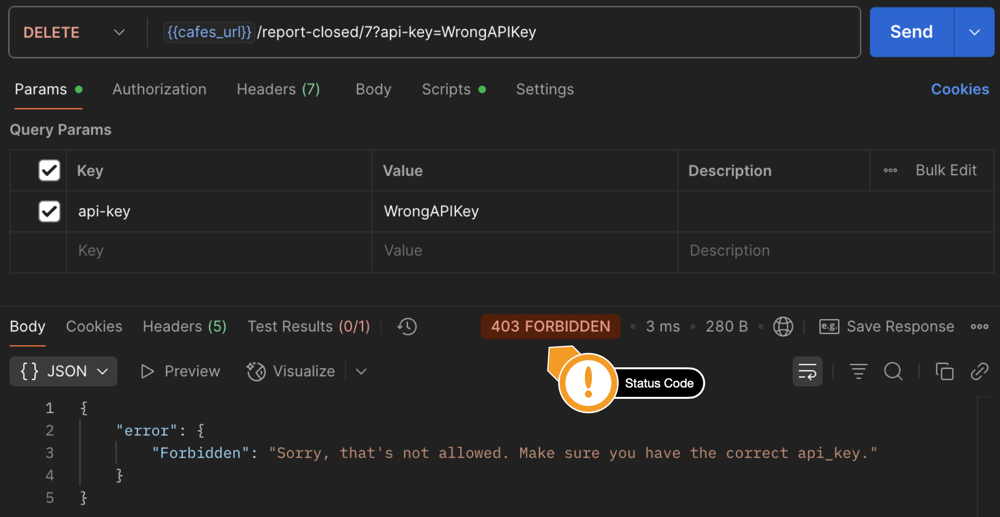
    
 
    
And if the café with that id doesn't exist:

    

        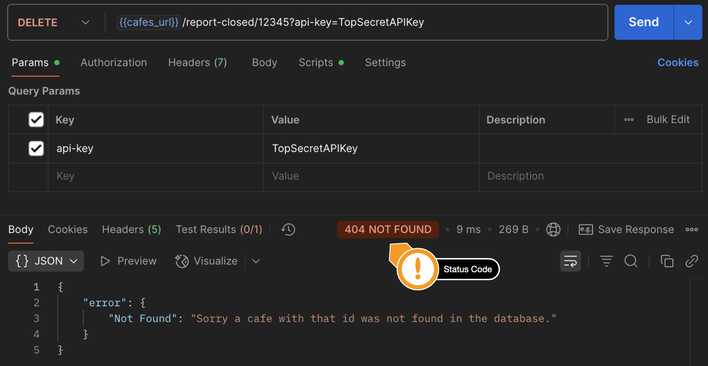
    
 
    <h3>Build Documentation for Your API</h3> 
    

        If we want other people to use our API, then we have to document how to use it. People can't see the code on 
        our servers, so we have to tell them how to interact with our servers via the API constraints.
    

    
e.g. What are the routes, what are the required parameters etc.

    

        Luckily we made all our requests in Postman and you gave each request a name and description then Postman 
        will generate the documentation automatically for us.
    

    

        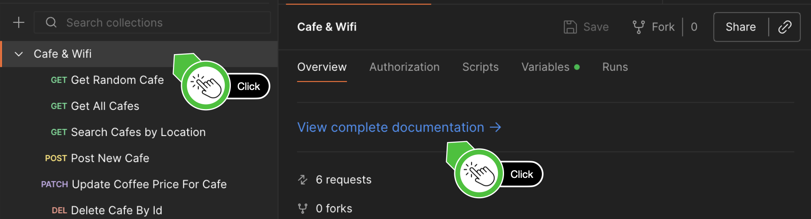
    
 
    

        Go through the steps to publish your documentation and this is what you should end up with:
        <a href="https://documenter.getpostman.com/view/41363538/2sAYXBFemz">
            https://documenter.getpostman.com/view/41363538/2sAYXBFemz
        </a>
    

