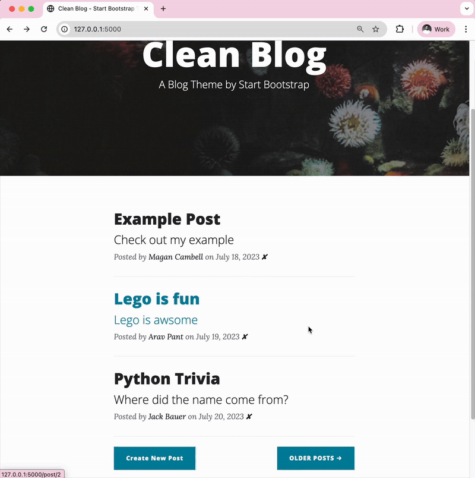
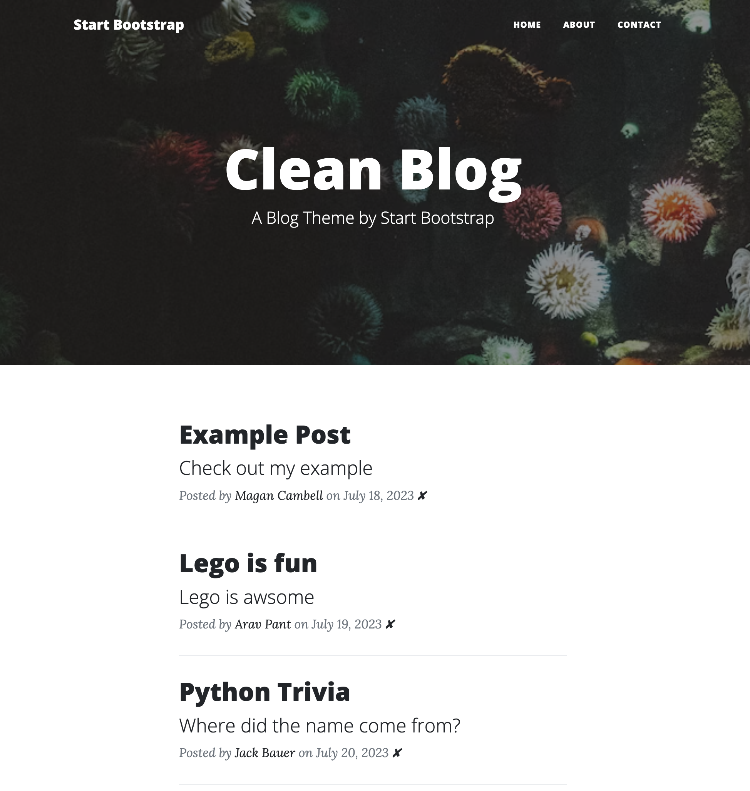
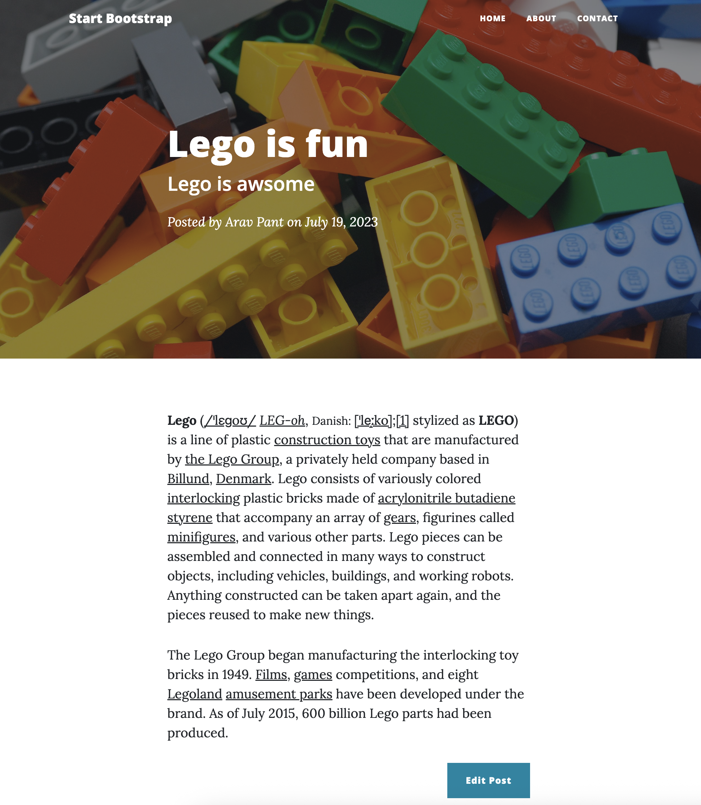

## Blog Capstone Project Part 3 - RESTful Routing

<h3>
    

        <a href="./server.py">server.py</a>
    

</h3>

    

        Using the knowledge we've gained, we're going to take our blog even further. We'll add more HTTP routes so 
        that you can create new blog posts, edit posts and delete posts. All inside your blog website.
    
        
    

        This is what your blog will be able to do:
    

    
    <h3>Requirement 1 - Be Able to GET Blog Post Items</h3>
    

        Instead of getting hold of blog posts from the npoint JSON bin as we've done in the previous blog project, 
        <a href="https://flask-sqlalchemy.palletsprojects.com/en/stable/quickstart/#query-the-data">grab the all the 
        posts</a> from the posts.db SQLite database using flask-SQLAlchemy.
    

    
This is what you should see when you are reading the blog posts from the posts.db:

    
    

        Once you've successfully loaded all the posts, add the code so that a user can click on an individual post 
        and read it:
    

    
    <h3>Requirement 2 - Be Able to POST a New Blog Post</h3>
    

        Create a new POST route called <code>/new-post</code> in your Flask server. This route should render the 
        make-post.html page when you click on the "Create New Post" button. The make_post.html needs to display a 
        form with 5 fields:
    

    <ul>
        <li>The blog post title</li>
        <li>The subtitle</li>
        <li>The author's name</li>
        <li>A URL for the background image</li>
        <li>The body (the main content) of the post</li>
    </ul>
    

        Use the Flask CKEditor package to make the Blog Content (<code>body</code>) input in the WTForm into a 
        full CKEditor.
    

    
Useful Docs:

    <ul>
        <li><a href="https://flask-ckeditor.readthedocs.io/en/latest/basic.html">flask_ckeditor</a></li>
        <li><a href="https://bootstrap-flask.readthedocs.io/en/stable/macros/#render-form">render_form()</a></li>
        <li><a href="https://flask-wtf.readthedocs.io/en/1.2.x/">flask-wtf</a></li>
    </ul>
    

        The data from the CKEditorField is saved as HTML. It contains all the structure and styling of the blog post. 
        In order for this structure to be reflected when you go to the <code>post.html</code> page for the blog post, 
        we added a <a href="https://jinja.palletsprojects.com/en/stable/templates/#jinja-filters.safe">Jinja safe() 
        filter</a>. This makes sure that when Jinja renders the post.html template, it doesn't treat the HTML as text. 
        To apply a Jinja filter, we used the pipe symbol "|" and this goes between the Jinja expression and Jinja 
        filter. e.g. {{ Jinja expression | Jinja filter }}. Note for simplicity we are not sanitising the HTML here 
        and assuming that we can trust our blog authors to not post a malicious <code>&lt;script&gt;</code>.
    

    <h3>Requirement 3 - Be Able to Edit Existing Blog Posts</h3>
    

        When you click on each of the blog posts on the home page you are taken to the <code>post.html</code> page for 
        the blog post. At the end of the post, you can see an Edit Post button. When you click on this button, it 
        should take you the <code>make-post.html</code> page.
    

    <h4>Autopopulate the form fields for an existing post</h4>
    

        When you head over to <code>make-post.html</code> the form should be populated with the existing content when 
        editing an old post. Add the code to autopopulate the fields in the WTForm with the blog post's data. 
        This way the user doesn't have to type out their blog post again.
    

    <h4>Redirect the user to the blog entry after submitting their edits</h4>
    

        When the user is done editing in the WTForm, they click "Submit Post", the post should now be updated in the 
        database. And the user redirected to the post.html page for that blog post.
    

    

        Also, the date field should not be changed, it should represent the original date the post was made. 
        Not the date of the edit.
    

    <h3>Requirement 4- Be Able DELETE Blog Posts</h3>
    

        In <code>index.html</code> create an anchor tag that just shows a ✘ character next to each post.
        (you can copy and paste this).
    

    

        When you click on it, it should delete the post from the database and redirect the user to the home page.
    

