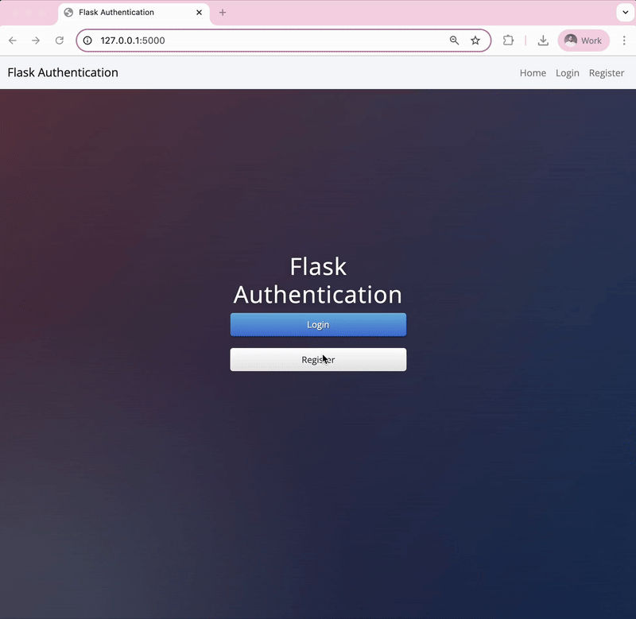
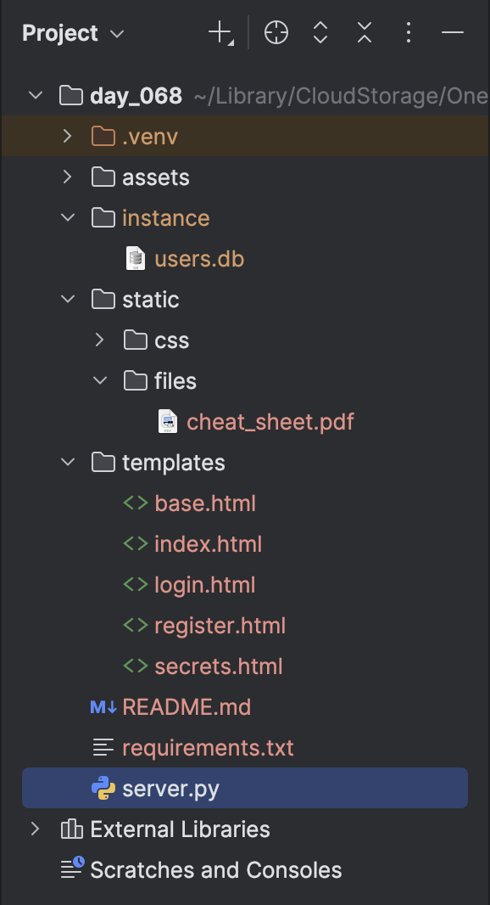
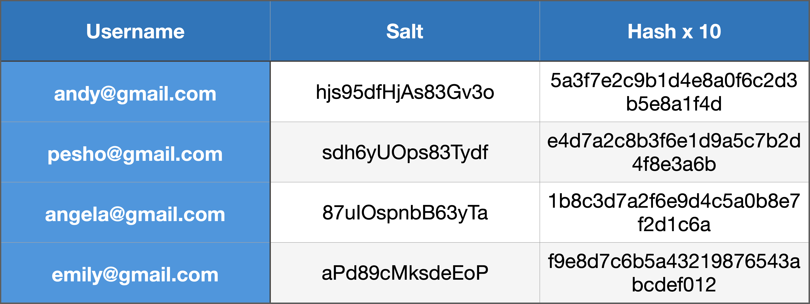
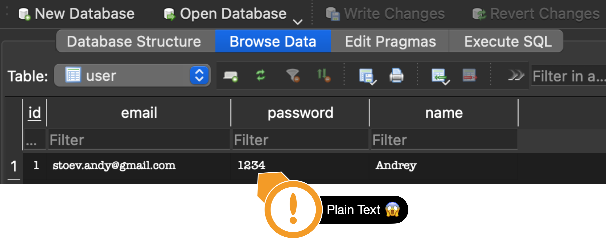
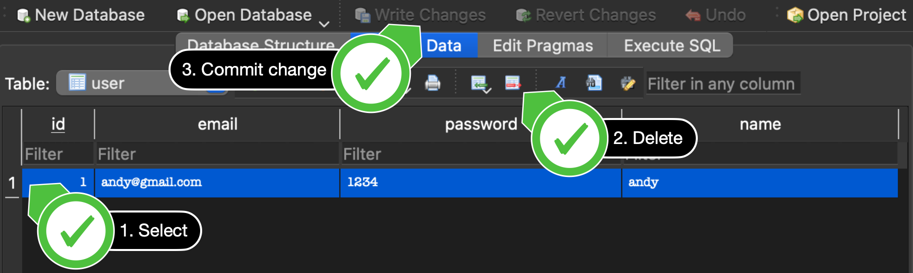
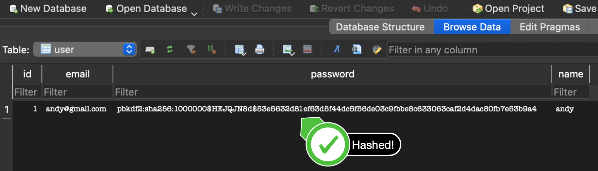
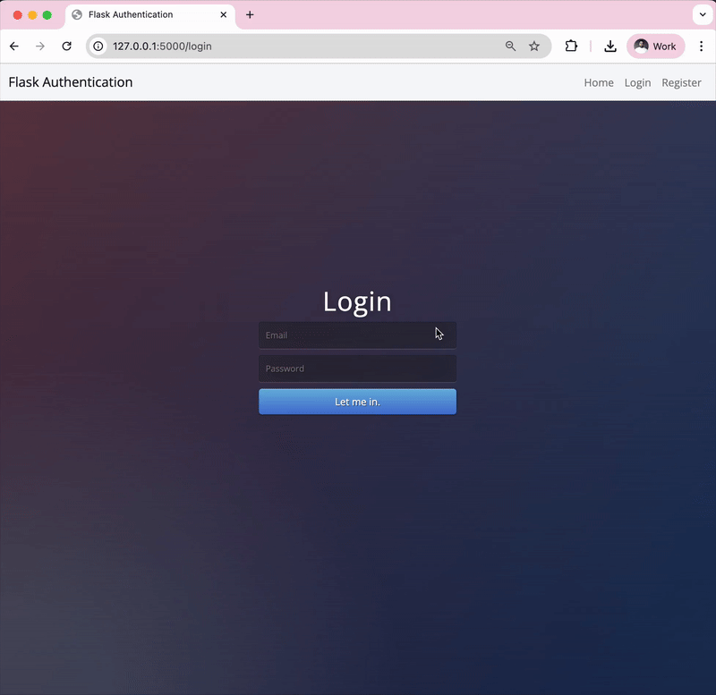
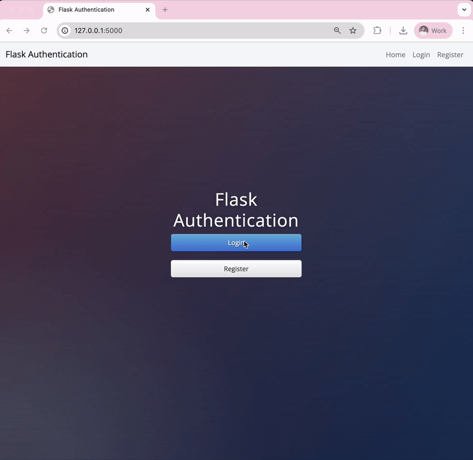
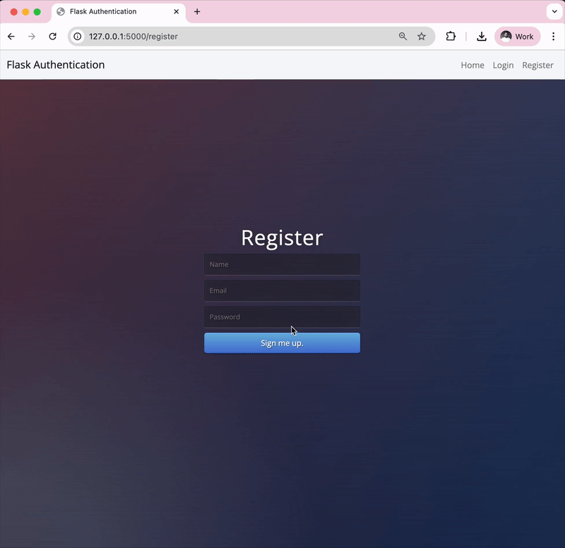
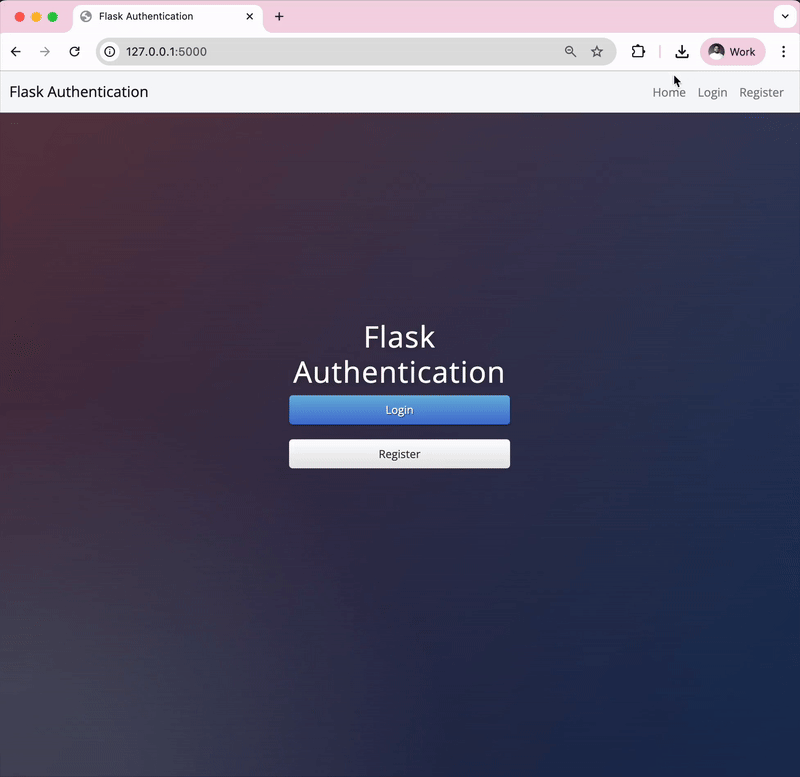

## Authentication with Flask
### Login and Registering Users with Authentication

    

        The most important component of a website is having users. Real humans who can contribute to the website. 
        If Facebook had no users then it would just be adverts. If blogs had no users then it would just be the 
        ramblings of an author.
    

    

        But in order to have users and associate data to user accounts, we need a way to register them and allow 
        them to sign back into their accounts at a later date.
    

    

        This means they will be giving us some information that we have to keep secure. This is what authentication 
        is all about, how to figure out if a user really is who they say they are.
    

    <h3>
        <a href="./server.py">server.py</a>
    </h3>
    

        
    

    <h3>Authentication</h3>
    <h4>From Beginning to End</h4>
    <h5>Why Authenticate?</h5>
    

        In order to associate pieces of data with individual users, we need to create an account for each user.
        So that they would sign up to our website using a username and a password and we would essentially create 
        kind of like an ID card for them to uniquely identify them on our database and to save all the data that 
        they generate onto that account. So the next time they come back onto the website, they'll be able to use 
        their username and password and log in to our website and be able to access all of those possibly private 
        pieces of information.
    

    <h5>Restrict Access</h5>
    

        The other reason why you should, might want to add authentication to your website is to restrict access 
        to certain areas of the website depending on the status of the user.
    

    

        So, for example, if you were Spotify or Netflix and you charge a subscription for accessing certain
        parts of the website, then once the user pays, you have to update their account in your database to
        say that they have paid and they'll be allowed to access the TV shows or songs that they're entitled to.
    

    <h3>Register New Users</h3>
    <h4>Register a new user and add them your database</h4>
    

        In order to register new users, you will need to take the information they have inputted in register.html 
        form and create a new <code>User</code> object with <code>email</code>, <code>name</code> and 
        <code>password</code> to save into the <b>users.db</b>.
    

    
Once the user is registered, send them straight to the secrets.html page.

    <h4>Greet the user on the Secrets page</h4>
    

        The secrets.html page should say "Hello &lt;insert name&gt;" in the h1. The name should correspond to the name 
        they typed in the registration form.
    

    <h3>Downloading Files</h3>
    

        When the user accesses the <b>secrets.html</b> page, they should be able to download a secret file. 
        The file is located in the starting project:
    

    
static &gt; files &gt; cheat_sheet.pdf

    
    
In order to do this, we need to use a method from Flask called <code>send_from_directory()</code>.

    
Documentation: <a href="https://flask.palletsprojects.com/en/2.3.x/api/#flask.send_from_directory">
        flask.send_from_directory
    </a>

    <h3>Encryption and Hashing</h3>
    <ul>
        <li>Online encryption: <a href="https://cryptii.com/">cryptii.com</a></li>
        <li>How the Enigma Machine Works: <a href="https://www.youtube.com/watch?v=G2_Q9FoD-oQ">https://www.youtube.com/watch?v=G2_Q9FoD-oQ</a></li>
        <li>The Flaw in the Enigma Machine<a href="https://www.youtube.com/watch?v=V4V2bpZlqx8">https://www.youtube.com/watch?v=V4V2bpZlqx8</a></li>
    </ul>
    <h3>How to Hack Passwords 101</h3>
    <ul>
        <li>Plain Text Offenders: <a href="https://plaintextoffenders.com/">https://plaintextoffenders.com/</a></li>
        <li>Pwned Passwords: <a href="https://haveibeenpwned.com/Passwords">https://haveibeenpwned.com/Passwords</a></li>
        <li>Most Common Passwords: <a href="https://en.wikipedia.org/wiki/List_of_the_most_common_passwords">https://en.wikipedia.org/wiki/List_of_the_most_common_passwords</a></li>
        <li>Password Complexity Checkers: <a href="http://password-checker.online-domain-tools.com/">http://password-checker.online-domain-tools.com/</a></li>
    </ul>
    <h3>Salting Passwords</h3>
    
    <h3>Hashing and Salting Passwords using Werkzeug</h3>
    
At the moment, all the users passwords are stored in our database as plaintext:

    
    
Delete the previous unhashed entry in the database

    
    
Let's secure their password by hashing it before we store it.

    
To do this, we'll use the Werkzeug helper function <code>generate_password_hash()</code>

    
Hash and salt the user's password: <a href="https://werkzeug.palletsprojects.com/en/3.0.x/utils/#module-werkzeug.security">
    https://werkzeug.palletsprojects.com/en/3.0.x/utils/#module-werkzeug.security</a>

    
Aim to hash the password using <b>pbkdf2:sha256</b>

    
And add a <code>salt_length</code> of <b>8</b>.

    
This is what you should end up with:

    
    <h3>Authenticating Users with Flask-Login</h3>
    

        At the moment, if you simply navigate to <code>/secrets</code> you can see the secret page and the download 
        link. There are no authentication barriers. How can we make sure that only registered/logged in users can see 
        that page and download the file?
    
    
    
We'll need to secure certain routes in our server and make them only accessible if a user is authenticated.

    
To do this, most Flask developers will use the Flask-Login package.

    
<a href="Flask-Login documentation">Flask-Login documentation</a>

    <ol>
        <li><a href="https://flask-login.readthedocs.io/en/latest/#configuring-your-application">configure your Flask app to use Flask_Login</a></li>
        <li><a href="https://flask-login.readthedocs.io/en/latest/#how-it-works">create a user_loader callback.</a></li>
        <li>
            <a href="https://flask-login.readthedocs.io/en/latest/#your-user-class">implement the UserMixin in your User class</a>
            
<a href="https://www.thedigitalcatonline.com/blog/2020/03/27/mixin-classes-in-python/">Further Reading on Mixins</a>

        </li>
        <li>Check the user's password using the <a href="https://werkzeug.palletsprojects.com/en/stable/utils/#werkzeug.security.check_password_hash">check_password_hash function</a>.</li>
        <li><a href="https://flask-sqlalchemy.palletsprojects.com/en/stable/quickstart/#query-the-data">Find the user by the email</a>they entered in the login form (e.g., with a <a href="https://docs.sqlalchemy.org/en/20/tutorial/data_select.html#the-where-clause">where</a> clause).</li>
        <li>If the user has successfully logged in or registered, use the <code>login_user()</code> function to authenticate them.</li>
        <li>Both the /secrets and /download route need to be secured so that only authenticated users can access them.</li>
    </ol>
    <h3>Flask Flash Messages</h3>
    

        Sometimes, you will want to give the user some feedback on an action they took. e.g. Was there an issue 
        with login in? Are they typing in the wrong password or does their email not exist? It would be a good user 
        experience if, in these situations, we told them what was wrong, instead of just constantly redirecting them 
        back to the login page.
    

    

        The easiest way to do this is through Flask Flash messages. They are messages that are sent to the 
        template to be rendered just once. And they disappear when the page is reloaded.
    

    
<a href="https://flask.palletsprojects.com/en/stable/patterns/flashing/">https://flask.palletsprojects.com/en/stable/patterns/flashing/</a>

    <ol>
        <li>
            Update the <code>/login</code> route so that if the user's email doesn't exist in the database, 
            you send them a Flash message to let them know and redirect them back to the <code>/login</code> route. e.g.
            

            
A &lt;p&gt; tag in the login page will show up as red text.

        </li>
        <li>
            Update the <code>/login</code> route so that if the <code>check_password()</code> function returns 
            <code>False</code>, you send a Flash message to the user when you redirect them back to the login page. e.g.
            

        </li>
        <li>
            Update the <code>/register</code> route so that if the user enters an email that already exists in the 
            database, you redirect them to the login page and show a flash message to let them know they have 
            already registered. e.g.
            

        </li>
    </ol>
    <h3>Passing Authentication Status to Templates</h3>
    <h4>Hide the login/register buttons for logged-in users</h4>
    

        When a user is logged in, the home page should <b>not</b> show the login/register buttons. And the navigation 
        bar should <b>not</b> show Register or Login either.
    

    
e.g.

        

    

        See if you can make some changes to the code in <code>base.html</code> and <code>index.html</code>
        so this happens.
    

    

        Also, add a little message to the logged in user on the homepage that reads 
        <b>(you are already logged in)</b> with a &lt;p&gt; tag.
    

    
Remember, as we learnt in previous lessons base.html is the layout template which all the pages inherit from.

    

