## Capstone Project Part 4 - Adding Users

### Adding Users to Our Blog Project

    

        Wouldn't it be great if we could have some users on our blog? What if we could let anyone sign up and comment 
        on our blog posts? In order for that to work, we would need to add authentication to our blog. This will be 
        the final step in our Blog Capstone Project. Once we're done, it will be a fully-fledged blog website that you 
        can publish and launch.
    

    
    

        
.

        

            
forms
                

                    
<a href="#">__init__.py</a>

                    
<a href="#">forms.py</a>

                

            

            
models
                

                    
<a href="#">__init__.py</a>

                    
<a href="#">blog_post.py</a>

                    
<a href="#">comment.py</a>

                    
<a href="#">user.py</a>

                

            

            
routes
                

                    
<a href="#">__init__.py</a>

                    
<a href="#">auth_routes.py</a>

                    
<a href="#">blog_routes.py</a>

                    
<a href="#">main_routes.py</a>

                

            

            
services
                

                    
<a href="#">__init__.py</a>

                    
<a href="#">auth_service.py</a>

                    
<a href="#">blog_service.py</a>

                    
<a href="#">comment_service.py</a>

                

            

            
utils
                

                    
<a href="#">__init__.py</a>

                    
<a href="#">decorators.py</a>

                    
<a href="#">gravatar.py</a>

                

            

            
<a href="#">__init__.py</a>

            
<a href="#">app.py</a>

            
<a href="#">config.py</a>

            
<a href="#">extensions.py</a>

            
<a href="#">generate_class_tree.py</a>

            
<a href="#">init_db.py</a>

            
<a href="#">README.md</a>

            
<a href="#">requirements.txt</a>

        

    

    

        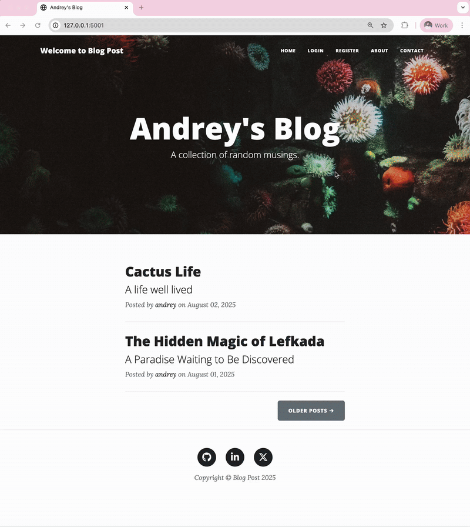
    

    <h3>Requirement 1 - Register New Users</h3>
    

        Allow users to go to the <code>/register</code> route to sign up to your blog website.
    

    <ol>
        <li>Create a WTForm in the <b>forms.py</b> called <code>RegisterForm</code></li>
        <li>
            Create a new <code>User</code> table for your database. The data the user entered should 
            be used to create a new entry in your <b>posts.db</b> within a <code>User</code> table.
        </li>
        <li>
            Create your new user within the /register route. Hash and salt the user's password using 
            <a href="https://werkzeug.palletsprojects.com/en/3.0.x/utils/#module-werkzeug.security">Werkzeug</a>. 
        </li>
        <li>
            Use Bootstrap-Flask's <code>render_form()</code> 
            <a href="https://bootstrap-flask.readthedocs.io/en/stable/basic/#macros">macro</a> to render the form on 
            the <b>register.html</b>.
        </li>
    </ol>
    

        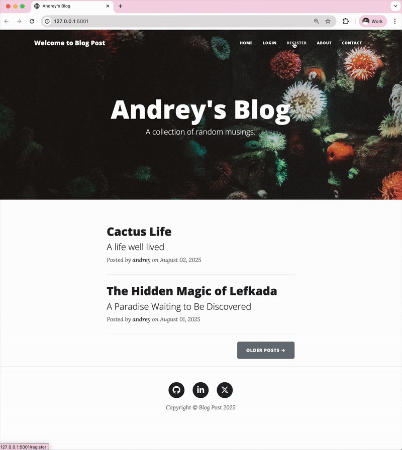
    

    <h3>Requirement 2 - Login Registered Users</h3>
    <ol>
        <li>
            

                Users who have been successfully registered (added to the user table in the database) should be able 
                to go to the <code>/login</code> route to use their credentials to log in. You will need to review 
                the <a href="https://flask-login.readthedocs.io/en/latest/">Flask-Login</a> docs to be able to do this.
            

            

                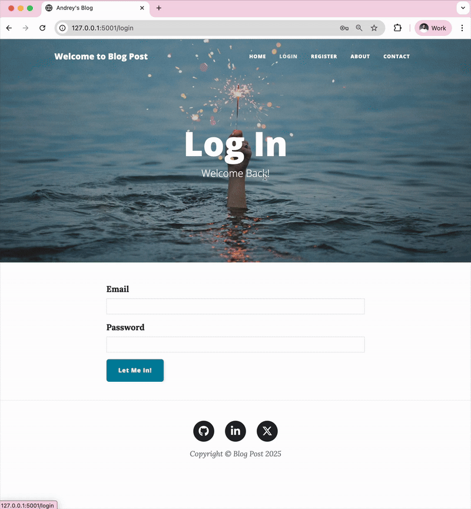
            

        </li>
        <li>
            

                Add 1 line of code in the <code>/register</code> route so that when users successfully register they are 
                taken back to the home page and are logged in with Flask-Login.
            

        </li>
        <li>
            
 
                In the in the <code>/register</code> route, if a user is trying to register with an email that already 
                exists in the database then they should be redirected to the <code>/login</code> route and a flash 
                message used to tell them to log in with that email instead.
            

            
For the flash message use a &lt;p&gt; tag with <code>class="flash"</code>.

            

                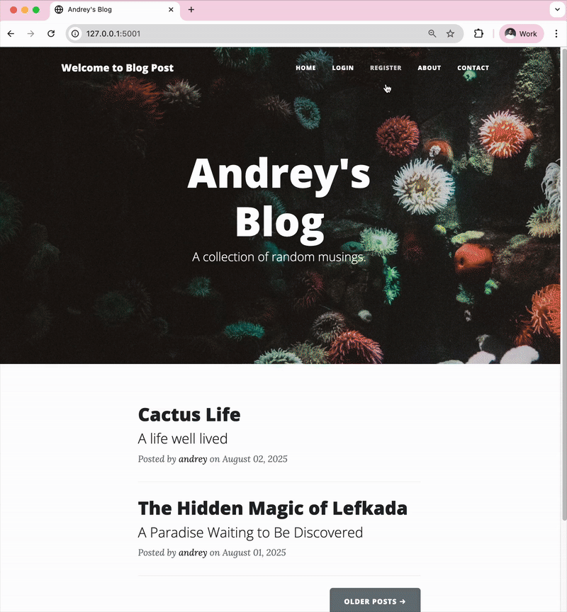
            

        </li>
        <li>
            

                In the <code>/login</code> route, if a user's email does not exist in the database or if their 
                password does not match the one stored using <code>check_password()</code> then they should be 
                redirected back to <code>/login</code> and a flash message should let them know what they issue was 
                and ask them to try again.
            

            

                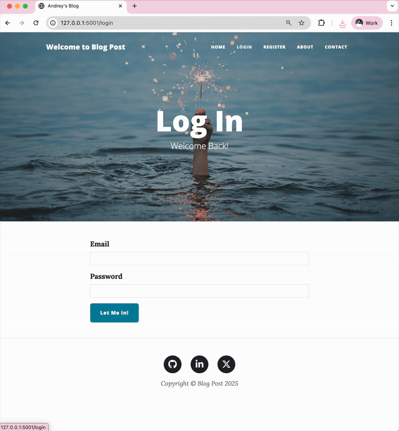
            

        </li>
        <li>
            

                Figure out how to update the navbar so that when a user is not logged in it shows:
            

            

                
            

            

                But if the user is logged in / authenticated after registering, then the navbar should show:
            

            

                
            

            

                <a href="https://flask-login.readthedocs.io/en/latest/#login-example">
                    https://flask-login.readthedocs.io/en/latest/#login-example
                </a>
            

        </li>
        <li>
            

                Code up the <code>/logout</code> route so that when the user clicks on the LOGOUT button, it logs them 
                out and takes them back to the home page.
            

        </li>
    </ol>
    <h3>Requirement 3 - Protect Routes</h3>
    

        In our blog, the first registered user will be the admin. The <b>admin</b> user will be able to create new blog 
        posts, edit posts and delete posts.
    

    <ol>
        <li>
            

                The first user's <code>id</code> is <code>1</code>. We can use this in <b>index.html</b> and 
                <b>post.html</b> to make sure that only the admin user can see the "Create New Post" and "Edit Post" and 
                Delete buttons.
            

            

                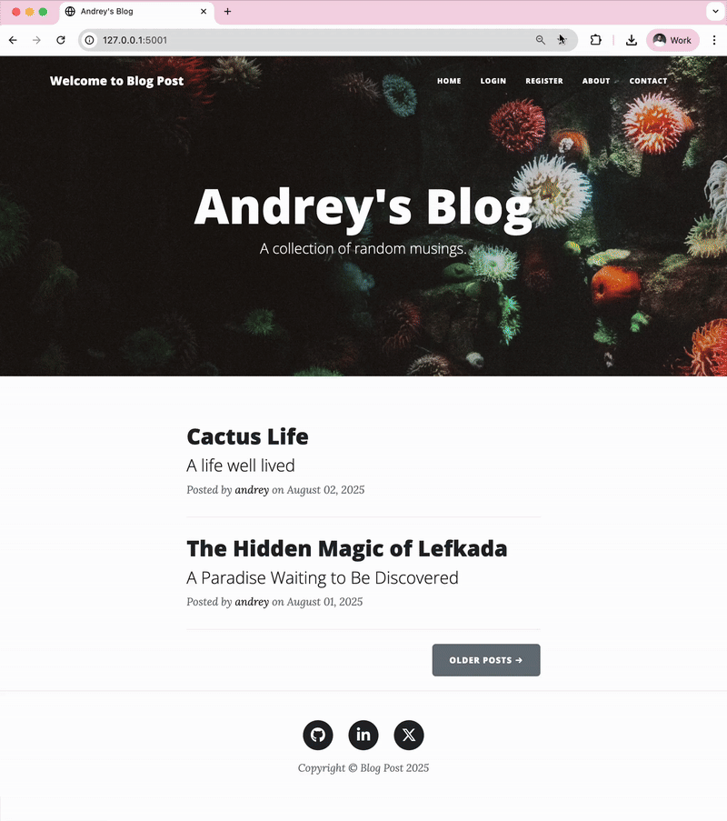
            

        </li>
        <li>
            

                Just because a user can't see the buttons, they can still manually access the <code>/edit-post</code> 
                or <code>/new-post</code> or <code>/delete</code> routes. Protect these routes by writing your own 
                <a href="https://docs.python.org/3/glossary.html#term-decorator">Python decorator</a> called 
                <code>@admin_only</code>.
            

            

                If the <code>current_user</code>'s id is <code>1</code> then they can access those routes, otherwise, 
                they should get a 403 error (not authorised).
            

            

                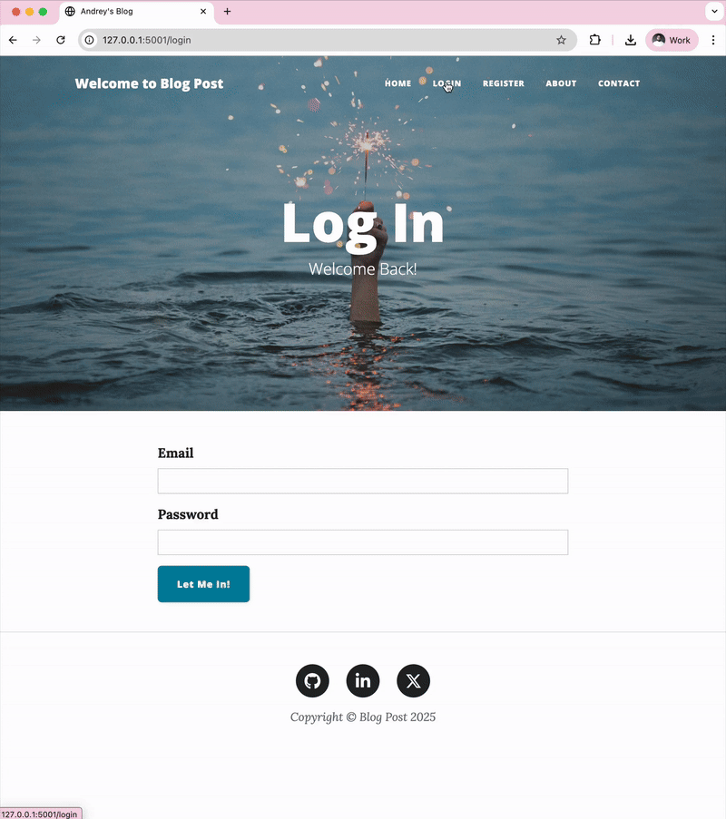
            

        </li>
    </ol>
    <h3>Creating Relational Databases</h3>
    

        Given that the 1st user is the admin and the blog owner. It would make sense if we could link the blog posts 
        they write to their user in the database. In the future, maybe we will want to invite other users to write 
        posts in the blog and grant them the admin privileges.
    

    

        So we need to create a <b>relationship</b> between the <code>User</code> table and the <code>BlogPost</code> 
        table to link them together. So we can see which BlogPosts a User has written. Or see which <code>User</code> 
        is the author of a particular <code>BlogPost</code>.
    

    

        
    

    

        If we were just writing Python code, you could imagine creating a <code>User</code> object which has a property 
        called <code>posts</code> that contains a List of <code>BlogPost</code> objects.
    

    
e.g.

    

        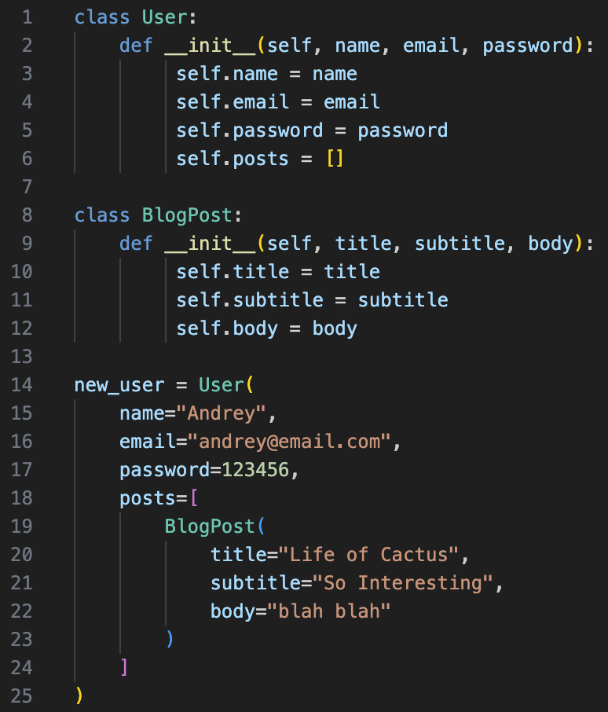
    

    

        This would make it easy to find all the BlogPosts a particular user has written. But what about the other 
        way around? How can you find the author of a particular BlogPost object? This is why we're using a database 
        instead of just simple Python data structures.
    

    

        In relational databases such as SQLite, MySQL or PostgreSQL we're able to define a relationship between 
        tables using a <code>ForeignKey</code> and a <code>relationship()</code> method.
    

    

        e.g. If we wanted to create a <a href="https://docs.sqlalchemy.org/en/20/orm/basic_relationships.html#one-to-many">
        One to Many relationship</a> between the <code>User</code> Table and the <code>BlogPost</code> table, where One 
        <code>User</code> can create many BlogPost objects, we can use the SQLAlchemy docs to achieve this.
    

    

        <a href="https://docs.sqlalchemy.org/en/20/orm/basic_relationships.html">https://docs.sqlalchemy.org/en/20/orm/basic_relationships.html</a>
    

    <h4>A new database schema</h4>
    

        Modify the <code>class User(UserMixin, db.Model)</code> and <code>class BlogPost(db.Model)</code> code to 
        create a bidirectional One-to-Many relationship between the two tables. The User should be the parent and the 
        BlogPost will be child. You should be able to easily locate the BlogPosts a User has written and also the 
        User of any BlogPost object.
    

    

        Note, you will be changing the schema here by adding a foreign key, the <code>author_id</code>. This will be 
        <i>a breaking change</i>. The blog website will not work after you have made this change.
    

    

        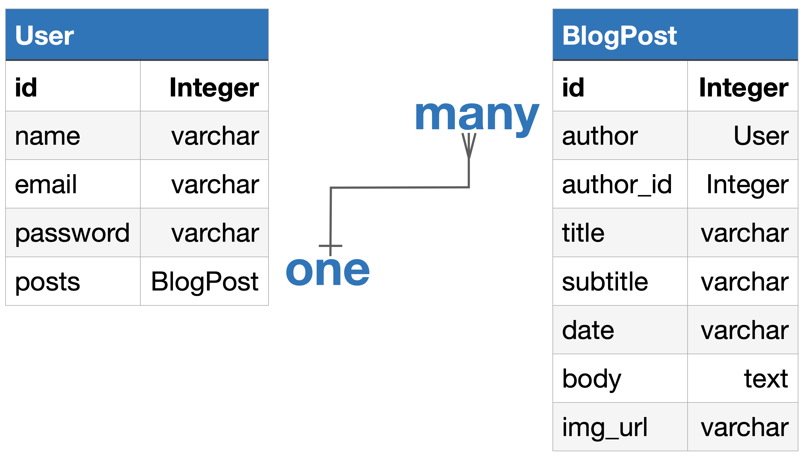
    

    
if re-run your blog at this point you will see this error

    
<code>OperationalError: (sqlite3.OperationalError) no such column: blog_posts.author_id</code>

    

        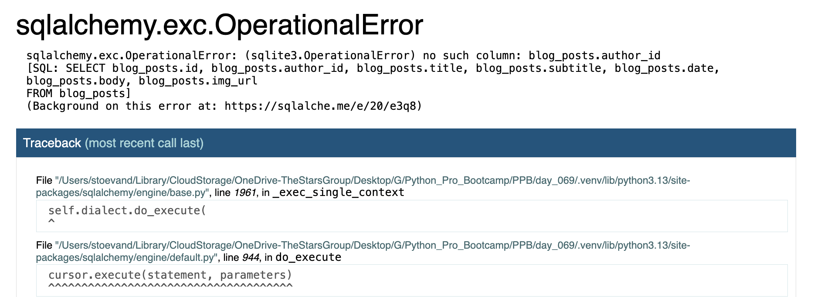
    
   
    <h4>Re-create the database with a new admin user and posts</h4>
    

        Our old database is no longer compatible with the new database structure - there are no entries for 
        <code>author_id</code> in the old posts.
    

    

        Our new code in the main.py modifies our database model by adding a new column into our database that was not 
        present in the original <code>blog.db</code> from the starter code:
    

    
<code>author_id = db.Column(db.Integer, db.ForeignKey("users.id"))</code>

    

        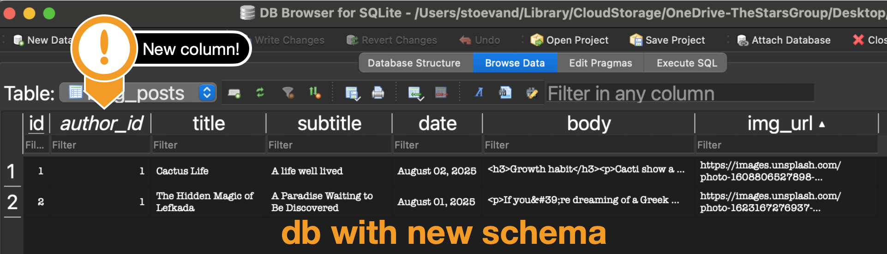
    

    

        There is no need to preserve the sample data and testing data so we will delete the database and create a new 
        one from scratch. However, this raises an important point: database schemas need to be defined early during 
        the development process. Once an application has launched and accumulated lots of data, you will need to 
        preserve this data by <i>migrating</i> to the new database. Lucky for us, we can leave out the migration step.
    

    

        <b>Stop your server and delete the existing blog.db entirely.</b> Untick safe delete when prompted and confirm 
        deletion.
    

    

        <b>Restart your server and register a new admin user.</b>
    

    

        Also create a new post since we've just wiped our database. However, you'll see the author name disappear 
        from the index.html and page.html pages.
    

    

        Modify the <b>index.html</b> and <b>post.html</b> pages so that the author name is still displayed in the 
        right places.
    

    

        
    

    <h3>Requirement 4 - Allow Any User to Add Comments to BlogPosts</h3>
    <ol>
        <li>
            

                Create a <code>CommentForm</code> in the form.py file it will only contain a single 
                <code>CKEditorField</code> for users to write their comments.
            

            

                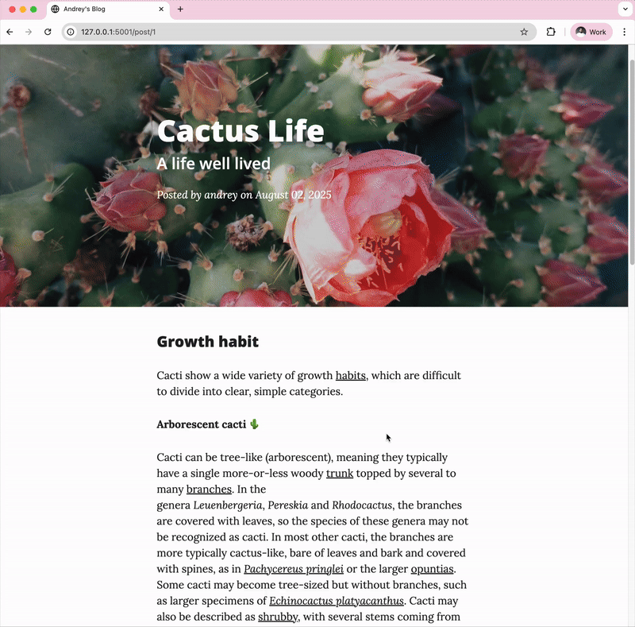
            
 
            

                <a href="https://flask-ckeditor.readthedocs.io/en/latest/basic.html">CKEditor docs</a>
            

            

                The next step is to allow users to leave a comment and save the comment. Now that we've seen how 
                relationships can be established between tables in our database. Let's step up our relationships 
                to create a new Table where any user can write comments to our blog posts.
            

        </li>
        <li>
            

                Create a Table called <code>Comment</code> where the <code>tablename</code> is <code>"comments"</code>. 
                It should contain an <code>id</code> and a <code>text</code> property which will be the primary key 
                and the text entered into the CKEditor.
            

        </li>
        <li>
            

                Establish a One-to-Many relationship Between the <code>User</code> Table (Parent) and the 
                <code>Comment</code> table (Child). Where One <code>User</code> is linked to Many <code>Comment</code> 
                objects.
            

            

                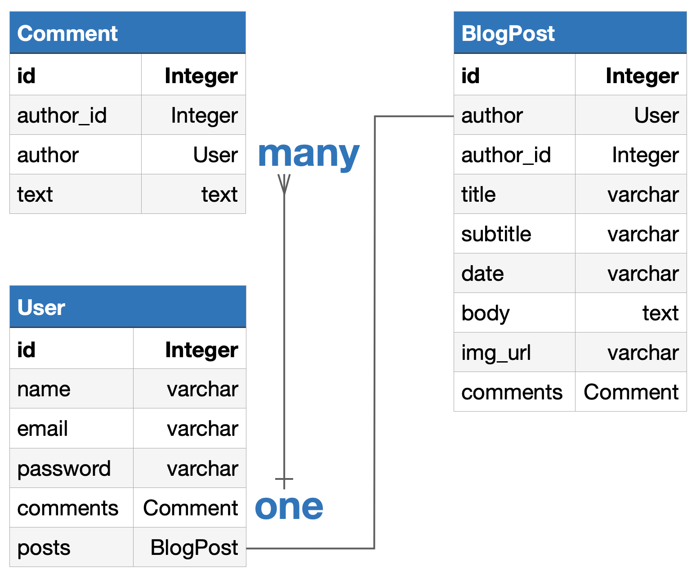
            

        </li>
        <li>
            

                Establish a One-to-Many relationship between each <code>BlogPost</code> object (Parent) and 
                <code>Comment</code> object (Child). Where each <code>BlogPost</code> can have many associated 
                <code>Comment</code> objects.
            

            

                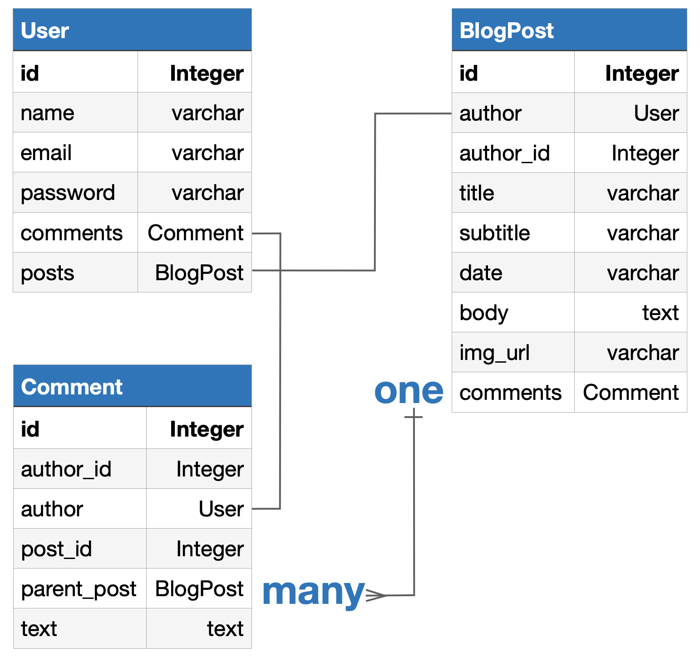
            

        </li>
        <li>
            

                We added a new Table added and changed the database schema. Let's re-create our database from scratch 
                once again. Stop your flask server and <b>delete the existing blog.db entirely</b>.
            

            

                <b>Restart your flask server and register your first user.</b> This will be your admin user.
            

            

                Create a new blog post:
            

            

                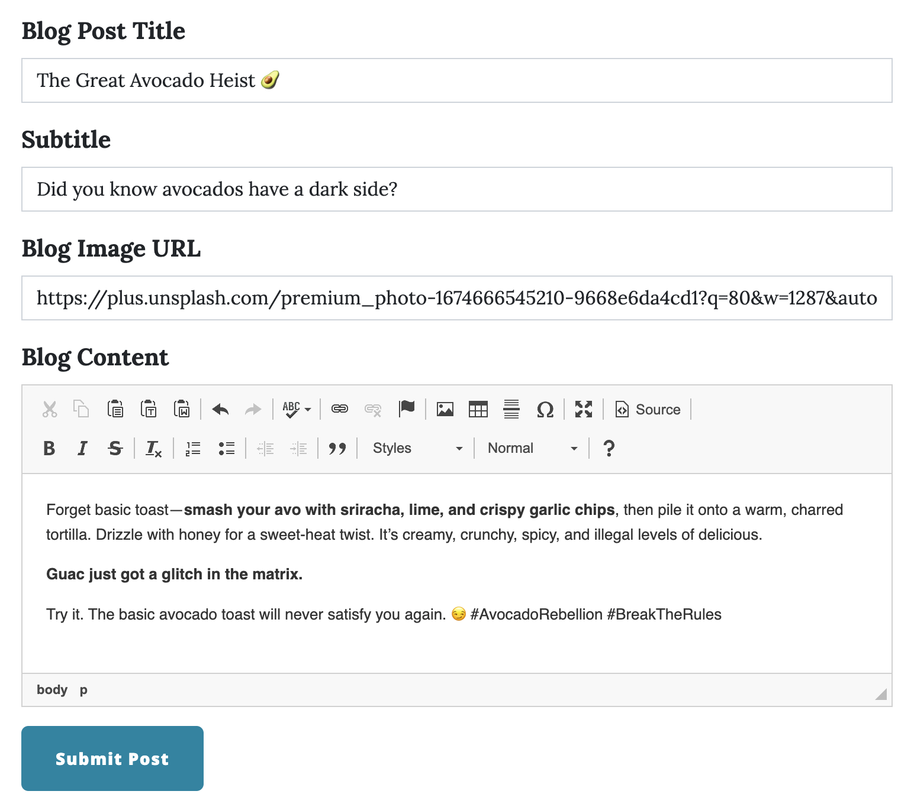
            

            

                <b>Create another user: a blog reader.</b> The blog reader will comment on the posts.
            

            

                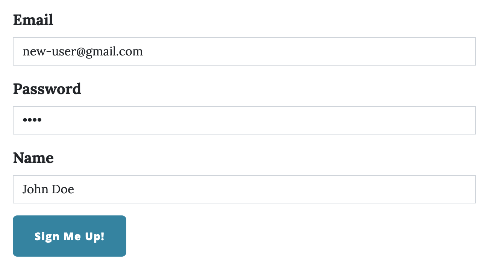
            

        </li>
        <li>
            

                Only allow registered and logged-in users (users that have been authenticated) to comment on posts. 
                Otherwise, they should see a flash message telling them to log in and redirect them to the 
                <code>/login</code> route. You will need to update the <code>/post/&lt;int:post_id&gt;</code> route.
            

            

                After you've written your code, test it out. Log in as the blog reader, your "John Doe" user 
                (or any user that is not the primary user) and make a comment on a blog post. <i>Check the blog.db</i> 
                to find your comment.
            

            

                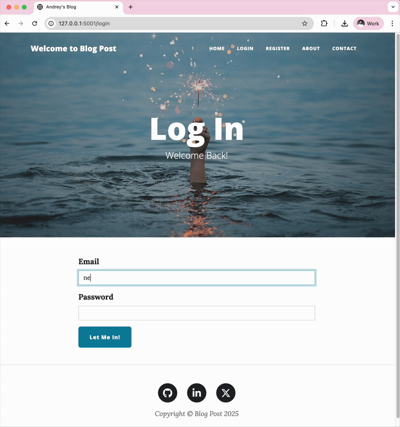
            

            

                If a user is not logged in, clicking "submit comment" should take them back to the login page.
            

            

                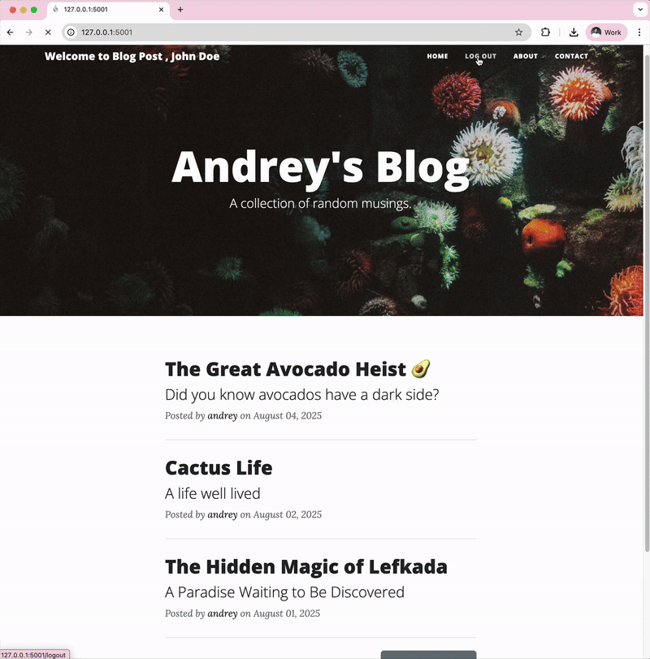
            

        </li>
        <li>
            

                Our comments are not visible on the page yet! Let's change this. Update the code in <b>post.html</b> 
                to display all the comments associated with the blog post.
            

            

                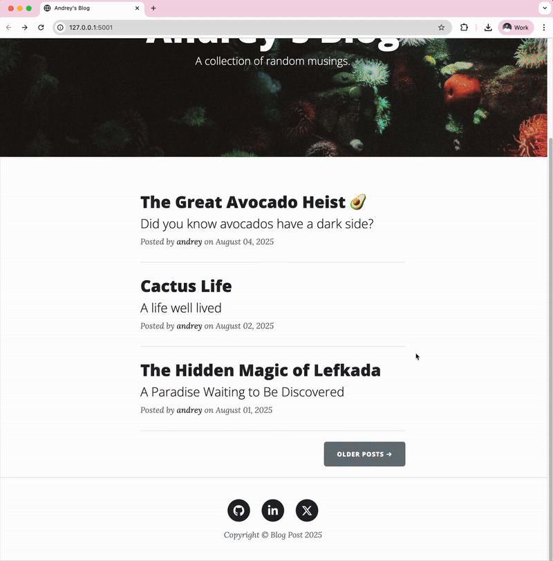
            

            <h4>Add some profile pics to the comment section</h4>
            
Gravatar images are used across the internet to provide an avatar image for blog commenters.

            
e.g. Check out the comments section of this blog post:

            

                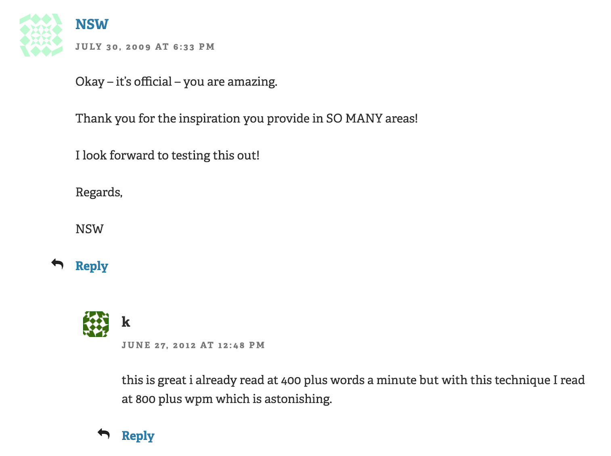
            

            

                Gravatar allows you to change the image that you use across the blog websites that use Gravatar here: 
                <a href="https://en.gravatar.com/">https://en.gravatar.com/</a>
            

            
It's super simple to implement into a Flask application.

        </li>
        <li>
            

                Use <a href="https://flask-gravatar.readthedocs.io/en/latest/">flask-gravatar</a> to add Gravatar 
                images into your comments section.
            

            

                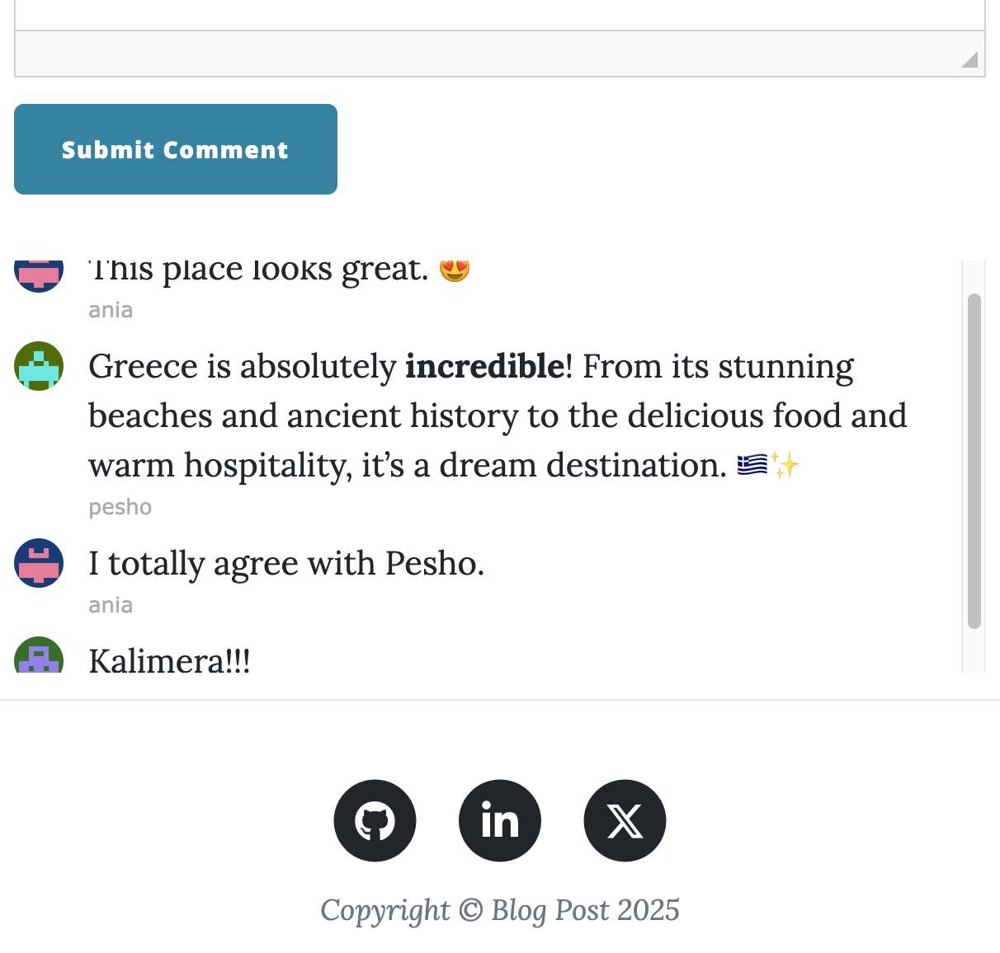
            

            

                More detailed info for gravatar can be found here: 
                <a href="https://docs.gravatar.com/">https://docs.gravatar.com/</a>
            

        </li>
    </ol>

    <h3>App data:</h3>
    <ol>
        <li>Admin:  email=<b>admin@email.com</b>, pass=<b>1234</b></li>
        <li>User:  email=<b>pesho@gmail.com</b>, pass=<b>1234</b></li>
    </ol>

