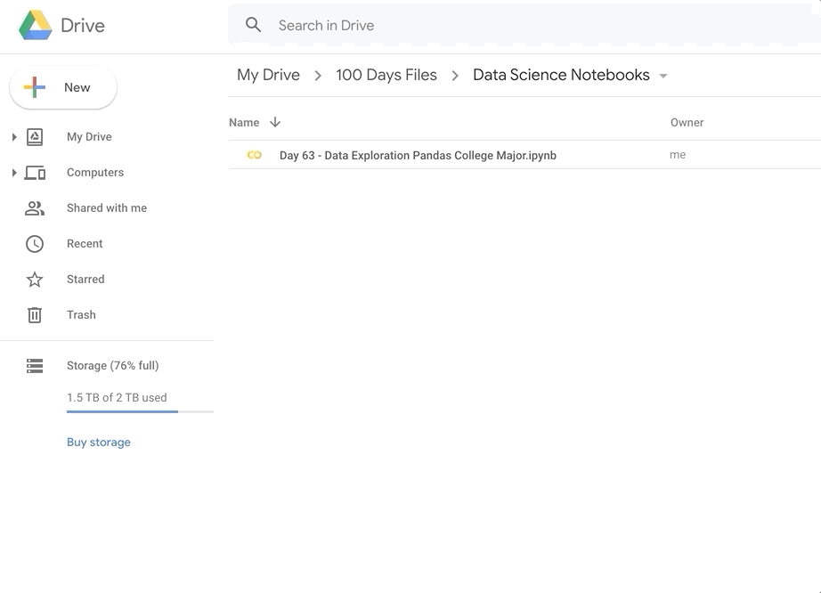
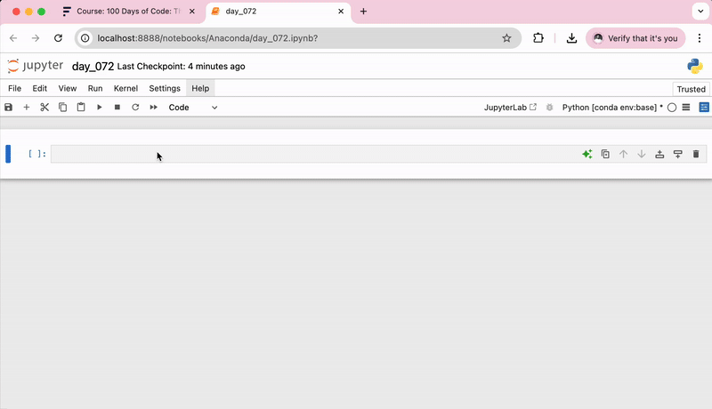
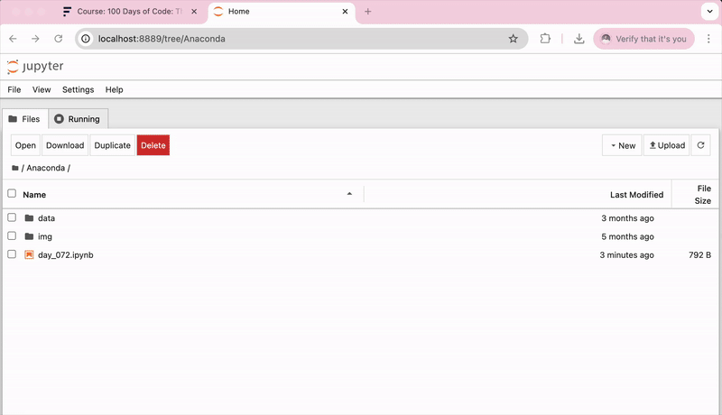
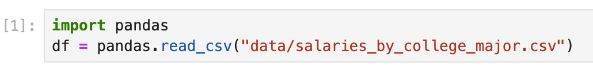

<h1>Data Exploration with Pandas: College Major vs Your Salary</h1>

    <h3>We will learn Data Exploration with Pandas by Analysing the Post-University Salaries of Graduates by Major</h3>
    

        
    

    

        College degrees are very expensive. But, do they pay you back? Choosing Philosophy or International Relations 
        as a major may have worried your parents, but does the data back up their fears? PayScale Inc. did a year-long 
        survey of 1.2 million Americans with only a bachelor's degree. We'll be digging into this data and use Pandas 
        to answer these questions:
    

    <ul>
        <li>Which degrees have the highest starting salaries?</li>
        <li>Which majors have the lowest earnings after college?</li>
        <li>Which degrees have the highest earning potential?</li>
        <li>What are the lowest risk college majors from an earnings standpoint?</li>
        <li>
            Do business, STEM (Science, Technology, Engineering, Mathematics) or 
            HASS (Humanities, Arts, Social Science)degrees earn more on average?
        </li>
    </ul>
    
We will learn:

    <ul>
        <li>How to explore a Pandas DataFrame</li>
        <li>How to detect NaN (not a number) values and clean your data</li>
        <li>How to select particular columns, rows, and individual cells</li>
        <li>How to sort your data</li>
        <li>How to group data by category</li>
    </ul>
    
... and more

    <h3>Getting Set Up for Data Science</h3>
    <h4>Introducing the Google Colab Notebook</h4>
    

        PyCharm is a fantastic IDE, but when we're exploring and visualising a dataset, you'll find the 
        Python notebook format better suited.
    

    

        Open your first Google Colab Notebook in through your <a href="https://drive.google.com/">Google Drive</a>. 
        You can find the Python Notebook under New → More → Google Colaboratory
    

    

        
    

    

        If you cannot access the Google Colab Notebooks or would like to run everything locally on your computer, 
        then I recommend <a href="https://www.anaconda.com/products/individual">installing Anaconda</a> and using the 
        bundled Jupyter Notebook instead. Either way works. Google Colab is essentially just an online version of Jupyter.
    

    <h3>How to use a Python Notebook</h3>
    

        The notebook is divided into cells. Each cell can be executed individually and the result is 
        automatically printed out below. To execute a cell use the shortcut <b>Shift + Enter</b>.
    

    

        
    

    

        <i>Note:</i> The Google Colab Notebook will to connect to a Runtime in order to execute any code.
    

    
That's pretty much it.

    <h3>Upload the Data and Read the .csv File</h3>
    

        Download the salaries_by_college_major.csv file and add this file to the 
        notebook by dropping it into the sidebar with the little folder icon.
    

    

        
    

    
Then import pandas into your notebook and read the .csv file.

    

        
    

    
EXPLORE!

