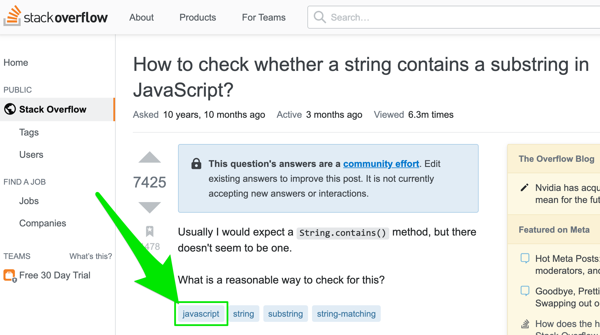

<h1>Data Visualization with Matplitlib: Programming Languages</h1>

    <h3>Analyze the Popularity of Different Programming Languages over Time</h3>
    

        
    

    

        The oldest programming language still in use today is FORTRAN, which was developed in 1957. Since then many 
        programming languages have been developed. But which programming language is the most popular? 
        Which programming language is the Kim Kardashian of programming languages; the one people just can't stop 
        talking about?
    

    

        StackOverflow will help us answer this burning question. Each post on Stack OverFlow comes with a Tag. 
        And this Tag can be the name of a programming language.
    

    

        
    

    

        To figure out which language is the most popular, all we need to do is count the number of posts on 
        Stack Overflow that are tagged with each language. The language with the most posts wins!
    

    

        We will learn how to:
    

    <ul>
        <li>visualise your data and create charts with Matplotlib</li>
        <li>pivot, group and manipulate your data with Pandas to get it into the format you want</li>
        <li>work with timestamps and time-series data</li>
        <li>style and customise a line chart to your liking</li>
    </ul>

