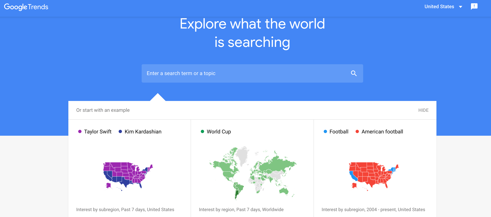

<h1>Resampling and Visualising Time Series</h1>
<h2>Combine Google Trends with other Time Series Data</h1>

    

        
    

    

        What can be the popularity of search terms tell us about the world?
        Google Trends gives us access to the popularity of Google Search terms.
        Let's investigate:
    

    <ul>
        <li>How search volume for "Bitcoin relates to the price of Bitcoin"</li>
        <li>How search volume for a hot stock like Tesla relates to that stock's price and</li>
        <li>How searches for "Unemployment Benefits" vary with the actual unemployment rate in the United States</li>
    </ul>
    

        We will learn:
    

    <ul>
        <li>How to make time-series data comparable by resampling and converting to the same periodicity (e.g., from daily data to monthly data).</li>
        <li>Fine-tuning the styling of Matplotlib charts by using limits, labels, linestyles, markers, colours, and the chart's resolution.</li>
        <li>Using grids to help visually identify seasonality in a time series.</li>
        <li>Finding the number of missing and NaN values and how to locate NaN values in a DataFrame.</li>
        <li>How to work with Locators to better style the time axis on a chart.</li>
        <li>Review the concepts learned in the previous three days and apply them to new datasets.</li>
    </ul>

