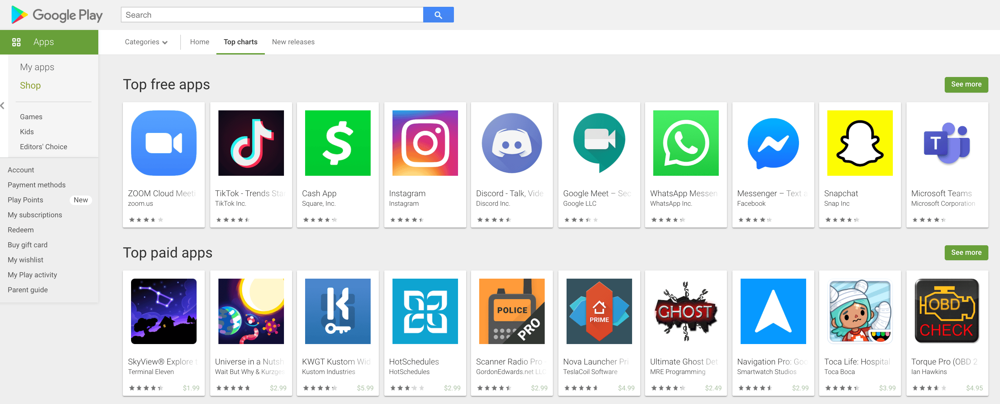

<h1>Beautiful Plotly Charts</h1>
<h2>Analysing the Android App Store</h2>

    
Wrestle the Android App Store Data into Beautiful Looking Charts with Plotly

    

        
    

    

        Have you ever thought about building your own iOS or Android app? 
        If so, then you probably have wondered about how things work in the app stores. 
        Today we'll replicate some of the app store analytics provided by companies like App Annie or Sensor Tower 
        that helps inform development and app marketing strategies for many companies. This stuff is BIG business!
    

    
In this module, we will compare thousands of apps in the Google Play Store so that we can gain insight into:

    <ul>
        <li>How competitive different app categories (e.g., Games, Lifestyle, Weather) are</li>
        <li>Which app category offers compelling opportunities based on its popularity</li>
        <li>How many downloads you would give up by making your app paid vs. free</li>
        <li>How much you can reasonably charge for a paid app</li>
        <li>Which paid apps have had the highest revenue</li>
        <li>How many paid apps will recoup their development costs based on their sales revenue</li>
    </ul>
    
Today you'll learn:

    <ul>
        <li>How to quickly remove duplicates</li>
        <li>How to remove unwanted symbols and convert data into a numeric format</li>
        <li>How to wrangle columns containing nested data with Pandas</li>
        <li>How to create compelling data visualisations with the plotly library</li>
        <li>Create vertical, horizontal and grouped bar charts</li>
        <li>Create pie and donut charts for categorical data</li>
        <li>Use colour scales to make beautiful scatter plots</li>
    </ul>

