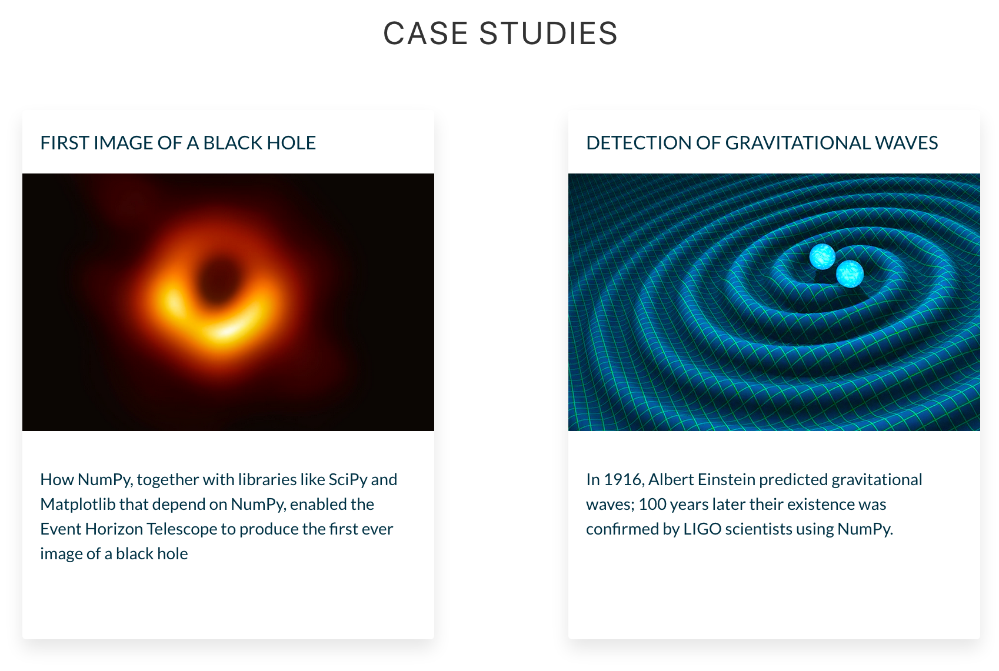

<h1>Computation with NumPy and N-Dimensional Arrays</h1>

    

        No Data Science course can be complete without learning NumPy <b>(Numerical Python)</b>. 
        NumPy is a Python library that’s used in almost every field of science and engineering. 
        It’s practically <b>THE</b> standard for working with numerical data in Python. 
        The case studies for how NumPy is being used speak for themselves 😮 
    

    

        
    

    

        So far, we’ve been using Pandas, which is built on top of NumPy. 
        Think of Pandas as a high-level data manipulation tool that includes functionality for working with 
        time-series or for grouping, joining, merging and finding missing data 
        (i.e., everything we’ve been doing so far). NumPy on the other hand shines with low-level tasks, 
        like doing serious math and calculations.
    

    
Today you'll learn:

    <ul>
        <li>How to leverage the power 💪 of NumPy's ndarrays.</li>
        <li>How to access individual values and subsets inside an n-dimensional array.</li>
        <li>How broadcasting 📣 works with ndarrays.</li>
        <li>How to do linear algebra with NumPy.</li>
        <li>How to generate points that you can plot on a chart.</li>
        <li>How to manipulate images as ndarrays.</li>
    </ul>
    

        
    

