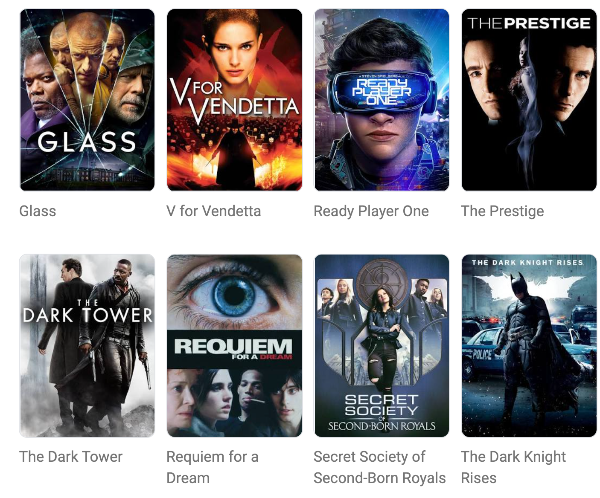

<h1>Linear Regression and Data Visualization with Seaborn</h1>

    

        We're going to be looking at movie budget and revenue data. 
        This dataset is perfect for trying out some new tools like scikit-learn to run a linear regression 
        and seaborn, a popular data visualisation library built on top of Matplotlib. 
    

    

        
    

    

        The question we want to answer is: Do higher film budgets lead to more revenue in the box office?
        In other words, should a movie studio spend more on a film to make more? 
    

    
Today you'll learn:

    <ul>
        <li>How to use a popular data visualisation library called Seaborn.</li>
        <li>How to run and interpret a linear regression with scikit-learn.</li>
        <li>How to plot a regression a scatter plot to visualise relationships in the data.</li>
        <li>How to add a third dimension to a scatter plot to create a bubble chart.</li>
        <li>How to cleverly use floor division <code>//</code> to convert your data.</li>
        <li>How to manipulate images as ndarrays.</li>
    </ul>
    

        
    

    

        
    

