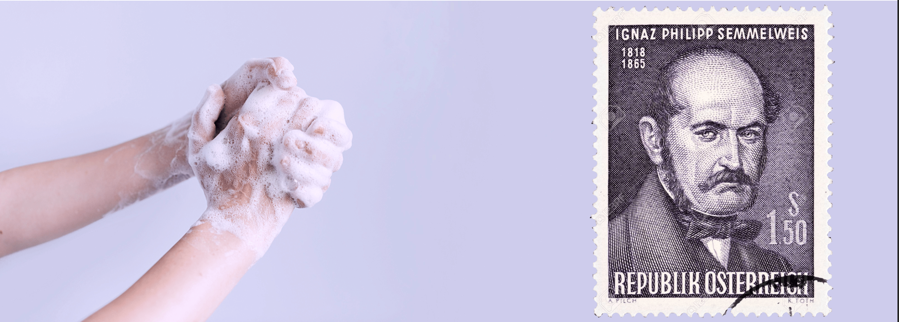

<h1>The tragic Discovery of Handwashing: t-Tests & Distributions</h1>

    

        Today you will become a doctor, but not just any doctor. You will become Dr Ignaz Semmelweis, 
        a Hungarian physician born in 1818 who worked in the Vienna General Hospital.
    

    

        
    

    

        In the past, people didn't know about bacteria, germs, or viruses. People illness was caused by "bad air" or 
        evil spirits. But in the 1800s Doctors started looking more at anatomy, doing autopsies and making arguments 
        based on data. Dr Semmelweis suspected that something was going wrong with the procedures at Vienna General 
        Hospital. Dr Semmelweis wanted to figure out why so many women in maternity wards were dying from childbed 
        fever (i.e., <a href="https://en.wikipedia.org/wiki/Postpartum_infections" target="_blank">puerperal fever</a>).
    

    
Today you'll learn:

    <ul>
        <li>How to make a compelling argument using data.</li>
        <li>How to superimpose histograms to show differences in distributions.</li>
        <li>How to use a Kernel Density Estimate (KDE) to show a graphic estimate of a distribution.</li>
        <li>How to use scipy and test for statistical significance by looking at p-values.</li>
        <li>How to highlight different parts of a time series chart in Matplotib.</li>
        <li>How to add and configure a Legend in Matplotlib.</li>
        <li>Use NumPy's <code>.where()</code> function to process elements depending on a condition.</li>
    </ul>

