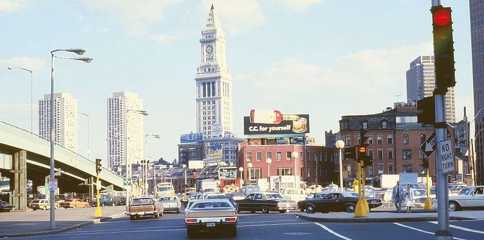
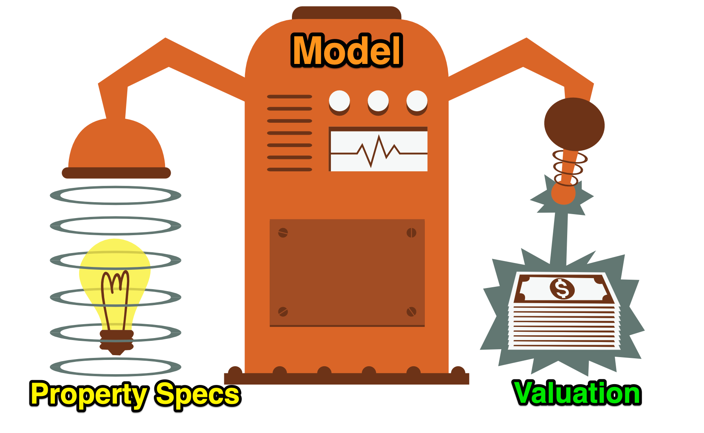

<h1>Capstone Project - Predict House Prices</h1>

    

        
    

    

        Welcome to Boston Massachusetts in the 1970s! Imagine you're working for a real estate development company. 
        Your company wants to value any residential project before they start. You are tasked with building a model 
        that can provide a price estimate based on a home's characteristics like:
    

    <ul>
        <li>The number of rooms</li>
        <li>The distance to employment centres</li>
        <li>How rich or poor the area is</li>
        <li>How many students there are per teacher in local schools etc</li>
    </ul>
    
Today you will:

    <ol>
        <li>Analyse and explore the Boston house price data</li>
        <li>Split your data for training and testing</li>
        <li>Run a Multivariable Regression</li>
        <li>Evaluate how your model's coefficients and residuals</li>
        <li>Use data transformation to improve your model performance</li>
        <li>Use your model to estimate a property price</li>
    </ol>
    

        
    

